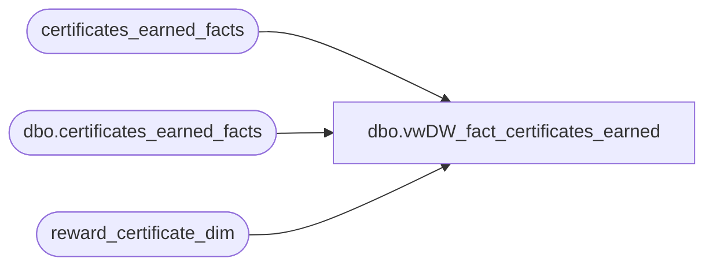

# dbo.vwDW_fact_certificates_earned

**Database:** dw  
**Server:** papamart  

## Architecture Diagram



## Table Dependencies

| Referenced Table |
|---|
| certificates_earned_facts |
| dbo.certificates_earned_facts |
| reward_certificate_dim |

## View Code

```sql
CREATE VIEW [dbo].[vwDW_fact_certificates_earned]
AS

	SELECT
		e.[reward_certificate_key]
		,e.[customer_key]
		,e.[customer_demographics_key]
		,e.[customer_geography_key]
		,e.[visit_count_key_12months]
		,e.[visit_count_key_24months]
		,e.[visit_count_key_36months]
		,e.[sfs_transaction_type_key]
		,e.[reference_no]
		,e.[reward_transaction_id]
		,e.[date_key]
		,d.[communication_date_key]
		,e.[communication_channel_key]
	FROM [dw].[dbo].[certificates_earned_facts] e
	inner join reward_certificate_dim c
		on c.reward_certificate_key = e.reward_certificate_key
	inner join (select e.[reward_certificate_key]
					, e.[communication_channel_key]
					, min(isnull(e.[communication_date_key],c.first_earned_date_key)) as [communication_date_key]
					from [certificates_earned_facts] e
					inner join reward_certificate_dim c
						on c.reward_certificate_key = e.reward_certificate_key
					group by e.[reward_certificate_key]
						, e.[communication_channel_key]) d
		on d.reward_certificate_key = e.reward_certificate_key
			and d.[communication_channel_key] = e.[communication_channel_key]
```

