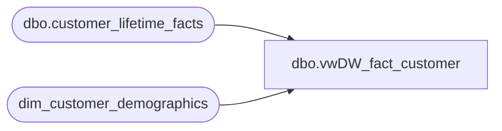

# dbo.vwDW_fact_customer

**Database:** dw  
**Server:** papamart  

## Architecture Diagram



## Table Dependencies

| Referenced Table |
|---|
| dbo.customer_lifetime_facts |
| dim_customer_demographics |

## View Code

```sql
CREATE VIEW [dbo].[vwDW_fact_customer]
AS

	SELECT
		customer_key
		,customer_geography_key
		,customer_demographics_key
		,bbw_loyalty_signup_date_key
		,bbw_nearest_store_key
		,bbw_lifetime_dollars_key
		,bbw_last_visit_date_key
		,bbw_visit_count_key
		,visit_count_key_3months
		,visit_count_key_12months
		,visit_count_key_24months
		,visit_count_key_36months
		,birthday_data_status_key
		,postal_address_status_key
		,email_address_status_key
		,Name_data_status_key
		,Phone_data_status_key

		,bbw_first_visit_date_key
		,bbw_web_first_visit_date_key
		,bbw_web_last_visit_date_key
		,bbw_web_visit_count_key
		,bbw_future_nearest_store_key
		,bbw_Distance_To_Nearest_Store_key
		,bbw_Distance_To_Nearest_FutureStore_key
		,snapshot_date_key

		,visit_count_3months
		,visit_count_12months
		,visit_count_24months
		,visit_count_36months

		,Reward_points_Balance_Range_Key
		,crm_reward_current_points_balance
	FROM dbo.customer_lifetime_facts
	-- This will ensure only SFS customers are pulled into the cube
	where customer_demographics_key in (select customer_demographics_key from dim_customer_demographics where loyalty_status_code = 'Y')
```

