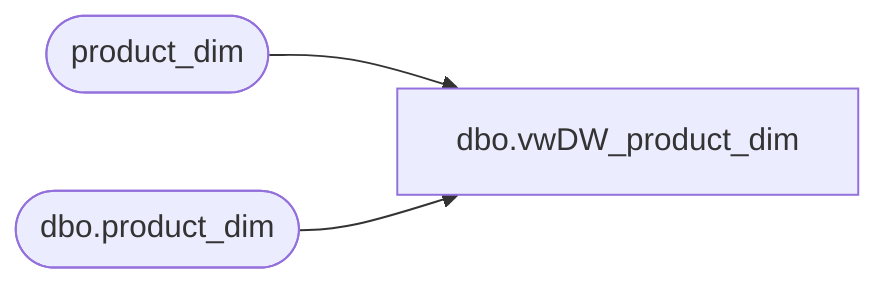

# dbo.vwDW_product_dim

**Database:** dw  
**Server:** papamart  

## Architecture Diagram



## Table Dependencies

| Referenced Table |
|---|
| product_dim |
| dbo.product_dim |

## View Code

```sql
CREATE VIEW [dbo].[vwDW_product_dim] 
AS
-- =============================================================================================================
-- Name: [dbo].[vwDW_product_dim]
--
-- Description: View underlying the  Shared Product Dimension in the SSAS Papa Mart and Merch Cubes.   
-- Defines attributes for the dimension and levels for the hierarchies
--
-- Dependencies: 
--
-- Revision History
--		Name:					Date:			Comments:
--		Funmi Agbebi			5/12/2010		added Canadian dollar field
--
--		Funmi Agbebi			4/30/2010		replaced single record dummy fields for sku 0 with dummy records
--												for each division, department and style, necessary to make
--												style-level MERCHDB01 views (e.g. vwDW_WeeklyOnHand_Style) work.
--												product_key for dummy styles is subclass_code + style_code + jurisdiction_id
--
--		Funmi Agbebi			3/31/2010		added fields for Jurisdiction and JurisdictionCodeKey
--												added fields for new Branded Merchandise Hierarchy Merch ClassCodeKey, Merch SubclassCodeKey, Merch StyleCodeKey
--												replaced dummy fields for sku 0 with single records in each division and jurisdiction
--												
--		Outside Consultant		2006			original creation
-- =============================================================================================================

	SELECT
		CAST(product_key AS varchar(50)) AS product_key, sku, activation_date, style_code, style_code + ' - ' + style_desc AS style_desc
		,subclass_code + '-' + style_code + '-' + color_code AS color_code, color_desc
		,product_desc, subclass_code + ' - ' + subclass AS subclass
		,SUBSTRING(subclass_code, 1, LEN(subclass_code) - 3) + ' - ' + class AS class
		,department_code + ' - ' + replace(replace(replace(department,'Can ',''),'Uk-',''),'Uk ','') AS department, department_code
		,SUBSTRING(subclass_code, 1, 5) + ' - ' + division AS division
		,chain, concept, priceline_code, subclass_code, class_code
		,SUBSTRING(subclass_code, 1, LEN(subclass_code) - 3) AS ClassCodeKey
		,SUBSTRING(subclass_code, 1, 5) AS DivisionCodeKey, subclass_code + '-' + style_code AS StyleCodeKey
		,primary_vendor_code, primary_vendor_name, alt_primary_vendor_code
		,current_retail, price_with_vat, euro_value, merch_status, ISNULL(wss_reportable, 'N') AS wss_reportable
		,ISNULL(reorder_flag, CAST(0 AS bit)) AS reorder_flag
		, current_selling_retail_home as USDollarCurrentRetail
		, cdn_value as CADollarCurrentRetail

--Fields for R-B-Z division.  New addition starts (FA - 3/31/2010)
		,cast(department_code  + '-' + jurisdiction_code as varchar(50)) as JurisdictionCodeKey
		,cast(jurisdiction_code + ' ' + replace(replace(replace(department,'Can ',''),'Uk-',''),'Uk ','') as varchar(100))  AS Jurisdiction     --  ,jurisdiction_code + ' ' + department AS Jurisdiction
		, CASE WHEN department_code like 'R-B-Z%'  
			   THEN cast(SUBSTRING(subclass_code, 1, LEN(subclass_code) - 3) + '-' + jurisdiction_code as varchar(75))
			   ELSE cast(SUBSTRING(subclass_code, 1, LEN(subclass_code) - 3) as varchar(75))
		 END AS MerchClassCodeKey
		, CASE WHEN department_code like 'R-B-Z%'  
			   THEN cast(subclass_code + '-' + jurisdiction_code as varchar(100))
			   ELSE cast(subclass_code as varchar(100)) 
		 END AS MerchSubclassCodeKey
		, CASE WHEN department_code like 'R-B-Z%'  
			   THEN cast(subclass_code + '-' + jurisdiction_code + '-' + style_code as varchar(150))
			   ELSE cast(subclass_code + '-' + style_code as varchar(150))
		 END AS MerchStyleCodeKey
--Fields for R-B-Z division.  New addition ends (FA - 3/31/2010)

	FROM papamart.dw.dbo.product_dim  with (nolock) 
	WHERE subclass_code IS NOT NULL

	UNION


	-- SELECT to create dummy products for each division
	SELECT DISTINCT
		SUBSTRING(subclass_code, 1, 5) AS product_key
		,0 AS sku, '1-1-1900' AS activation_date, 'N/A' style_code
		,SUBSTRING(subclass_code, 1, 5) + ' - ' + division AS style_desc
		,SUBSTRING(subclass_code, 1, 5) AS color_code
		,NULL AS color_desc
		,SUBSTRING(subclass_code, 1, 5) + ' - ' + division AS product_desc
		,SUBSTRING(subclass_code, 1, 5) + ' - ' + division AS subclass
		,SUBSTRING(subclass_code, 1, 5) + ' - ' + division AS class
		,SUBSTRING(subclass_code, 1, 5) + ' - ' + division AS department
		,SUBSTRING(subclass_code, 1, 5) AS department_code
		,SUBSTRING(subclass_code, 1, 5) + ' - ' + division AS division, chain, concept, 'N/A' AS priceline_code
		,SUBSTRING(subclass_code, 1, 5) AS subclass_code
		,SUBSTRING(subclass_code, 1, 5) AS class_code
		,SUBSTRING(subclass_code, 1, 5) AS ClassCodeKey
		,SUBSTRING(subclass_code, 1, 5) AS DivisionCodeKey
		,SUBSTRING(subclass_code, 1, 5) AS StyleCodeKey
		,'N/A' AS primary_vendor_code
		,'N/A' AS primary_vendor_name, 'N/A' AS alt_primary_vendor_code
		,CAST(NULL AS decimal (14, 2)) AS current_retail, CAST(NULL AS decimal (14, 2)) AS price_with_vat
		,CAST(NULL AS decimal (14, 2)) AS euro_value, CAST(NULL AS varchar(6)) AS merch_status
		,'N' AS wss_reportable
		,CAST(0 AS bit) AS reorder_flag
		, null as USDollarCurrentRetail
		, null as CADollarCurrentRetail
		,SUBSTRING(subclass_code, 1, 5) AS JurisdictionCodeKey
		,SUBSTRING(subclass_code, 1, 5) + ' - ' + division  AS Jurisdiction     
		,SUBSTRING(subclass_code, 1, 5) AS MerchClassCodeKey
		,SUBSTRING(subclass_code, 1, 5) AS MerchSubclassCodeKey
		,SUBSTRING(subclass_code, 1, 5) AS MerchStyleCodeKey
	FROM product_dim
	WHERE subclass_code IS NOT NULL

	UNION


-- SELECT to create dummy products for each department
	SELECT DISTINCT
		department_code AS product_key
		,0 AS sku, '1-1-1900' AS activation_date, 'N/A' style_code
		,department_code + ' - ' + replace(replace(replace(department,'Can ',''),'Uk-',''),'Uk ','') AS style_desc
		,department_code AS color_code
		,NULL AS color_desc
		,department_code + ' - ' + replace(replace(replace(department,'Can ',''),'Uk-',''),'Uk ','') AS product_desc
		,department_code + ' - ' + replace(replace(replace(department,'Can ',''),'Uk-',''),'Uk ','') AS subclass
		,department_code + ' - ' + replace(replace(replace(department,'Can ',''),'Uk-',''),'Uk ','') AS class
		,department_code + ' - ' + replace(replace(replace(department,'Can ',''),'Uk-',''),'Uk ','') AS department
		,department_code
		,SUBSTRING(subclass_code, 1, 5) + ' - ' + division AS division
		,chain, concept, 'N/A' AS priceline_code, department_code AS subclass_code
		,department_code AS class_code, department_code AS ClassCodeKey, SUBSTRING(subclass_code, 1, 5) AS DivisionCodeKey
		,department_code AS StyleCodeKey, 'N/A' AS primary_vendor_code
		,'N/A' AS primary_vendor_name, 'N/A' AS alt_primary_vendor_code
		,CAST(NULL AS decimal (14, 2)) AS current_retail, CAST(NULL AS decimal (14, 2)) AS price_with_vat
		,CAST(NULL AS decimal (14, 2)) AS euro_value, CAST(NULL AS varchar(6)) AS merch_status
		,'N' AS wss_reportable
		,CAST(0 AS bit) AS reorder_flag
		, null as USDollarCurrentRetail
		, null as CADollarCurrentRetail
		,department_code  + '-' + jurisdiction_code AS JurisdictionCodeKey
		,jurisdiction_code + ' ' + replace(replace(replace(department,'Can ',''),'Uk-',''),'Uk ','') AS Jurisdiction     
		,department_code AS MerchClassCodeKey
		,department_code AS MerchSubclassCodeKey
		,department_code AS MerchStyleCodeKey
	FROM product_dim
	WHERE subclass_code IS NOT NULL

UNION

	-- SELECT to create dummy products for each style
	SELECT DISTINCT
		subclass_code + '-' + style_code + '-' + 
		case when jurisdiction_code = 'US' then '1'
			when jurisdiction_code = 'UK' then '2'
			when jurisdiction_code = 'CA' then '3'
			when jurisdiction_code = 'FR' then '4'
			when jurisdiction_code = 'IE' then '5'
		else null end AS product_key
		,0 AS sku, '1-1-1900' AS activation_date, 'N/A' style_code
		,style_code + ' - ' + style_desc AS style_desc
		,subclass_code + '-' + style_code AS color_code
		,NULL AS color_desc
		,style_code + ' - ' + style_desc AS product_desc
		,subclass_code + ' - ' + subclass AS subclass
		,SUBSTRING(subclass_code, 1, LEN(subclass_code) - 3) + ' - ' + class AS class
		,department_code + ' - ' + replace(replace(replace(department,'Can ',''),'Uk-',''),'Uk ','') AS department
		,department_code
		,SUBSTRING(subclass_code, 1, 5) + ' - ' + division AS division
		,chain
		,concept
		,'N/A' AS priceline_code
		,subclass_code
		,class_code
		,SUBSTRING(subclass_code, 1, LEN(subclass_code) - 3) AS ClassCodeKey
		,SUBSTRING(subclass_code, 1, 5) AS DivisionCodeKey
		,subclass_code + '-' + style_code AS StyleCodeKey
		,'N/A' AS primary_vendor_code, 'N/A' AS primary_vendor_name, 'N/A' AS alt_primary_vendor_code
		,CAST(NULL AS decimal (14, 2)) AS current_retail, CAST(NULL AS decimal (14, 2)) AS price_with_vat
		,CAST(NULL AS decimal (14, 2)) AS euro_value, CAST(NULL AS varchar(6)) AS merch_status
		,'N' AS wss_reportable
		,CAST(0 AS bit) AS reorder_flag
		, null as USDollarCurrentRetail
		, null as CADollarCurrentRetail
		,department_code  + '-' + jurisdiction_code AS JurisdictionCodeKey
		,jurisdiction_code + ' ' + replace(replace(replace(department,'Can ',''),'Uk-',''),'Uk ','') AS Jurisdiction     

--		,SUBSTRING(subclass_code, 1, LEN(subclass_code) - 3) AS MerchClassCodeKey
		, CASE WHEN department_code like 'R-B-Z%'  
			   THEN SUBSTRING(subclass_code, 1, LEN(subclass_code) - 3) + '-' + jurisdiction_code
			   ELSE SUBSTRING(subclass_code, 1, LEN(subclass_code) - 3)
		 END AS MerchClassCodeKey

--		,subclass_code AS MerchSubclassCodeKey
		, CASE WHEN department_code like 'R-B-Z%'  
			   THEN subclass_code + '-' + jurisdiction_code 
			   ELSE subclass_code 
		 END AS MerchSubclassCodeKey

--		,subclass_code + '-' + style_code  AS MerchStyleCodeKey
		, CASE WHEN department_code like 'R-B-Z%'  
			   THEN subclass_code + '-' + jurisdiction_code + '-' + style_code
			   ELSE subclass_code + '-' + style_code
		 END AS MerchStyleCodeKey
	FROM product_dim
	WHERE subclass_code IS NOT NULL


/*	
UNION

	-- SELECT to create dummy products for each jurisdiction
	SELECT DISTINCT
		department_code  + '-' + jurisdiction_code AS product_key
		,0 AS sku, '1-1-1900' AS activation_date, 'N/A' style_code
		,jurisdiction_code + ' ' + replace(replace(replace(department,'Can ',''),'Uk-',''),'Uk ','') AS style_desc
		,department_code  + '-' + jurisdiction_code AS color_code
		,NULL AS color_desc
		--,department_code + ' - ' + replace(replace(replace(department,'Can ',''),'Uk-',''),'Uk ','') AS color_desc
		,jurisdiction_code + ' ' + replace(replace(replace(department,'Can ',''),'Uk-',''),'Uk ','') AS product_desc
		,jurisdiction_code + ' ' + replace(replace(replace(department,'Can ',''),'Uk-',''),'Uk ','') AS subclass
		,jurisdiction_code + ' ' + replace(replace(replace(department,'Can ',''),'Uk-',''),'Uk ','') AS class
		,department_code + ' - ' + replace(replace(replace(department,'Can ',''),'Uk-',''),'Uk ','') AS department
		,department_code
		,SUBSTRING(subclass_code, 1, 5) + ' - ' + division AS division
		,chain, concept, 'N/A' AS priceline_code
		,department_code  + '-' + jurisdiction_code AS subclass_code
		,department_code  + '-' + jurisdiction_code AS class_code
		,department_code  + '-' + jurisdiction_code AS ClassCodeKey
		,SUBSTRING(subclass_code, 1, 5) AS DivisionCodeKey
		,department_code  + '-' + jurisdiction_code AS StyleCodeKey
		,'N/A' AS primary_vendor_code
		,'N/A' AS primary_vendor_name, 'N/A' AS alt_primary_vendor_code
		,CAST(NULL AS decimal (14, 2)) AS current_retail, CAST(NULL AS decimal (14, 2)) AS price_with_vat
		,CAST(NULL AS decimal (14, 2)) AS euro_value, CAST(NULL AS varchar(6)) AS merch_status
		,'N' AS wss_reportable
		,CAST(0 AS bit) AS reorder_flag
		, null as USDollarCurrentRetail
		,department_code  + '-' + jurisdiction_code AS JurisdictionCodeKey
		,jurisdiction_code + ' ' + replace(replace(replace(department,'Can ',''),'Uk-',''),'Uk ','') AS Jurisdiction     
		,department_code  + '-' + jurisdiction_code AS MerchClassCodeKey
		,department_code  + '-' + jurisdiction_code AS MerchSubclassCodeKey
		,department_code  + '-' + jurisdiction_code AS MerchStyleCodeKey
	FROM product_dim
	WHERE subclass_code IS NOT NULL

	UNION

	-- SELECT to create dummy products for each class
	SELECT DISTINCT
		SUBSTRING(subclass_code, 1, LEN(subclass_code) - 3) AS product_key
		,0 AS sku, '1-1-1900' AS activation_date, 'N/A' style_code
		,SUBSTRING(subclass_code, 1, LEN(subclass_code) - 3) + ' - ' + class AS style_desc
		,SUBSTRING(subclass_code, 1, LEN(subclass_code) - 3) AS color_code
		,NULL AS color_desc
		--,SUBSTRING(subclass_code, 1, LEN(subclass_code) - 3) + ' - ' + class AS color_desc
		,SUBSTRING(subclass_code, 1, LEN(subclass_code) - 3) + ' - ' + class AS product_desc
		,SUBSTRING(subclass_code, 1, LEN(subclass_code) - 3) + ' - ' + class AS subclass
		,SUBSTRING(subclass_code, 1, LEN(subclass_code) - 3) + ' - ' + class AS class
		,department_code + ' - ' + replace(replace(replace(department,'Can ',''),'Uk-',''),'Uk ','') AS department
		,department_code
		,SUBSTRING(subclass_code, 1, 5) + ' - ' + division AS division
		,chain
		,concept
		,'N/A' AS priceline_code
		,SUBSTRING(subclass_code, 1, LEN(subclass_code) - 3) AS subclass_code
		,class_code
		,SUBSTRING(subclass_code, 1, LEN(subclass_code) - 3) AS ClassCodeKey
		,SUBSTRING(subclass_code, 1, 5) AS DivisionCodeKey
		,SUBSTRING(subclass_code, 1, LEN(subclass_code) - 3) AS StyleCodeKey
		,'N/A' AS primary_vendor_code, 'N/A' AS primary_vendor_name, 'N/A' AS alt_primary_vendor_code
		,CAST(NULL AS decimal (14, 2)) AS current_retail, CAST(NULL AS decimal (14, 2)) AS price_with_vat
		,CAST(NULL AS decimal (14, 2)) AS euro_value, CAST(NULL AS varchar(6)) AS merch_status
		,'N' AS wss_reportable
		,CAST(0 AS bit) AS reorder_flag
		, null as USDollarCurrentRetail
		,department_code  + '-' + jurisdiction_code AS JurisdictionCodeKey
		,jurisdiction_code + ' ' + replace(replace(replace(department,'Can ',''),'Uk-',''),'Uk ','') AS Jurisdiction     


--		,SUBSTRING(subclass_code, 1, LEN(subclass_code) - 3) AS MerchClassCodeKey
		, CASE WHEN department_code like 'R-B-Z%'  
			   THEN SUBSTRING(subclass_code, 1, LEN(subclass_code) - 3) + '-' + jurisdiction_code
			   ELSE SUBSTRING(subclass_code, 1, LEN(subclass_code) - 3)
		 END AS MerchClassCodeKey

--		,SUBSTRING(subclass_code, 1, LEN(subclass_code) - 3) AS MerchSubclassCodeKey
		, CASE WHEN department_code like 'R-B-Z%'  
			   THEN SUBSTRING(subclass_code, 1, LEN(subclass_code) - 3) + '-' + jurisdiction_code
			   ELSE SUBSTRING(subclass_code, 1, LEN(subclass_code) - 3)
		 END AS MerchSubclassCodeKey
--		,SUBSTRING(subclass_code, 1, LEN(subclass_code) - 3) AS MerchStyleCodeKey
		, CASE WHEN department_code like 'R-B-Z%'  
			   THEN SUBSTRING(subclass_code, 1, LEN(subclass_code) - 3) + '-' + jurisdiction_code
			   ELSE SUBSTRING(subclass_code, 1, LEN(subclass_code) - 3)
		 END AS MerchStyleCodeKey
	FROM product_dim
	WHERE subclass_code IS NOT NULL

	UNION

	-- SELECT to create dummy products for each sub-class
	SELECT DISTINCT
		subclass_code AS product_key
		,0 AS sku, '1-1-1900' AS activation_date, 'N/A' style_code
		,subclass_code + ' - ' + subclass AS style_desc
		,subclass_code AS color_code
		,NULL AS color_desc
		--,subclass_code + ' - ' + subclass AS color_desc
		,subclass_code + ' - ' + subclass AS product_desc
		,subclass_code + ' - ' + subclass AS subclass
		,SUBSTRING(subclass_code, 1, LEN(subclass_code) - 3) + ' - ' + class AS class
		,department_code + ' - ' + replace(replace(replace(department,'Can ',''),'Uk-',''),'Uk ','') AS department
		,department_code
		,SUBSTRING(subclass_code, 1, 5) + ' - ' + division AS division
		,chain
		,concept
		,'N/A' AS priceline_code
		,subclass_code
		,class_code
		,SUBSTRING(subclass_code, 1, LEN(subclass_code) - 3) AS ClassCodeKey
		,SUBSTRING(subclass_code, 1, 5) AS DivisionCodeKey
		,subclass_code AS StyleCodeKey
		,'N/A' AS primary_vendor_code, 'N/A' AS primary_vendor_name, 'N/A' AS alt_primary_vendor_code
		,CAST(NULL AS decimal (14, 2)) AS current_retail, CAST(NULL AS decimal (14, 2)) AS price_with_vat
		,CAST(NULL AS decimal (14, 2)) AS euro_value, CAST(NULL AS varchar(6)) AS merch_status
		,'N' AS wss_reportable
		,CAST(0 AS bit) AS reorder_flag
		, null as USDollarCurrentRetail
		,department_code  + '-' + jurisdiction_code AS JurisdictionCodeKey
		,jurisdiction_code + ' ' + replace(replace(replace(department,'Can ',''),'Uk-',''),'Uk ','') AS Jurisdiction     

--		,SUBSTRING(subclass_code, 1, LEN(subclass_code) - 3) AS MerchClassCodeKey
		, CASE WHEN department_code like 'R-B-Z%'  
			   THEN SUBSTRING(subclass_code, 1, LEN(subclass_code) - 3) + '-' + jurisdiction_code
			   ELSE SUBSTRING(subclass_code, 1, LEN(subclass_code) - 3)
		 END AS MerchClassCodeKey

--		,subclass_code AS MerchSubclassCodeKey
		, CASE WHEN department_code like 'R-B-Z%'  
			   THEN subclass_code + '-' + jurisdiction_code 
			   ELSE subclass_code 
		 END AS MerchSubclassCodeKey

--		,subclass_code AS MerchStyleCodeKey
		, CASE WHEN department_code like 'R-B-Z%'  
			   THEN subclass_code + '-' + jurisdiction_code 
			   ELSE subclass_code 
		 END AS MerchStyleCodeKey
	FROM product_dim
	WHERE subclass_code IS NOT NULL

	UNION
*/
```

