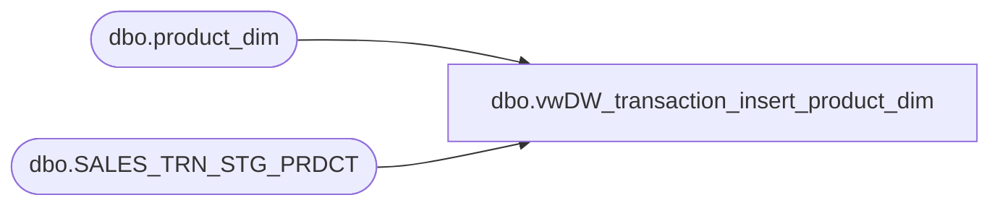

# dbo.vwDW_transaction_insert_product_dim

**Database:** dw  
**Server:** papamart  

## Architecture Diagram



## Table Dependencies

| Referenced Table |
|---|
| dbo.product_dim |
| dbo.SALES_TRN_STG_PRDCT |

## View Code

```sql
CREATE VIEW [dbo].[vwDW_transaction_insert_product_dim]
AS

/**********************************************************
View: vwDW_transaction_insert_product_dim
Purpose: Used as source for Transaction_Insert_Product_Dim.dtsx

History: 
09/09/2011	Trista Parmentier	Created view using logic from Informatica mapping, m_History_Fact_Load+Tax_v6. 
								This replaces the logic in the path that inserts new products into DW.dbo.product_dim.

**********************************************************/

SELECT DISTINCT 
	stg.Line_Object,
	stg.Line_Object_Description,
	stg.Line_Object * -1 AS sku,
	'US' AS jurisdiction_code,
	1 AS jurisdiction_id
FROM DWStaging.dbo.SALES_TRN_STG_PRDCT stg
LEFT OUTER JOIN dbo.product_dim p ON
	(stg.Line_Object * -1) = p.sku
```

