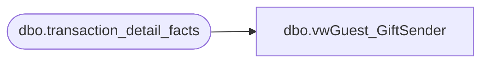

# dbo.vwGuest_GiftSender

**Database:** dw  
**Server:** papamart  

## Architecture Diagram



## Table Dependencies

| Referenced Table |
|---|
| dbo.transaction_detail_facts |

## View Code

```sql
--select top 1000 * from vwGuest_GiftSender
--CREATE
CREATE VIEW dbo.vwGuest_GiftSender
--WITH SCHEMABINDING    
AS


SELECT t.sender_customer_key as gift_sender_cust_key
from dbo.transaction_detail_facts t
where t.transaction_line_seq < 0
and t.sender_customer_key <> 0
```

