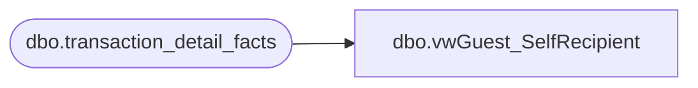

# dbo.vwGuest_SelfRecipient

**Database:** dw  
**Server:** papamart  

## Architecture Diagram



## Table Dependencies

| Referenced Table |
|---|
| dbo.transaction_detail_facts |

## View Code

```sql
--select top 1000 * from vwGuest_SelfRecipient
CREATE   VIEW dbo.vwGuest_SelfRecipient
--WITH SCHEMABINDING    
AS


/*
SELECT t.recipient_customer_key as self_recip_cust_key
from dbo.transaction_detail_facts t
join dbo.animal_dim a on t.animal_key = a.animal_key 
where t.transaction_line_seq < 0
and a.purpose = 'self' 
and t.recipient_customer_key <> 0
*/

SELECT DISTINCT t.recipient_customer_key as self_recip_cust_key
--from dbo.animal_dim a 
--join dbo.transaction_detail_facts t on t.animal_key = a.animal_key 
from dbo.transaction_detail_facts t
where t.purpose_key = 1 --'self' 
and t.transaction_line_seq < 0
and t.recipient_customer_key <> 0
```

