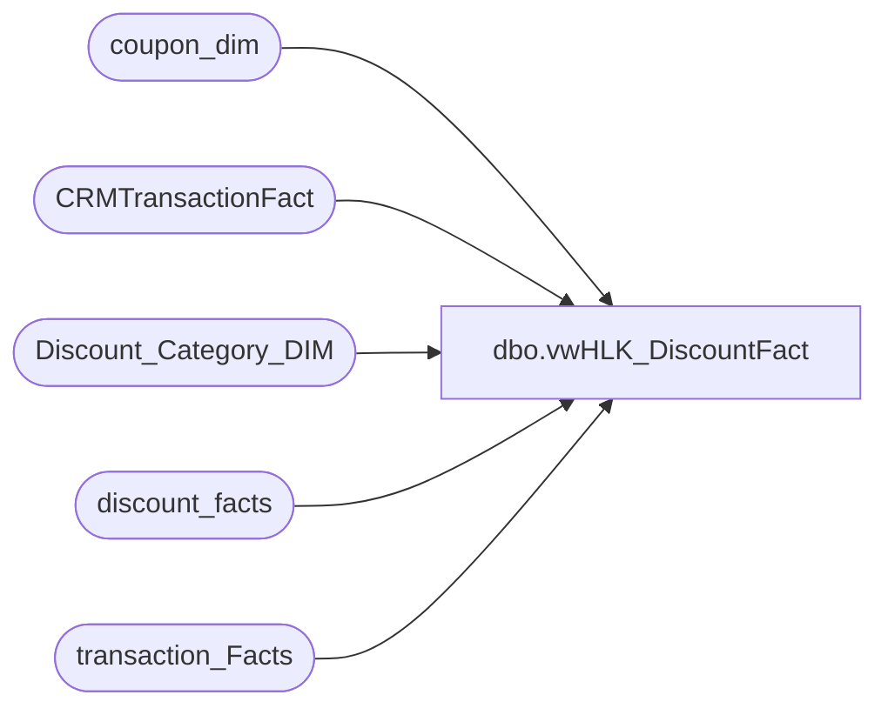

# dbo.vwHLK_DiscountFact

**Database:** dw  
**Server:** papamart  

## Architecture Diagram



## Table Dependencies

| Referenced Table |
|---|
| coupon_dim |
| CRMTransactionFact |
| Discount_Category_DIM |
| discount_facts |
| transaction_Facts |

## View Code

```sql
Create View [dbo].[vwHLK_DiscountFact]
AS
select 
       df.transaction_id,
       df.store_key,
       df.date_key,
       df.units,
       df.unit_gross_amount*-1 as discount_amt,
       cd.coupon_desc,
       cd.event_name,
       cd.category,
       dcd.financialGroup
from discount_facts df with (nolock)
       join transaction_Facts tf with (nolock)
       on df.transaction_id=tf.transaction_id
       join CRMTransactionFact ctsf with (nolock)
       on tf.transaction_id=ctsf.TransactionID
       join coupon_dim cd with (nolock) on df.coupon_key=cd.coupon_key
       JOIN Discount_Category_DIM dcd with (nolock) on cd.categoryTypeID=dcd.categoryTypeID
where
       ctsf.TransactionDate >= '11/1/2014'
       and ctsf.CustomerNumber IS NOT NULL
```

