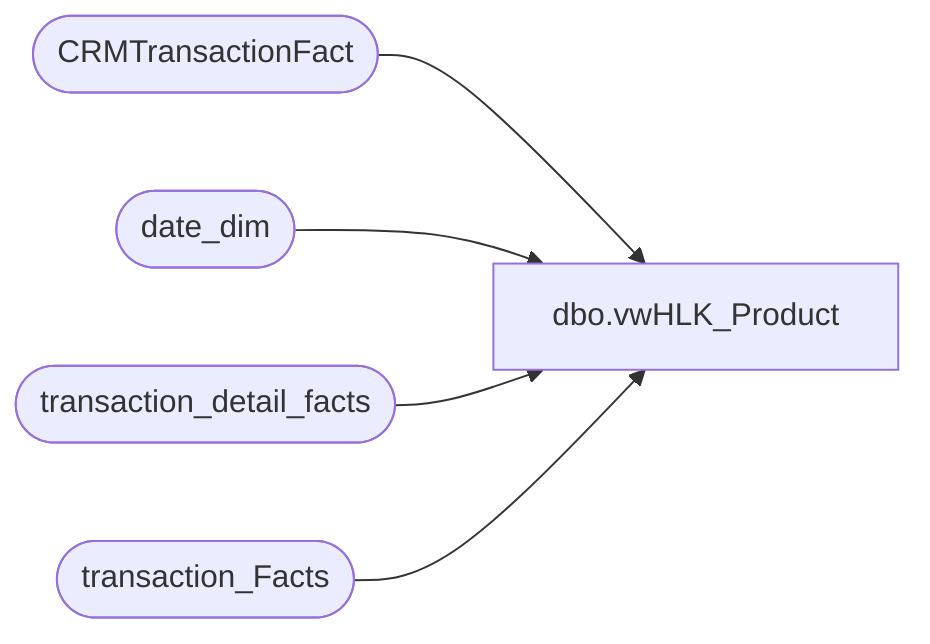

# dbo.vwHLK_Product

**Database:** dw  
**Server:** papamart  

## Architecture Diagram



## Table Dependencies

| Referenced Table |
|---|
| CRMTransactionFact |
| date_dim |
| transaction_detail_facts |
| transaction_Facts |

## View Code

```sql
Create View [dbo].[vwHLK_Product]
AS
       select
       tdf.transaction_id,
       tdf.product_key,
       tdf.store_key,
       tdf.date_key,
       tdf.units as units_sold,
       tdf.unit_gross_amount,
       tdf.unit_disc_amount,
       tdf.unit_gross_amount-tdf.unit_disc_amount as unit_net_amount
from transaction_detail_facts tdf with (nolock) 
       join transaction_Facts tf with (nolock)
       on tdf.transaction_id=tf.transaction_id
       join CRMTransactionFact ctsf with (nolock)
       on tf.transaction_id=ctsf.TransactionID
       join date_dim dd with (nolock)
       on tdf.date_key=dd.date_key
where
       ctsf.TransactionDate >= '11/1/2014'
       and ctsf.CustomerNumber IS NOT NULL
```

