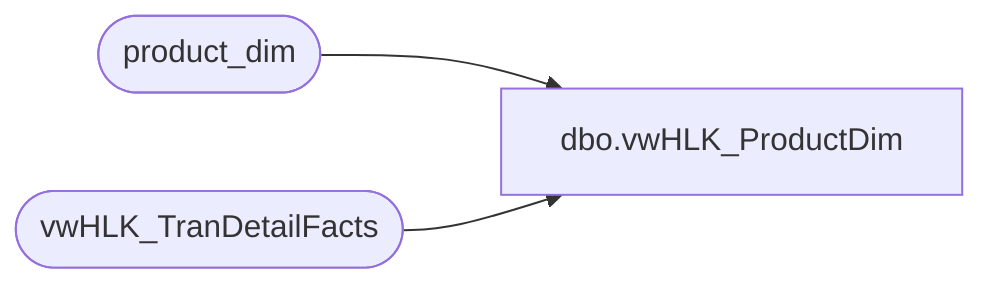

# dbo.vwHLK_ProductDim

**Database:** dw  
**Server:** papamart  

## Architecture Diagram



## Table Dependencies

| Referenced Table |
|---|
| product_dim |
| vwHLK_TranDetailFacts |

## View Code

```sql
Create View [dbo].[vwHLK_ProductDim]
AS
select distinct pd.*
from product_dim pd with (nolock)
       join vwHLK_TranDetailFacts t
       on pd.product_key=t.product_key
```

