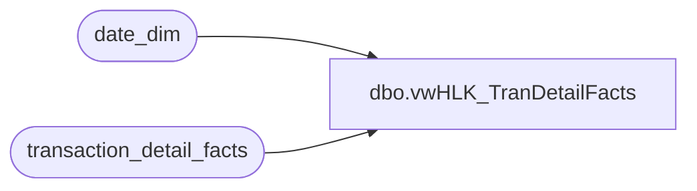

# dbo.vwHLK_TranDetailFacts

**Database:** dw  
**Server:** papamart  

## Architecture Diagram



## Table Dependencies

| Referenced Table |
|---|
| date_dim |
| transaction_detail_facts |

## View Code

```sql
CREATE View [dbo].[vwHLK_TranDetailFacts]
AS
select distinct tdf.product_key
from transaction_detail_facts tdf with (nolock)
       join date_dim dd with (nolock)
       on tdf.date_key=dd.date_key
where
       dd.actual_Date>='11/1/2014'
```

