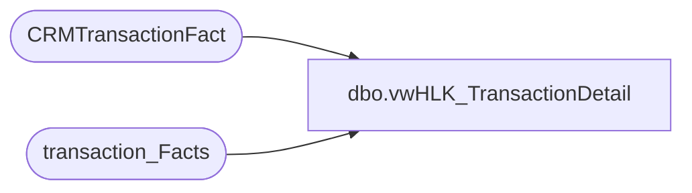

# dbo.vwHLK_TransactionDetail

**Database:** dw  
**Server:** papamart  

## Architecture Diagram



## Table Dependencies

| Referenced Table |
|---|
| CRMTransactionFact |
| transaction_Facts |

## View Code

```sql
Create View [dbo].[vwHLK_TransactionDetail]
AS
select
       ctsf.CustomerNumber,
       --tf.date_key,
       tf.store_key,
       tf.GAAP_transaction_flag,
       tf.GAAP_sales_amount,
       tf.merchandise_units,
       tf.animal_units,
       tf.footwear_units,
       tf.accessories_units,
       tf.sounds_units,
       tf.clothing_units,
       tf.giftcard_units
--into queries.dbo.tmp_bp_hlk_transaction_facts
from CRMTransactionFact ctsf with (nolock)
       join transaction_Facts tf with (nolock)
       on ctsf.TransactionID=tf.transaction_id
where ctsf.CustomerNumber IS NOT NULL
AND ctsf.TransactionDate >= '11/1/2014'
```

