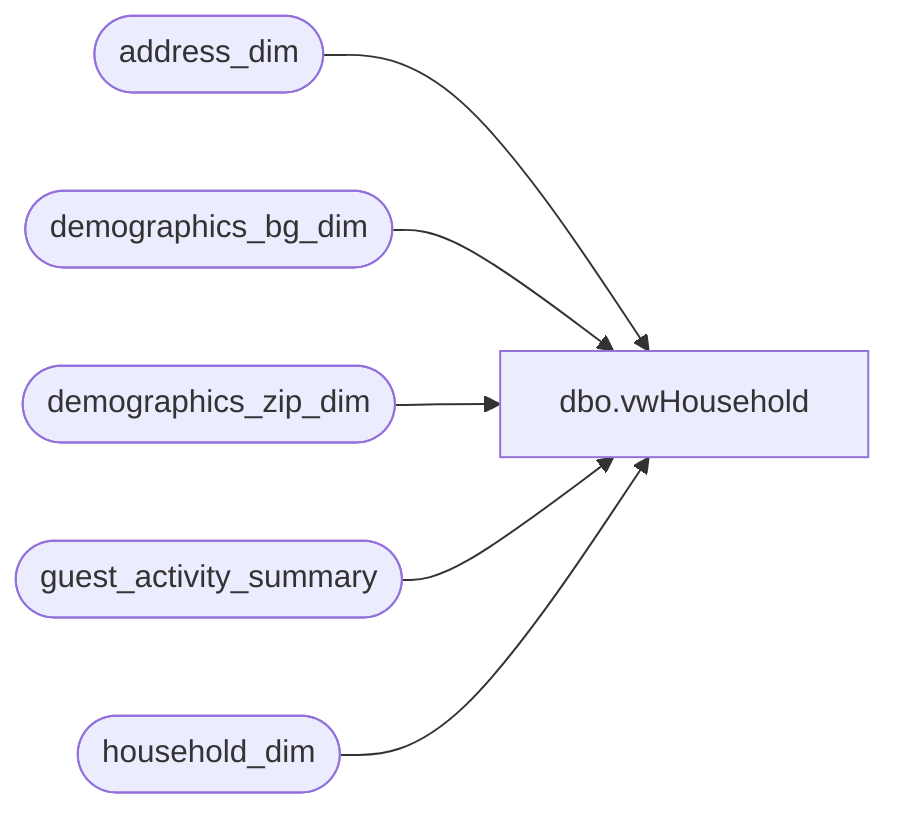

# dbo.vwHousehold

**Database:** dw  
**Server:** papamart  

## Architecture Diagram



## Table Dependencies

| Referenced Table |
|---|
| address_dim |
| demographics_bg_dim |
| demographics_zip_dim |
| guest_activity_summary |
| household_dim |

## View Code

```sql
/*(May need to change to LEFT OUTER JOINs if 
 needing to show Household information
 that doesn't have matching zip code lookup info.)*/
CREATE    VIEW dbo.vwHousehold
--WITH SCHEMABINDING 
AS
SELECT DISTINCT
 hd.household_key
,hd.household_id
,ad.address1
,ad.address2
,ad.city
,ad.state_province
,ad.state_province_name
,ad.postal_code
,ad.postal_plus4 
,ad.vanity_city
,ad.country 
,ad.country_name 
,ad.county 
,ad.latitude 
,ad.longitude 
,hd.household_surname 
,hd.send_mail_y_n 
,ad.Verified_Address
,b.block_group_full 
,b.msa 
,b.demographic_year 
,b.msa_name 
,b.dma 
,b.dma_name 
,b.nielson_county_size 
,b.cur_population 
,b.cur_num_of_households 
,b.prism_cluster 
,b.prizm_cluster_name 
,z.zip_code 
from guest_activity_summary gas
	join household_dim hd on gas.household_key = hd.household_key
	join address_dim ad on gas.current_address_key = ad.address_key
 	join demographics_zip_dim z ON ad.demographics_zip_key = z.demographics_zip_key
 	left join demographics_bg_dim b ON ad.demographics_bg_key = b.block_group_full
```

