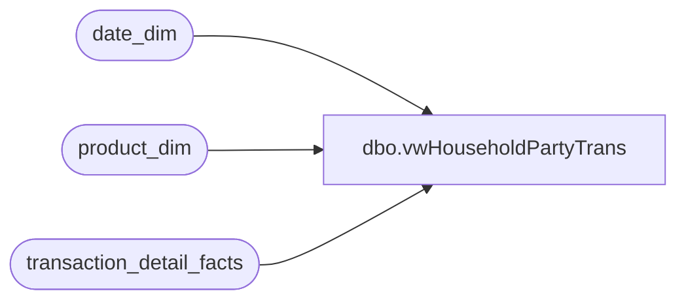

# dbo.vwHouseholdPartyTrans

**Database:** dw  
**Server:** papamart  

## Architecture Diagram



## Table Dependencies

| Referenced Table |
|---|
| date_dim |
| product_dim |
| transaction_detail_facts |

## View Code

```sql
CREATE view vwHouseholdPartyTrans
as
select 
case when plus.dept is null and bear.dept = 'bear' then 'Bare Bear'
	 when plus.dept ='plus' and bear.dept is null then 'Plus Only'
	 when plus.dept ='plus' and bear.dept = 'bear' then 'Bear Plus'
else NULL
end  as 'tran_type'
,tdf.transaction_id,tdf.transaction_line_seq
,tdf.register_num,tdf.store_key
,tdf.date_key,tdf.time_key
,dd.actual_date
from transaction_detail_facts tdf
	join date_dim dd on tdf.date_key = dd.date_key
	join product_dim pd on tdf.product_key = pd.product_key
	left join (
			select 
			 tdf.transaction_id
			,tdf.transaction_line_seq
			,tdf.register_num
			,tdf.store_key
			,tdf.date_key
			,tdf.time_key
			,'plus' as 'dept'
			from transaction_detail_facts tdf
				join date_dim dd on tdf.date_key = dd.date_key
				join product_dim pd on tdf.product_key = pd.product_key
			where pd.department in ('accessories','clothes','footwear','sounds')
			) as plus on tdf.transaction_id = plus.transaction_id
						and tdf.transaction_line_seq=plus.transaction_line_seq
						and tdf.register_num=plus.register_num
						and tdf.store_key=plus.store_key
						and tdf.date_key=plus.date_key
						and tdf.time_key=plus.time_key
	left join (
			select 
			 tdf.transaction_id
			,tdf.transaction_line_seq
			,tdf.register_num
			,tdf.store_key
			,tdf.date_key
			,tdf.time_key
			,'bear' as 'dept'
			from transaction_detail_facts tdf
				join date_dim dd on tdf.date_key = dd.date_key
				join product_dim pd on tdf.product_key = pd.product_key
			where pd.department in ('unstuffed','prestuffed')
			) as bear on tdf.transaction_id = bear.transaction_id
						and tdf.transaction_line_seq=bear.transaction_line_seq
						and tdf.register_num=bear.register_num
						and tdf.store_key=bear.store_key
						and tdf.date_key=bear.date_key
						and tdf.time_key=bear.time_key
where --dd.actual_date = '10/20/03'and
	 tdf.party_y_n = 'y'
	and tdf.transaction_type_key=0 
	and tdf.transaction_line_seq>0
```

