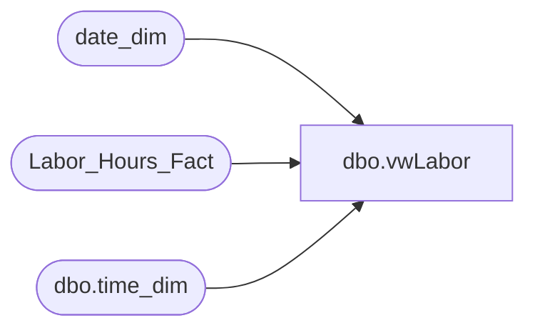

# dbo.vwLabor

**Database:** dw  
**Server:** papamart  

## Architecture Diagram



## Table Dependencies

| Referenced Table |
|---|
| date_dim |
| Labor_Hours_Fact |
| dbo.time_dim |

## View Code

```sql
CREATE view vwLabor as

with TimeDataOne as
(
		SELECT
			time_key,
			CAST(CAST([hour] AS varchar) + ':' + CAST([minute] AS varchar) AS datetime) AS minTime,
			CAST(CAST([hour] AS varchar) + ':' + CAST([minute] + 29 AS varchar) + ':59' AS datetime) AS maxTime,
			0 AS offsetDate
		
		FROM
			dbo.time_dim AS td WITH (NOLOCK)
		WHERE
			([minute] IN (0, 30))
		UNION ALL
		SELECT
			time_key,
			DATEADD(D, 1, CAST(CAST([hour] AS varchar) + ':' + CAST([minute] AS varchar) AS datetime)) AS minTime,
			DATEADD(D, 1, CAST(CAST([hour] AS varchar) + ':' + CAST([minute] + 29 AS varchar) + ':59' AS datetime)) AS maxTime,
			1 AS offsetDate
		FROM
			dbo.time_dim AS td WITH (NOLOCK)
		WHERE
			([minute] IN (0, 30))
),
LaborStageOne as
(
	SELECT
		lhf.store_key,
		lhf.date_key,
		lhf.start_time,
		lhf.end_time
	FROM Labor_Hours_Fact lhf WITH (NOLOCK) 
	join date_dim dd with (nolock) on lhf.date_key = dd.date_key
	where datediff(dd, dd.actual_date, getdate()) <= 60
)
SELECT
	lhf.store_key,
	lhf.date_key + td.offsetDate AS date_key,
	sum(
			CASE
				WHEN td.minTime <= lhf.start_Time AND
				td.maxTime <= lhf.end_Time THEN DATEDIFF(MINUTE, lhf.start_Time, td.maxTime) + 1
				WHEN td.mintime <= lhf.start_Time AND
				td.maxTime > lhf.end_Time THEN DATEDIFF(MINUTE, lhf.start_Time, lhf.end_Time)
				WHEN td.mintime > lhf.start_Time AND
				td.maxTime >= lhf.end_Time THEN DATEDIFF(MINUTE, td.minTime, lhf.end_Time)
				WHEN td.mintime > lhf.start_Time AND
				td.maxTime < lhf.end_Time THEN DATEDIFF(MINUTE, td.minTime, td.maxTime) + 1
				ELSE -99
			END)
		AS minsWorked
FROM LaborStageOne lhf WITH (NOLOCK)
join TimeDataOne td on lhf.start_Time < td.maxTime
		AND lhf.end_Time > td.minTime
join date_dim dd with (nolock) on lhf.date_key + td.offsetDate = dd.date_key 
WHERE lhf.start_Time<> lhf.end_Time
group by lhf.store_key,
	lhf.date_key + td.offsetDate
UNION 
SELECT
	lhf.store_key,
	lhf.date_key + td.offsetDate AS date_key,
	sum(lhf.wrkd_minutes) as minsWorked
FROM
	Labor_Hours_Fact lhf WITH (NOLOCK)
join TimeDataOne td on lhf.start_Time BETWEEN td.minTime AND td.maxTime
join date_dim dd with (nolock) on lhf.date_key + td.offsetDate = dd.date_key 
WHERE 
	lhf.start_Time = lhf.end_Time
group by lhf.store_key,
	lhf.date_key + td.offsetDate
```

