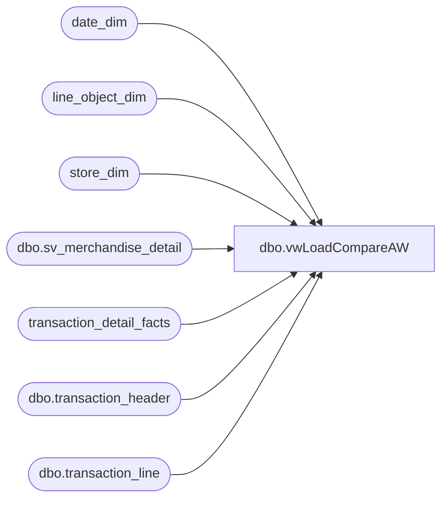

# dbo.vwLoadCompareAW

**Database:** dw  
**Server:** papamart  

## Architecture Diagram



## Table Dependencies

| Referenced Table |
|---|
| date_dim |
| line_object_dim |
| store_dim |
| dbo.sv_merchandise_detail |
| transaction_detail_facts |
| dbo.transaction_header |
| dbo.transaction_line |

## View Code

```sql
CREATE     VIEW [dbo].[vwLoadCompareAW]
as 
/**************************************************************************
*  CREATED BY:  Dan Morgan
*
*  PURPOSE:		To get a current total of Auditworks to compare with the 
*				Informatica load.

*			This is the same logic that is used to populate 
*			auditworks.dbo.tblCompareSummaryAuditwks.  However, cannot rely
*   		on this table due to auditors making changes.
*
*	Name		Date		Change
*	Garyd		08/19/2010	Update server name for SA 5.0.
***************************************************************************/

/*
DECLARE @AWTranDate Datetime

SET @AWTranDate = (select min(aw_date) from OURSBLANC.auditworks.dbo.tblCompareSummaryAuditwks)
*/

select aw.aw_store as 'StoreID'
	,aw.aw_date as 'Date'
	,aw.aw_units
	,l.units as 'dm_units'
	,(aw.aw_sales*-1) as 'aw_sales'	
	,l.sales as 'dm_sales'
	,aw.aw_units - COALESCE (l.units,0) as 'UnitDiff'
	,((aw.aw_units - COALESCE (l.units,0))/aw.aw_units)*100 as 'UnitPctDiff' --unitdiff/actual
	,(aw.aw_sales*-1) - COALESCE (l.sales,0) as 'SalesDiff'
	,(((aw.aw_sales*-1) - COALESCE (l.sales,0))/(aw.aw_sales*-1))*100  as 'SalesPctDiff'
from 
		(
		select a.store_no as 'aw_store', a.transaction_date as 'aw_date', b.Units as 'aw_units', a.Net_Sales as 'aw_sales'
		from 	(
				SELECT 	a.store_no, 
					a.transaction_date, 
					SUM(b.gross_line_amount * b.db_cr_none * b.voiding_reversal_flag) as Net_Sales 
				FROM 	bedrockdb01.auditworks.dbo.transaction_header a, 
					bedrockdb01.auditworks.dbo.transaction_line b 
				WHERE a.transaction_id=b.transaction_id 
				    AND (a.transaction_date Between   CONVERT(char,DATEADD(day,-1,GETDATE()),101) and   CONVERT(char,DATEADD(day,-1,GETDATE()),101)
				    AND a.store_no Between 1 and 990 
				    AND a.transaction_void_flag = 0 
				    AND b.line_void_flag=0 
				    AND b.line_object IN (100,400,404)) 
				GROUP BY a.store_no,a.transaction_date 
				) as a
		left join 
				(
				SELECT 	a.store_no, 
					a.transaction_date, 
					SUM(c.units * c.db_cr_none*-1 * c.voiding_reversal_flag) as Units 
				FROM 	bedrockdb01.auditworks.dbo.transaction_header a, 
					bedrockdb01.auditworks.dbo.transaction_line b, 
					bedrockdb01.auditworks.dbo.sv_merchandise_detail c 
				WHERE 	a.transaction_id=b.transaction_id  
				    AND b.transaction_id=c.transaction_id 
				    AND b.line_id=c.line_id 
				    AND (a.transaction_date Between   CONVERT(char,DATEADD(day,-1,GETDATE()),101) and   CONVERT(char,DATEADD(day,-1,GETDATE()),101)
				    AND a.store_no Between 1 and 990 
				    AND a.transaction_void_flag = 0 
				    AND b.line_void_flag=0 
				    AND b.line_object IN (100,400,404)) 
				GROUP BY a.store_no,a.transaction_date 
				) as b
		on 	a.store_no = b.store_no and
			a.transaction_date = b.transaction_date
		where b.units >0 --DM added 3/11/04, because store 154 come online with 0 units, 0 sales.
		) as aw
 left join 
			(
			select sd.store_id,dd.actual_date, sum(unit_gross_amount) as 'Sales', sum(units) as 'Units' 
			--into #LoadDM
			from transaction_detail_facts tdf
				join store_dim sd on tdf.store_key = sd.store_key
				join date_dim dd on tdf.date_key = dd.date_key
				join line_object_dim lod on tdf.line_object_key = lod.line_object_key
			where dd.actual_date = CONVERT(char,DATEADD(day,-1,GETDATE()),101)--@AWTranDate
				and lod.line_object in (100,400,404)
				and tdf.transaction_line_seq >0
			group by sd.store_id,dd.actual_date
			) as l
	on aw.aw_store = l.store_id 
		and aw.aw_date = l.actual_date
--order by aw.aw_store
```

