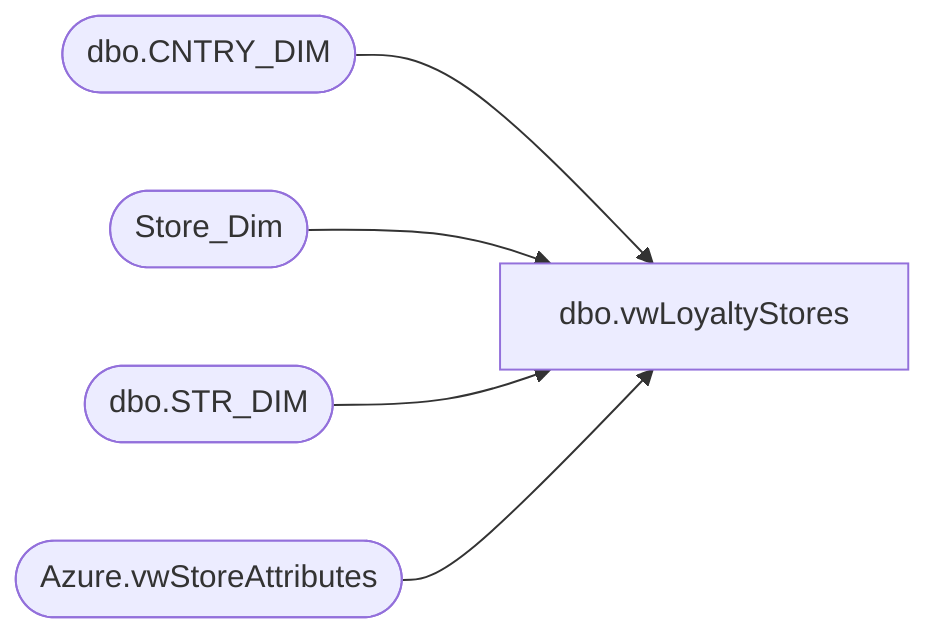

# dbo.vwLoyaltyStores

**Database:** dw  
**Server:** papamart  

## Architecture Diagram



## Table Dependencies

| Referenced Table |
|---|
| dbo.CNTRY_DIM |
| Store_Dim |
| dbo.STR_DIM |
| Azure.vwStoreAttributes |

## View Code

```sql
CREATE VIEW [dbo].[vwLoyaltyStores]  AS


--1 sec
--IF (Object_ID('tempdb..#stores') IS NOT NULL) DROP TABLE #stores
SELECT	 
	right(('0000' + CAST(sd.STR_NUM AS VARCHAR)), 4) AS StoreNumber,
	CAST(dsd.Store_Key AS VARCHAR) AS StoreKey,
	cd.NM_FULL AS CountryNameFull,
	sa.StoreConcept
--into #stores		 
FROM KODIAK.BABWMstrData.dbo.STR_DIM sd
INNER JOIN Store_Dim dsd ON dsd.store_id=sd.STR_NUM
left join KODIAK.BABWMstrData.dbo.CNTRY_DIM cd ON cd.CNTRY_ID=sd.CNTRY_ID
left join [Azure].[vwStoreAttributes] sa on right(('0000' + CAST(sd.STR_NUM AS VARCHAR)), 4) = sa.storenumber
WHERE sd.CMPNY_ID=1 AND sd.STR_ID > 0
--AND (dsd.closing_date>=DATEADD(day, -7, DATEADD(year, -2, DATEADD(yy, DATEDIFF(yy, 0, GETDATE()), 0)))
	--OR dsd.closing_date IS NULL)
AND sd.STR_NUM not between 501 and 505  -- Labs
AND sd.STR_NUM NOT BETWEEN 9001 AND 9100 -- Test Stores
```

