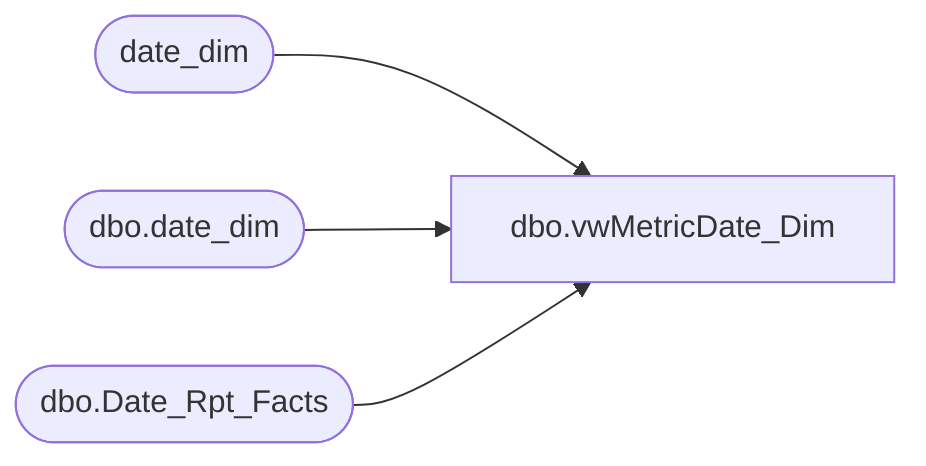

# dbo.vwMetricDate_Dim

**Database:** dw  
**Server:** papamart  

## Architecture Diagram



## Table Dependencies

| Referenced Table |
|---|
| date_dim |
| dbo.date_dim |
| dbo.Date_Rpt_Facts |

## View Code

```sql
CREATE         VIEW [dbo].[vwMetricDate_Dim]
AS
SELECT 	--drf.date_key_LY,
	--drf.date_key_TY,
	getdate() as currentDateTime,
	(select max(date_key) 
	 from date_dim 
	 where actual_date >= dateadd(d,-1,getdate()) and actual_date <= getdate()
	 ) as current_date_key,
	(select max(drf.date_key_LY) 
	 from date_dim d
	 join dbo.Date_Rpt_Facts drf on d.date_key = drf.date_key_TY 
	 where d.actual_date >= dateadd(d,-1,getdate()) and d.actual_date <= getdate()
	 ) as current_date_key_LY,
	(select week_id 
	 from date_dim 
	 where actual_date >= dateadd(d,-1,getdate()) and actual_date <= getdate()
	 ) as current_week_id,
	(select week_id-1 
	 from date_dim 
	 where actual_date >= dateadd(d,-1,getdate()) and actual_date <= getdate()
	 ) as previous_week_id,
	(select period_id 
	 from date_dim 
	 where actual_date >= dateadd(d,-1,getdate()) and actual_date <= getdate()
	 ) as current_period_id,
	(select quarter_id 
	 from date_dim 
	 where actual_date >= dateadd(d,-1,getdate()) and actual_date <= getdate()
	 ) as current_quarter_id,
	(select max(period_id) from date_dim where week_id = 
		(select week_id-1 
		 from date_dim 
		 where actual_date >= dateadd(d,-1,getdate()) and actual_date <= getdate() 
		)
		) as previous_week_period_id,
	(select max(quarter_id) from date_dim where week_id = 
		(select week_id-1 
		 from date_dim 
		 where actual_date >= dateadd(d,-1,getdate()) and actual_date <= getdate() 
		)
		) as previous_week_quarter_id,
	d.*


from dbo.date_dim d
where actual_date is not null
--join dbo.Date_Rpt_Facts drf on d.date_key = drf.date_key_TY 

--where date_key IN (3176,2812)
--WHERE fiscal_year = 2005
```

