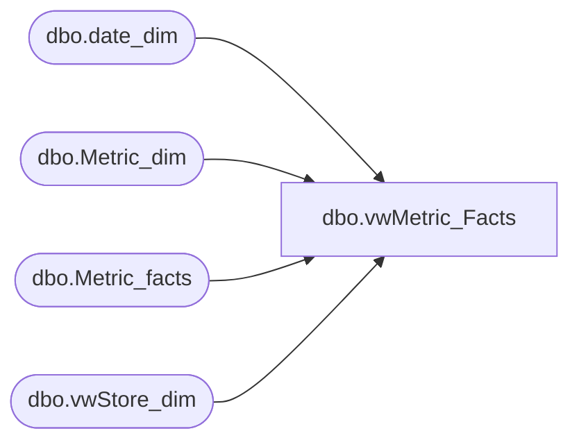

# dbo.vwMetric_Facts

**Database:** dw  
**Server:** papamart  

## Architecture Diagram



## Table Dependencies

| Referenced Table |
|---|
| dbo.date_dim |
| dbo.Metric_dim |
| dbo.Metric_facts |
| dbo.vwStore_dim |

## View Code

```sql
CREATE                VIEW dbo.vwMetric_Facts
--WITH SCHEMABINDING    
AS
SELECT  mf.amount 
	,md.[name]
	,dd.actual_date
	,dd.fiscal_week
	,dd.fiscal_period
	,dd.fiscal_quarter
	,dd.fiscal_year
	,sd.store_id
	,sd.store_name
	,storeNameNum
	,bearea
	,bearritory
	,region
	,country
	,opening_date
	,closing_date
	,CASE WHEN dd.week_id < sd.comp_week_id THEN 'N'
	      WHEN dd.week_id >= sd.comp_week_id THEN 'Y' END as CompStatus 
FROM dbo.Metric_facts mf
JOIN dbo.Metric_dim md ON mf.metric_dim_key = md.metric_dim_key
JOIN dbo.vwStore_dim sd ON mf.store_key = sd.store_key
JOIN dbo.date_dim dd ON mf.date_key = dd.date_key
```

