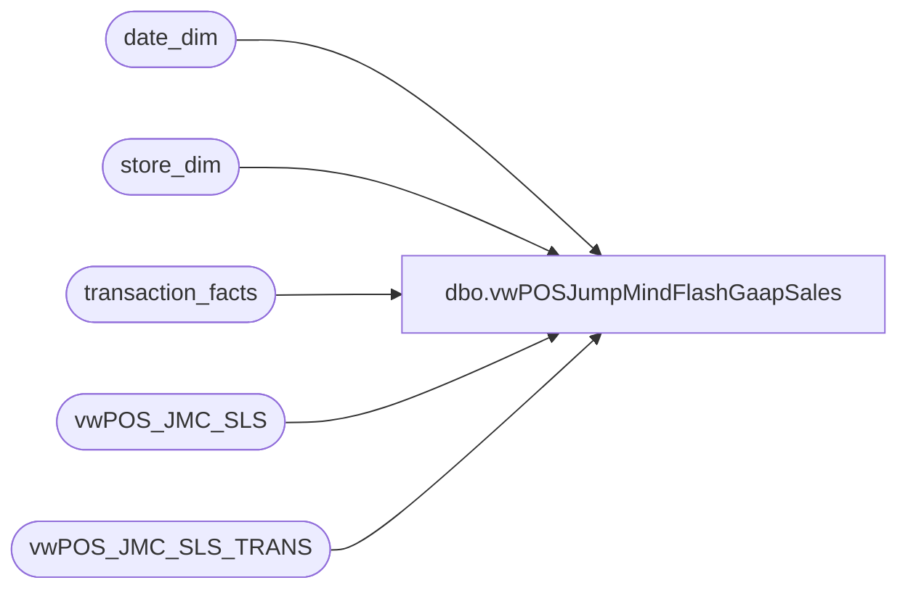

# dbo.vwPOSJumpMindFlashGaapSales

**Database:** dw  
**Server:** papamart  

## Architecture Diagram



## Table Dependencies

| Referenced Table |
|---|
| date_dim |
| store_dim |
| transaction_facts |
| vwPOS_JMC_SLS |
| vwPOS_JMC_SLS_TRANS |

## View Code

```sql
create view vwPOSJumpMindFlashGaapSales
as
select 
	right(concat(cast('0000' as varchar), cast(h.StoreID as varchar)),4) as location_code,
	sd.store_name as location_name,
	h.trans_nbr as rtl_trn_id,
	h.StoreID as store_no,
	h.RegisterNumber as workstation_no,
	h.trans_nbr as rtl_trn_no,
	h.Employee as operator_no,
	h.trans_type as rtl_trn_type_code,
	d.item_id as item_no,
	--d.item_name,
	0 as void_flg,
	d.create_time as TransactionDateTime,
	d.actual_unit_price as net_sales,
	d.create_time as entry_date,
	'JumpMind' as source,
	NULL as WebOrderNumber,
	tf.transaction_id as TransactionID,
	cast(d.quantity as int) as net_units,
	cast(d.quantity as int) as tran_units
from vwPOS_JMC_SLS h
join vwPOS_JMC_SLS_TRANS d
	on h.StoreID=d.StoreID
	and h.BusinessDate=d.BusinessDate
	and h.RegisterNumber=d.RegisterNumber
	and h.trans_nbr=d.sequence_number
join date_dim dd on cast(d.create_time as date)=cast(dd.actual_date as date)
join store_dim sd on h.StoreID=sd.store_id 
left join transaction_facts tf on 
	dd.date_key=tf.date_key
	and	sd.store_key=tf.store_key
	and h.RegisterNumber=tf.register_no
	and h.trans_nbr=tf.transaction_no
where 1=1
and d.item_id<>'999999990'
```

