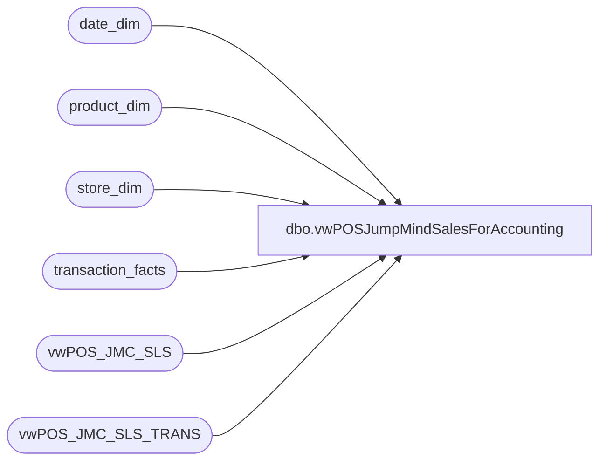

# dbo.vwPOSJumpMindSalesForAccounting

**Database:** dw  
**Server:** papamart  

## Architecture Diagram



## Table Dependencies

| Referenced Table |
|---|
| date_dim |
| product_dim |
| store_dim |
| transaction_facts |
| vwPOS_JMC_SLS |
| vwPOS_JMC_SLS_TRANS |

## View Code

```sql
CREATE view [dbo].[vwPOSJumpMindSalesForAccounting]

as

with
TransactionFlags as
	(
		select style_code 
		from product_dim  
		where department_code='R-B-D-47'
		group by style_code
	),
Prep as
	(
		select 
			right(concat(cast('0000' as varchar), cast(h.StoreID as varchar)),4) as location_code,
			sd.store_name as location_name,
			h.trans_nbr as rtl_trn_id,
			h.StoreID as store_no,
			h.RegisterNumber as workstation_no,
			h.trans_nbr as rtl_trn_no,
			h.Employee as operator_no,
			h.trans_type as rtl_trn_type_code,
			0 as void_flg,
			min(d.create_time) as TransactionDateTime,
			sum(d.extended_discounted_amount) as net_sales,
--			sum((d.actual_unit_price * cast((abs (d.quantity)) as int))) as net_sales,
			sum(d.tax_amount) as tax_amount,
			min(d.create_time) as entry_date,
			'JumpMind' as source,
			NULL as WebOrderNumber,
			tf.transaction_id as TransactionID,
			sum(cast(d.quantity as int)) as net_units,
			sum(cast(d.quantity as int)) as tran_units
		from vwPOS_JMC_SLS h
		join vwPOS_JMC_SLS_TRANS d
			on --h.StoreID=d.StoreID
				h.device_id=d.device_id
			and h.BusinessDate=d.BusinessDate
			--and h.RegisterNumber=d.RegisterNumber
			and h.trans_nbr=d.sequence_number
		join date_dim dd on cast(d.create_time as date)=cast(dd.actual_date as date)
		join store_dim sd on h.StoreID=sd.store_id 
		left join transaction_facts tf on 
			dd.date_key=tf.date_key
			and	sd.store_key=tf.store_key
			and h.RegisterNumber=tf.register_no
			and h.trans_nbr=tf.transaction_no
		where 1=1
		and h.StoreID not in (13,2013)
		and d.voided = 0 
		--and d.item_returned=0
		and h.trans_type in ('SALE', 'RETURN')--, 'REDEEM') ---redeem is a gift card cash out -- >>>
		and d.line_item_type ='STORE_SALE'
		and d.item_type in ('STOCK')--, 'DONATION', 'GIFTCARD')
		and h.trans_status='COMPLETED' 
		and d.item_id not in (select style_code from TransactionFlags)
		group by 
			right(concat(cast('0000' as varchar), cast(h.StoreID as varchar)),4),
			sd.store_name,
			h.trans_nbr,
			h.StoreID,
			h.RegisterNumber,
			h.trans_nbr,
			h.Employee,
			h.trans_type,
			tf.transaction_id
	)
select 
	location_code,	
	location_name,	
	rtl_trn_id,	
	store_no,	
	workstation_no,	
	rtl_trn_no,	
	operator_no,	
	cast (rtl_trn_type_code as varchar (50)) as rtl_trn_type_code ,	
	void_flg,	
	TransactionDateTime,	
	--sum(net_sales) net_sales,	-- Replaced on 11/30/2023
		case when left(location_code,1) = 2
		then (sum(net_sales) - Sum(tax_amount))
		else sum(net_sales) 
	end as net_sales, -- If it's UK store we need to deduct the VAT Tax 
	entry_date,	
	source,	
	WebOrderNumber,	
	TransactionID,	
	sum(net_units) net_units,	
	sum(tran_units) tran_units
from Prep 
group by 
	location_code,	
	location_name,	
	rtl_trn_id,	
	store_no,	
	workstation_no,	
	rtl_trn_no,	
	operator_no,	
	cast (rtl_trn_type_code as varchar (50)) ,	
	void_flg,	
	TransactionDateTime,
	entry_date,	
	source,	
	WebOrderNumber,	
	TransactionID
```

