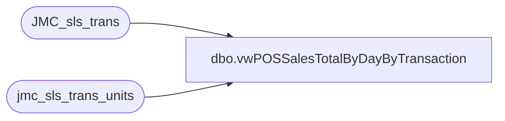

# dbo.vwPOSSalesTotalByDayByTransaction

**Database:** dw  
**Server:** papamart  

## Architecture Diagram



## Table Dependencies

| Referenced Table |
|---|
| JMC_sls_trans |
| jmc_sls_trans_units |

## View Code

```sql
CREATE view [dbo].[vwPOSSalesTotalByDayByTransaction]


as

with 
Units as
	(
		select 
			--cast(u.business_date as date) BusinessDate,
			cast (s.create_time as date) as BusinessDate, -- Replaced above on 8/14/2023
			u.business_unit_id as StoreNumber,
			case 
				when left(u.business_unit_id,1)='2 '
					then u.business_unit_id
				else cast(right((cast('0000' as varchar) + cast(right(u.business_unit_id,3) as varchar)),4) as int)
			end as StoreID,
			cast(right(u.device_id,3) as int) as RegisterNumber,
			u.trans_nbr TransactionNumber,
			sum(line_item_Count) Units
		from jmc_sls_trans_units u with (nolock)
		join JMC_sls_trans s with (nolock) on u.business_unit_id =s.business_unit_id  and u.device_id=s.device_id and u.trans_nbr=s.trans_nbr and u.business_date=s.business_date -- Added Join on 8/14/2023
		group by 
			--cast(u.business_date as date) ,
			cast (s.create_time as date) , -- Replaced above on 8/14/2023
			u.business_unit_id , 
			right(u.device_id,3),
			u.trans_nbr
	),
Sales as
	(
		select 
			--cast(s.business_date as date) as BusinessDate,
			cast (s.create_time as date) as BusinessDate, -- Replaced above on 8/14/2023
			case 
				when left(s.business_unit_id,1)='2 '
					then s.business_unit_id
				else cast(right((cast('0000' as varchar) + cast(right(s.business_unit_id,3) as varchar)),4) as int)
			end as StoreID,
			cast(right(s.device_id,2) as int) as RegisterNumber,
			s.trans_nbr TransactionNumber,
			sum(s.total) Sales
		from JMC_sls_trans s with (nolock) 
		where 
			(
				--cast(business_date as date) >='2023-04-12' --first day of new POs
				cast(s.create_time as date) >='2023-04-12' --first day of new POs -- -- Replaced above on 8/14/2023
				--and datediff(dd, business_date, getdate())<=7
			)
		and 
			case 
				when left(s.business_unit_id,1)='2 '
					then s.business_unit_id
				else cast(right((cast('0000' as varchar) + cast(right(s.business_unit_id,3) as varchar)),4) as int)
			end not in ('13', '2013') ---excluding endless aisle??
		group by
			--cast(s.business_date as date),
			cast (s.create_time as date) , -- Replaced above on 8/14/2023
			business_unit_id,
			s.device_id,
			s.trans_nbr
	)
select 
	s.StoreID,
	s.BusinessDate,
	s.RegisterNumber,
	s.TransactionNumber,
	sum(s.Sales) Sales,
	sum(u.Units) Units
from Sales s
join Units u on 
	s.BusinessDate=u.BusinessDate
	and s.StoreID=u.StoreID
	and s.RegisterNumber=u.RegisterNumber
	and s.TransactionNumber=u.TransactionNumber
group by 
	s.StoreID,
	s.BusinessDate,
	s.RegisterNumber,
	s.TransactionNumber
```

