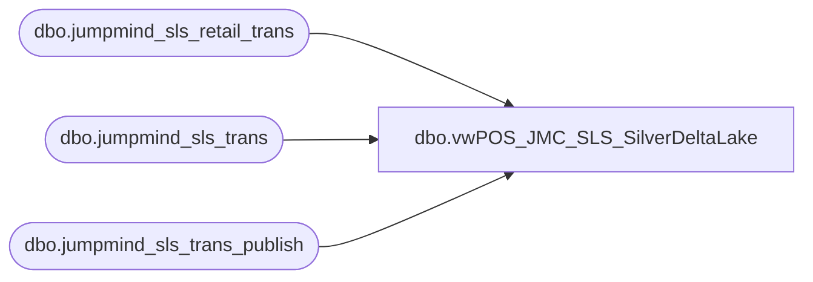

# dbo.vwPOS_JMC_SLS_SilverDeltaLake

**Database:** dw  
**Server:** papamart  

## Architecture Diagram



## Table Dependencies

| Referenced Table |
|---|
| dbo.jumpmind_sls_retail_trans |
| dbo.jumpmind_sls_trans |
| dbo.jumpmind_sls_trans_publish |

## View Code

```sql
create view vwPOS_JMC_SLS_SilverDeltaLake
as 

With 
JM as 
	(
		select 
			cast(t.business_date as date) as BusinessDate, t.business_unit_id, t.username, t.device_id , t.sequence_number as trans_nbr, rt.customer_id, rt.loyalty_card_number,
		t.trans_type, stp.trans_status, sum(rt.total) as total, sum(rt.subtotal) as subtotal, sum(rt.tax_total) as tax_total, sum(rt.discount_total) as discount_total
		,t.create_time, t.last_update_time
		from SilverDeltaLake.SilverDeltaLake.dbo.jumpmind_sls_trans t
		inner join SilverDeltaLake.SilverDeltaLake.dbo.jumpmind_sls_retail_trans rt on rt.device_id = t.device_id and rt.business_date = t.business_date and rt.sequence_number = t.sequence_number
		inner join  SilverDeltaLake.SilverDeltaLake.dbo.jumpmind_sls_trans_publish  stp on stp.device_id = t.device_id and stp.business_date = t.business_date and stp.sequence_number = t.sequence_number
		where 1=1
		and  stp.trans_status = 'COMPLETED'
		and t.business_date <> ''
		and t.business_date is not null 
		and cast(t.create_time as date) >= cast(getdate()-1 as date)
		group by t.business_date, t.business_unit_id,  t.username, t.device_id, t.sequence_number , rt.customer_id , rt.loyalty_card_number, t.trans_type, stp.trans_status, t.create_time, t.last_update_time
	)
select 
	cast(BusinessDate as date) as BusinessDate,
	--cast (create_time as date) as BusinessDate,
	case 
		when left(business_unit_id,1)='2'
			then business_unit_id
		else cast(right((cast('0000' as varchar) + cast(right(business_unit_id,3) as varchar)),4) as int)
	end as StoreID,
	cast(right(device_id,3) as int) as RegisterNumber,
	trans_nbr,
	total,
	trans_type,
	trans_status,
	loyalty_card_number,
	customer_id,
	username as Employee
from JM
where 1=1
	and isnumeric(right(device_id,2))=1

;
```

