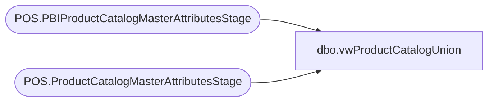

# dbo.vwProductCatalogUnion

**Database:** dw  
**Server:** papamart  

## Architecture Diagram



## Table Dependencies

| Referenced Table |
|---|
| POS.PBIProductCatalogMasterAttributesStage |
| POS.ProductCatalogMasterAttributesStage |

## View Code

```sql
create view vwProductCatalogUnion 

as

select *
from [stl-ssis-p-01].IntegrationStaging.POS.ProductCatalogMasterAttributesStage
UNION
select *
from [stl-ssis-p-01].IntegrationStaging.POS.PBIProductCatalogMasterAttributesStage
```

