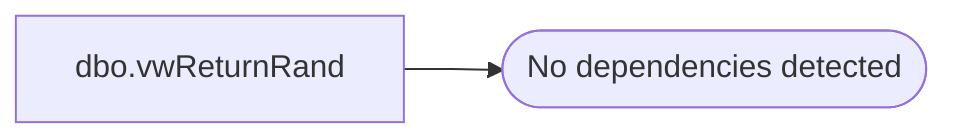

# dbo.vwReturnRand

**Database:** dw  
**Server:** papamart  

## Architecture Diagram



## Table Dependencies

_No table dependencies detected._

## View Code

```sql
CREATE VIEW dbo.vwReturnRand
WITH SCHEMABINDING
AS
SELECT     RAND() AS r
```

