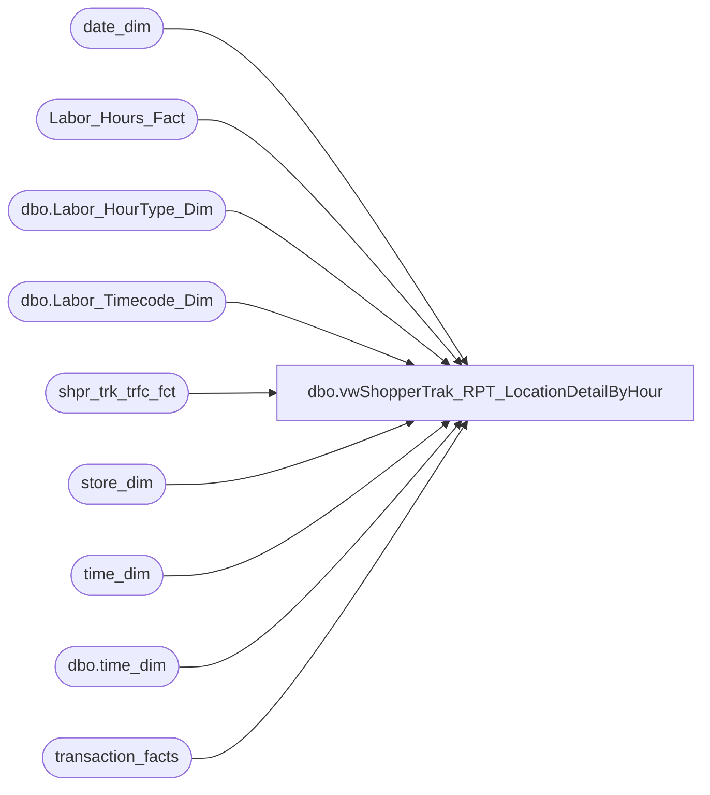

# dbo.vwShopperTrak_RPT_LocationDetailByHour

**Database:** dw  
**Server:** papamart  

## Architecture Diagram



## Table Dependencies

| Referenced Table |
|---|
| date_dim |
| Labor_Hours_Fact |
| dbo.Labor_HourType_Dim |
| dbo.Labor_Timecode_Dim |
| shpr_trk_trfc_fct |
| store_dim |
| time_dim |
| dbo.time_dim |
| transaction_facts |

## View Code

```sql
CREATE VIEW vwShopperTrak_RPT_LocationDetailByHour
AS
SELECT d.date_key
      ,traffic.hour
      ,d.actual_date
      ,s.store_id
      ,datename(dw, d.actual_date) + ', ' + datename(m, d.actual_date) + ' ' + cast(datepart(dd, d.actual_date) as varchar) [Day]
	 ,case 
	   when traffic.hour > 12 then 
		  cast(traffic.hour - 12 as varchar(2)) + ':00 PM - ' + cast(traffic.hour -12 as varchar(2)) + ':59 PM'
	   else
		  cast(traffic.hour as varchar(2)) + ':00 AM - ' + cast(traffic.hour as varchar(2)) + ':59 AM'
	  end [Time]
	 ,ISNULL(traffic.exits, 0) [Traffic]
	 ,cast(ISNULL(cast(traffic.exits as numeric)/ cast(sales.transactions as numeric), 0) as numeric (9,2)) [Conv %]
	 ,ISNULL(sales.transactions, 0) [Trans]
	 ,ISNULL(sales.sales, 0) [Sales]
	 ,cast(ISNULL(sales.sales / sales.transactions, 0) as numeric(9,2)) [Avg. Trans. Size]
	 ,cast(ISNULL(sales.sales / traffic.exits, 0) as numeric(9,2)) [Sales / Shopper]
	 ,ISNULL(labor.ActualLaborMinutes, 0) ActualLaborMinutes
	 ,ISNULL(cast(labor.ActualLaborHours as numeric(9, 2)), 0) ActualLaborHours
	 ,ISNULL(cast(labor.RoundedLaborHours as numeric(9, 2)), 0) RoundedLaborHours
	 ,ISNULL(labor.LaborHeadCount, 0) LaborHeadCount
	 ,CASE 
	   WHEN labor.RoundedLaborHours = 0 
		  THEN 0
	   ELSE
		  ISNULL(cast(traffic.exits / labor.RoundedLaborHours as numeric(9,2)), 0) 
	  END STAR
  FROM (
    select stf.dt_key date_key
		,t.hour hour
		,stf.str_key store_key
	     ,sum(stf.enters) enters
	     ,sum(stf.exits)  exits
      from shpr_trk_trfc_fct stf with (nolock)
     inner join time_dim t with (nolock)
        on t.time_key = stf.tm_key
     where shpr_trk_org_id not like '4%'
	group by stf.dt_key, t.hour, stf.str_key) traffic
  LEFT JOIN ( 
    select date_key
		,hour
		,store_key
		,count(distinct transaction_id) transactions
	     ,sum(GAAP_Sales_Amount) sales
      from transaction_facts tf with (nolock)
     inner join time_dim t with (nolock)
        on t.time_key = tf.time_key
	group by date_key, hour, store_key) sales
    ON sales.date_key = traffic.date_key
   AND sales.hour = traffic.hour
   AND sales.store_key = traffic.store_key
 LEFT JOIN ( 
    SELECT wb.date_key + tme.offsetDate AS date_key
          ,tme.hour
          ,wb.store_key
          ,SUM(CASE
                  WHEN tme.minTime <= wb.start_time AND tme.maxTime <= wb.end_time THEN
                        datediff(MINUTE, wb.start_time, tme.maxTime) + 1
                  WHEN tme.mintime <= wb.start_time AND tme.maxTime > wb.end_time THEN
                        datediff(MINUTE, wb.start_time, wb.end_time)
                  WHEN tme.mintime > wb.start_time AND tme.maxTime >= wb.end_time THEN
                        datediff(MINUTE, tme.minTime, wb.end_time)
                  WHEN tme.mintime > wb.start_time AND tme.maxTime < wb.end_time THEN
                        datediff(MINUTE, tme.minTime, tme.maxTime) + 1
                  ELSE
                        0
                END) AS ActualLaborMinutes
		 ,SUM(CASE
                  WHEN tme.minTime <= wb.start_time AND tme.maxTime <= wb.end_time THEN
                        datediff(MINUTE, wb.start_time, tme.maxTime) + 1
                  WHEN tme.mintime <= wb.start_time AND tme.maxTime > wb.end_time THEN
                        datediff(MINUTE, wb.start_time, wb.end_time)
                  WHEN tme.mintime > wb.start_time AND tme.maxTime >= wb.end_time THEN
                        datediff(MINUTE, tme.minTime, wb.end_time)
                  WHEN tme.mintime > wb.start_time AND tme.maxTime < wb.end_time THEN
                        datediff(MINUTE, tme.minTime, tme.maxTime) + 1
                  ELSE
                        0
			  END) / cast(60 as numeric) AS ActualLaborHours
		 ,SUM(CASE WHEN (CASE
                  WHEN tme.minTime <= wb.start_time AND tme.maxTime <= wb.end_time THEN
                        datediff(MINUTE, wb.start_time, tme.maxTime) + 1
                  WHEN tme.mintime <= wb.start_time AND tme.maxTime > wb.end_time THEN
                        datediff(MINUTE, wb.start_time, wb.end_time)
                  WHEN tme.mintime > wb.start_time AND tme.maxTime >= wb.end_time THEN
                        datediff(MINUTE, tme.minTime, wb.end_time)
                  WHEN tme.mintime > wb.start_time AND tme.maxTime < wb.end_time THEN
                        datediff(MINUTE, tme.minTime, tme.maxTime) + 1
                  ELSE
                        0
			  END) > 15 THEN 60 ELSE 0 END) / cast(60 as numeric) AS RoundedLaborHours
           ,count(distinct emp_key) AS LaborHeadCount 
    FROM Labor_Hours_Fact wb WITH (NOLOCK)
   INNER JOIN (
            SELECT time_key, hour
                  , cast(cast([hour] AS VARCHAR) + ':' + cast([minute] AS VARCHAR) AS DATETIME) AS minTime
                  , cast(cast([hour] AS VARCHAR) + ':' + cast([minute] + 59 AS VARCHAR) + ':59' AS DATETIME) AS maxTime
                  , 0 AS offsetDate
            FROM
                  dbo.time_dim AS td WITH (NOLOCK)
            WHERE
                  ([minute] IN (0))
            UNION ALL
            SELECT time_key, hour
                  , dateadd(D, 1, cast(cast([hour] AS VARCHAR) + ':' + cast([minute] AS VARCHAR) AS DATETIME)) AS minTime
                  , dateadd(D, 1, cast(cast([hour] AS VARCHAR) + ':' + cast([minute] + 59 AS VARCHAR) + ':59' AS DATETIME)) AS maxTime
                  , 1 AS offsetDate
            FROM
                  dbo.time_dim AS td WITH (NOLOCK)
            WHERE
                  ([minute] IN (0))) AS tme
          ON wb.start_time < tme.maxTime AND wb.end_time > tme.minTime
    INNER JOIN dbo.Labor_Timecode_Dim ltd with (nolock)
       ON ltd.timeCode_key = wb.timeCode_key
      AND isWork = 1
    INNER JOIN dbo.Labor_HourType_Dim lhtd with (nolock)
       ON lhtd.HourType_key = wb.HourType_key
      AND isPaid = 1
    GROUP BY wb.date_key + tme.offsetDate, tme.hour, wb.store_key) labor
    ON traffic.date_key = labor.date_key
   AND traffic.store_key = labor.store_key
 INNER JOIN date_dim d with (nolock)
    ON traffic.date_key = d.date_key
 INNER JOIN store_dim s with (nolock)
    ON traffic.store_key = s.store_key
 WHERE traffic.exits > 0
   AND traffic.hour = labor.hour
```

