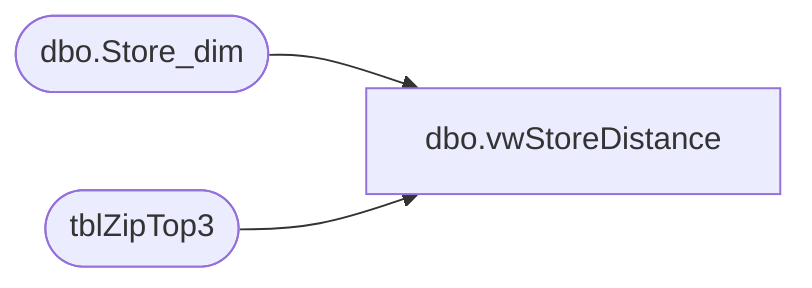

# dbo.vwStoreDistance

**Database:** dw  
**Server:** papamart  

## Architecture Diagram



## Table Dependencies

| Referenced Table |
|---|
| dbo.Store_dim |
| tblZipTop3 |

## View Code

```sql
CREATE VIEW [dbo].[vwStoreDistance]
AS
SELECT a.sZip postal_code, b.iStore store_id, a.NearestStore_Distance, b.store_key 
FROM
(
	SELECT z.sZip, MIN(CAST(z.distance AS INT)) NearestStore_Distance
	FROM tblZipTop3 z
	GROUP BY z.sZip
)a
INNER JOIN 
(
	SELECT z.sZip, z.iStore, CAST(z.distance AS INT) distance, s.store_key
	FROM tblZipTop3 z
	INNER JOIN dbo.Store_dim s ON z.iStore = s.store_id
) b on a.sZip = b.sZip AND a.NearestStore_Distance = b.distance
```

