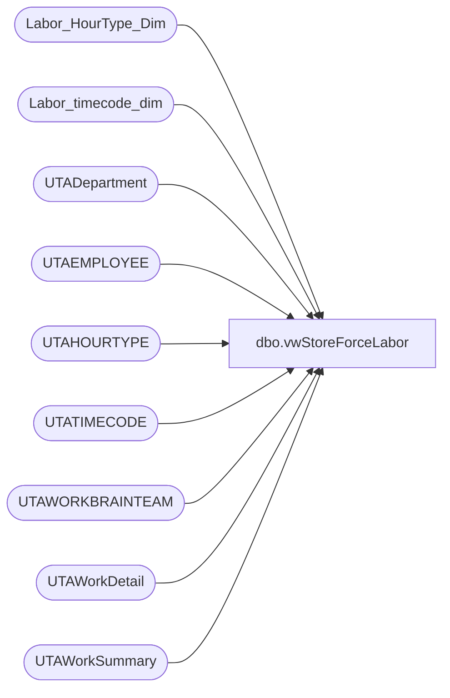

# dbo.vwStoreForceLabor

**Database:** dw  
**Server:** papamart  

## Architecture Diagram



## Table Dependencies

| Referenced Table |
|---|
| Labor_HourType_Dim |
| Labor_timecode_dim |
| UTADepartment |
| UTAEMPLOYEE |
| UTAHOURTYPE |
| UTATIMECODE |
| UTAWORKBRAINTEAM |
| UTAWorkDetail |
| UTAWorkSummary |

## View Code

```sql
CREATE View [vwStoreForceLabor]
AS
with stagedata 
	as(
	SELECT
		E.EMP_NAME AS "EmployeeNumber",
		case --changing to use department, as this appears to be where they actually clocked the data
			when left(d.dept_NAME,1) = '2'
				then cast(LEFT(d.dept_NAME, 4) as int) 
				else cast(right(LEFT(d.dept_NAME, 4),3) as int)
		end as "StoreCode",
		convert(varchar, wd.Wrkd_Work_Date, 103) as "Date",
		concat(right(concat('00', datepart(hh, wd.Wrkd_Start_Time)),2),':',right(concat('00', datepart(mi, wd.Wrkd_Start_Time)),2)
        ) as TimeClockedIn,
    concat
        (right(concat('00', datepart(hh, wd.Wrkd_End_Time)),2),':',right(concat('00', datepart(mi, wd.Wrkd_End_Time)),2)
        ) as TimeClockedOut,
		cast(wd.Wrkd_Work_Date as Date) as WorkDate
		
	FROM
		UTAWorkDetail wd with (nolock)
		JOIN UTAWorkSummary ws 
			ON wd.WRKS_ID = ws.WRKS_ID
		JOIN UTAEMPLOYEE e with (nolock)
			ON ws.EMP_ID = e.EMP_ID
		--JOIN UTAJOB j 
		--	ON wd.JOB_ID = j.JOB_ID
		--JOIN UTACALCGROUP cg
		--	ON e.CALCGRP_ID = cg.CALCGRP_ID
		JOIN UTAWORKBRAINTEAM wt with (nolock)
			ON wd.WBT_ID = wt.WBT_ID
		JOIN UTATIMECODE tc with (nolock)
			ON wd.TCODE_ID = tc.TCODE_ID
		JOIN Labor_timecode_dim ltd with (nolock)
			ON tc.TCODE_NAME = ltd.wb_cd and ltd.isWork = 1
		JOIN UTAHOURTYPE ht with (nolock)
			ON wd.HTYPE_ID = ht.HTYPE_ID
		JOIN Labor_HourType_Dim lhd with (nolock)
			ON Htype_Name = lhd.wb_cd and lhd.isPaid = 1
		join UTADepartment d  with (nolock)
			on wd.dept_id = d.dept_id
	WHERE
		ht.HTYPE_NAME != 'UNPAID'
		and isnumeric(d.dept_name) = 1
		and e.Emp_Fullname not like '%Support%'
		and e.Emp_Fullname not like '%test%'

	GROUP BY	
		e.EMP_NAME,
		case --changing to use department, as this appears to be where they actually clocked the data
					when left(d.dept_NAME,1) = '2'
						then cast(LEFT(d.dept_NAME, 4) as int) 
						else cast(right(LEFT(d.dept_NAME, 4),3) as int)
		end,
		convert(varchar, wd.Wrkd_Work_Date, 103),
		cast(wd.Wrkd_Work_Date as Date),
		concat(right(concat('00', datepart(hh, wd.Wrkd_Start_Time)),2),':',right(concat('00', datepart(mi, wd.Wrkd_Start_Time)),2)),
		concat(right(concat('00', datepart(hh, wd.Wrkd_End_Time)),2),':',right(concat('00', datepart(mi, wd.Wrkd_End_Time)),2))
		)

		select 
			case
				when cast(StoreCode as int) < 2000
					then 1000 + cast(StoreCode as int)
				else cast(StoreCode as int)
			end
			as StoreCode,
			EmployeeNumber,
			Date,
			TimeClockedIn,
			TimeClockedOut,
			WorkDate
		From stagedata 
	
	;
```

