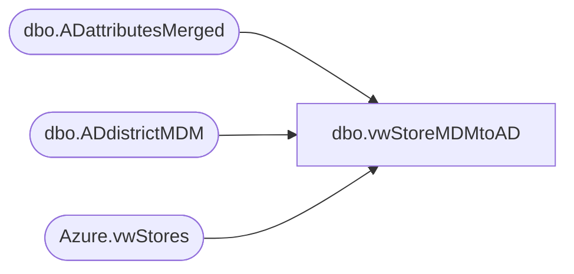

# dbo.vwStoreMDMtoAD

**Database:** dw  
**Server:** papamart  

## Architecture Diagram



## Table Dependencies

| Referenced Table |
|---|
| dbo.ADattributesMerged |
| dbo.ADdistrictMDM |
| Azure.vwStores |

## View Code

```sql
--select * from [dbo].[vwStoreMDMtoAD]


CREATE VIEW [dbo].[vwStoreMDMtoAD]
AS


with 
MDMstores as 
(
select storeNumber, StoreID,
case when StoreID = 578 then StoreNameFull + ' Mall' else StoreNameFull end as StoreNameFull, 
case when StoreID = 578 then StoreNameAbbr + ' Mall' else StoreNameAbbr end as StoreNameAbbr,
District
from [Azure].[vwStores] where CountryNameAbbr in ('US','UK','IE','CA') and StoreNumber not in ('0013','2013','470','0470','9925','9999',
'0920','0950','0960','0965','0980','1000','1001','1971','1972','2970','2991') 
--union
--select '0638' as storeNumber, '638' as StoreID, 'Teddybear Shopping Center' as StoreNameFull, 'Teddybear Center' as StoreNameAbbr, 'MD/DC' as District
),
ADstores as 
(
select AdsPath, LastName, Description, PhysicalDeliveryOfficeName,  UserPrincipalName, SamAccountName, EmployeeADGroup, EmployeeId  from DW.dbo.ADattributesMerged 
	where 
	(AdsPath like '%OU=Stores 000-099%' or AdsPath like '%OU=Stores 100-199%' or AdsPath like '%OU=Stores 200-299%' or AdsPath like '%OU=Stores 300-399%' or AdsPath like '%OU=Stores 400-499%' 
	 or AdsPath like '%OU=Stores 400-499%' or AdsPath like '%OU=Stores 500-599%' or AdsPath like '%OU=Stores 600-699%' or AdsPath like '%OU=Stores 800-899%'
	 or AdsPath like '%OU=Closed%' or AdsPath like '%OU=Stores,OU=BABWUK%') 
	and AdsPath not like '%OU=CWM%'
	and SamAccountName not in ('webshop', 'webshopCA','NYCStocksupervisors','365teststore','365teststoreCAN','365teststoreUK','ShanghaiDisney','tivoligardens')
	--and LastName not in ('2301','3002')
	--order by EmployeeID asc 
	--order by LastName asc 
	--and 
	--and EmployeeId = '0578'
	--select * from DW.dbo.ADattributesMerged where EmployeeId in ('0638','0547','0542') order by SamAccountName asc 
	--order by EmployeeId asc 
	),
	districtMap as
	(
select District, SamAccountName from DWStaging.dbo.ADdistrictMDM

	)
	--select m.*, a.*
	--, dM.SamAccountName
	select m.storeNumber, m.StoreID, 

	m.StoreNameFull, 
	--m.StoreNameAbbr,
	REPLACE(REPLACE(REPLACE(m.StoreNameAbbr, '''', ''),'/',''),' ','') as StoreNameAbbr,

	--left(REPLACE(m.StoreNameAbbr, ' ', ''), 20) as StoreNameAbbr_spacesRemoved,
	LEFT(REPLACE(REPLACE(REPLACE(m.StoreNameAbbr, '''', ''),'/',''),' ',''),20) as StoreNameAbbr_spacesRemoved,

	m.District,
	--'store_' + cast((Abs(Checksum(NewId()))%10) as varchar(1)) + char(ascii('a')+(Abs(Checksum(NewId()))%25)) + char(ascii('A')+(Abs(Checksum(NewId()))%25)) + left(newid(),5) as 'initialPassword',
	--'babWorkshop12345!' as 'initialPassword',
	'Thestuffyoulove25!' as 'initialPassword',

	--'LDAP://buildabear.com/CN=' + REPLACE(m.StoreNameAbbr, ' ', '') + ',DC=buildabear,DC=com' as 'defaultAdsPath', 

	'LDAP://buildabear.com/CN=' + m.StoreNameFull + ' - ' + m.StoreID + ',DC=buildabear,DC=com' as 'defaultAdsPath', 

	--case when m.StoreID between 1 and 99 then 'LDAP://buildabear.com/CN=' + m.StoreNameFull + ' - ' + m.StoreID + ',OU=Stores 000-099,OU=Stores,OU=BABW,DC=buildabear,DC=com'
	--when m.StoreID between 100 and 199 then  'LDAP://buildabear.com/CN=' + m.StoreNameFull + ' - ' + m.StoreID + ',OU=Stores 100-199,OU=Stores,OU=BABW,DC=buildabear,DC=com'
	--when m.StoreID between 200 and 299 then  'LDAP://buildabear.com/CN=' + m.StoreNameFull + ' - ' + m.StoreID + ',OU=Stores 200-299,OU=Stores,OU=BABW,DC=buildabear,DC=com'
	--when m.StoreID between 300 and 399 then  'LDAP://buildabear.com/CN=' + m.StoreNameFull + ' - ' + m.StoreID + ',OU=Stores 300-399,OU=Stores,OU=BABW,DC=buildabear,DC=com'
	--when m.StoreID between 400 and 499 then 'LDAP://buildabear.com/CN=' + m.StoreNameFull + ' - ' + m.StoreID + ',OU=Stores 400-499,OU=Stores,OU=BABW,DC=buildabear,DC=com'
	--when m.StoreID between 500 and 599 then  'LDAP://buildabear.com/CN=' + m.StoreNameFull + ' - ' + m.StoreID + ',OU=Stores 500-599,OU=Stores,OU=BABW,DC=buildabear,DC=com'
	--when m.StoreID between 600 and 699 then  'LDAP://buildabear.com/CN=' + m.StoreNameFull + ' - ' + m.StoreID + ',OU=Stores 600-699,OU=Stores,OU=BABW,DC=buildabear,DC=com'
	--when m.StoreID between 2000 and 2999 then   'LDAP://buildabear.com/CN=' + m.StoreNameFull + ' - ' + m.StoreID + ',OU=Stores,OU=BABWUK,DC=buildabear,DC=com'
	--else   'LDAP://buildabear.com/CN=' + m.StoreNameFull + ' - ' + m.StoreID + 'OU=Stores,DC=buildabear,DC=com' end
	--as newAdsPath,

	--case when m.StoreID between 1 and 99 then 'LDAP://buildabear.com/CN=' + REPLACE(m.StoreNameAbbr, ' ', '') + ',OU=Stores 000-099,OU=Stores,OU=BABW,DC=buildabear,DC=com'
	--when m.StoreID between 100 and 199 then  'LDAP://buildabear.com/CN=' + REPLACE(m.StoreNameAbbr, ' ', '') + ',OU=Stores 100-199,OU=Stores,OU=BABW,DC=buildabear,DC=com'
	--when m.StoreID between 200 and 299 then  'LDAP://buildabear.com/CN=' + REPLACE(m.StoreNameAbbr, ' ', '') + ',OU=Stores 200-299,OU=Stores,OU=BABW,DC=buildabear,DC=com'
	--when m.StoreID between 300 and 399 then  'LDAP://buildabear.com/CN=' + REPLACE(m.StoreNameAbbr, ' ', '') + ',OU=Stores 300-399,OU=Stores,OU=BABW,DC=buildabear,DC=com'
	--when m.StoreID between 400 and 499 then 'LDAP://buildabear.com/CN=' + REPLACE(m.StoreNameAbbr, ' ', '') + ',OU=Stores 400-499,OU=Stores,OU=BABW,DC=buildabear,DC=com'
	--when m.StoreID between 500 and 599 then  'LDAP://buildabear.com/CN=' + REPLACE(m.StoreNameAbbr, ' ', '') + ',OU=Stores 500-599,OU=Stores,OU=BABW,DC=buildabear,DC=com'
	--when m.StoreID between 600 and 699 then  'LDAP://buildabear.com/CN=' + REPLACE(m.StoreNameAbbr, ' ', '') + ',OU=Stores 600-699,OU=Stores,OU=BABW,DC=buildabear,DC=com'
	--when m.StoreID between 2000 and 2999 then   'LDAP://buildabear.com/CN=' + REPLACE(m.StoreNameAbbr, ' ', '') + ',OU=Stores,OU=BABWUK,DC=buildabear,DC=com'
	--else   'LDAP://buildabear.com/CN=' + REPLACE(m.StoreNameAbbr, ' ', '') + 'OU=Stores,DC=buildabear,DC=com' end
	--as newAdsPath,

	--m.StoreNameFull + ' - ' + m.StoreID as newDisplayName,  -- old display name
	m.StoreNameFull + ' - ' + m.storeNumber as newDisplayName,  -- new display name
	m.StoreNameFull as newFirstName,
	m.storeNumber as newLastName,
	m.StoreNameFull + ' - ' + m.StoreID as newFullName,
	'Store ' + m.StoreID as newDescription,
	'Store~' + m.StoreID as newOffice,
	case when m.StoreID between 1 and 999 then 1000 +  m.storeNumber when m.StoreID between 2000 and 2999 then m.storeNumber else  'na' end as newTelephone,
	
	--Left(REPLACE(m.StoreNameAbbr, ' ', ''), 20) + '@buildabear.com' as newEmail,
	LEFT(REPLACE(REPLACE(REPLACE(m.StoreNameAbbr, '''', ''),'/',''),' ',''),20) as newEmail,
	--Left(REPLACE(m.StoreNameAbbr, ' ', ''),20) + '@buildabear.com' as newPager,
	LEFT(REPLACE(REPLACE(REPLACE(m.StoreNameAbbr, '''', ''),'/',''),' ',''),20) as newPager,

	'Build-A-Bear Worksop' as newCompany,

	case when m.StoreID between 1 and 99 then 'LDAP://OU=Stores 000-099,OU=Stores,OU=BABW,DC=buildabear,DC=com'
	when m.StoreID between 100 and 199 then  'LDAP://OU=Stores 100-199,OU=Stores,OU=BABW,DC=buildabear,DC=com'
	when m.StoreID between 200 and 299 then 'LDAP://OU=Stores 200-299,OU=Stores,OU=BABW,DC=buildabear,DC=com'
	when m.StoreID between 300 and 399 then  'LDAP://OU=Stores 300-399,OU=Stores,OU=BABW,DC=buildabear,DC=com'
	when m.StoreID between 400 and 499 then 'LDAP://OU=Stores 400-499,OU=Stores,OU=BABW,DC=buildabear,DC=com'
	when m.StoreID between 500 and 599 then  'LDAP://OU=Stores 500-599,OU=Stores,OU=BABW,DC=buildabear,DC=com'
	when m.StoreID between 600 and 699 then  'LDAP://OU=Stores 600-699,OU=Stores,OU=BABW,DC=buildabear,DC=com'
	when m.StoreID between 800 and 899 then  'LDAP://OU=Stores 800-899,OU=Stores,OU=BABW,DC=buildabear,DC=com'
	when m.StoreID between 2000 and 2999 then  'LDAP://OU=Stores,OU=BABWUK,DC=buildabear,DC=com'
	else  'LDAP://OU=Stores,DC=buildabear,DC=com' end
	as newAdsPath,


	--Left(REPLACE(m.StoreNameAbbr, ' ', ''),20) + '@buildabear.com' as newUPN,
	LEFT(REPLACE(REPLACE(REPLACE(m.StoreNameAbbr, '''', ''),'/',''),' ',''),20) + '@buildabear.com' as newUPN,


	'Store' + ' ' +  m.StoreID + ' - ' + rtrim(m.StoreNameFull) as newGroupName,

	'Store' + ' ' + m.StoreID + ' - ' + rtrim(m.StoreNameFull) as newGroupAccount,

	'Store' + m.StoreID + '@buildabear.com' as newGroupEmail,

	'Store' + ' ' +  m.StoreID + ' - ' + m.StoreNameFull as newGroupDescription,

	'Store' + ' ' +  m.StoreID + ' - ' + m.StoreNameFull as newGroupDisplayName, 


	'Universal' as GroupScope,

	0 as IsSecurityGroup,

	'LDAP://buildabear.com/CN=' + 'Store' + ' ' +  m.StoreID + ' - ' + rtrim(m.StoreNameFull) + ',DC=buildabear,DC=com' as 'defaultAdsPath2', 

	case when m.StoreID between 2000 and 2999 then 'LDAP://OU=UK Store Distribution Lists,OU=UKGroups,OU=BABW,DC=buildabear,DC=com' 
	else  'LDAP://OU=Store Distribution Lists,OU=Groups,OU=BABW,DC=buildabear,DC=com' end as newAdsPath2,

	dM.SamAccountName as newDistrict


	,a.AdsPath, a.LastName, a.Description, a.PhysicalDeliveryOfficeName,  a.UserPrincipalName, a.SamAccountName, a.EmployeeADGroup, a.EmployeeId
	from MDMstores m
	left outer join ADstores a on m.StoreNumber = a.EmployeeId
	--left outer join  MDMstores  m  on m.StoreNumber = a.EmployeeId
	left outer join districtMap dM on m.District = dM.District
	--order by a.EmployeeId asc
	--==-- where clause for exceptions, stores in view but not in AD, more info below --==--
	where -- m.StoreNumber = '0573'
	--m.StoreNumber in ('0542','0548', '0545', '0547','0546')
	--m.StoreNumber = '2084'
	-- next 2 lines determine that store in MDM but not in AD so must be a new store 
	a.LastName is null and a.Description is null and a.PhysicalDeliveryOfficeName is null and 
	a.UserPrincipalName is null and a.SamAccountName is null and a.EmployeeADGroup is null and a.EmployeeId is null
	--==-- line below for exceptions, stores in view but not in AD, more info below --==--
    and 
	m.StoreNumber not in ('0025','0053',  '0074', '0187',  '0228', '0282', '0327', '0354', '0420', '0434', '0444', '0445', '0466', '0467','2015','2056','2070','2071','0525','0532')
	or m.StoreNumber = '0638'
	
	-- MDM store 0025 ,renamed to 526?  No AD account for 25 but there is for 526 
	-- MDM store 0053, has AD account but not in a store OU 
	-- MDM store 0074 renamed to 440? No AD account for 74 but there is one for 440
	-- MDM store 0187 renamed to 441?  No AD account for 1987 but therre is one for 441
	-- MDM store 0228 renamed to 439? No AD account for 228 but there is one for 439
	-- MDM store 0282, Midtown Plaza Canada,  no AD account found
	-- MDM store 0327, has AD account but not in a store OU 
	-- MDM store 0354, has AD account but not in a store OU 
	-- MDM store 0420, no AD account found
	-- MDM store 0434, no ad account found
	-- MDM store 0444, no ad account found
	-- MDM store 0445, no ad account found
	-- MDM store 0466, no ad account found
	-- MDM store 0467, no ad account found
	-- MDM store 2015, no ad account found
	-- MDM store 2056, no ad account found
	-- MDM store 2070, no ad account found
	-- MDM store 2071, no ad account found
	--order by m.storeNumber asc
```

