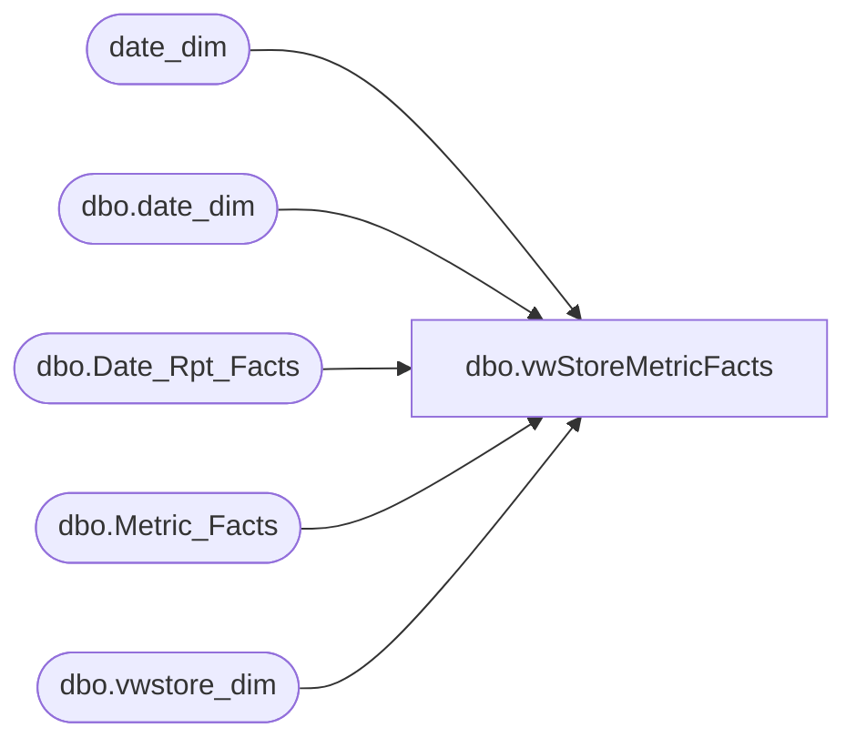

# dbo.vwStoreMetricFacts

**Database:** dw  
**Server:** papamart  

## Architecture Diagram



## Table Dependencies

| Referenced Table |
|---|
| date_dim |
| dbo.date_dim |
| dbo.Date_Rpt_Facts |
| dbo.Metric_Facts |
| dbo.vwstore_dim |

## View Code

```sql
CREATE VIEW dbo.vwStoreMetricFacts
AS 
	
SELECT     s.store_key As StoreKey,
	   s.store_id As StoreID,
	   s.storeNameNum As StoreNameNum,
           s.country As StoreCountry,
	   s.bearea As BearArea,
	   s.bearritory As BearTerritory,
	   s.region As BearRegion,
           s.opening_date As StoreOpeningDate,
           s.closing_date As StoreClosingDate,
           ddly.fiscal_week As LY_FiscalWeek,
           ddly.week_id As LY_WEEKID,
           Last_Year_Metrics.amount AS LY_Amount, 
           Date_Link.date_key_LY AS LY_Date_key,
	   ddty.fiscal_week As TY_FiscalWeek,
           ddty.week_id As TY_WeekID,
           This_Year_Metrics.amount AS TY_Amount,
           Date_Link.date_key_TY AS TY_Date_key,
           Last_Year_Metrics.metric_dim_key AS metric_dim_key

FROM       dw.dbo.Metric_Facts  Last_Year_Metrics (nolock)

           INNER JOIN dw.dbo.Date_Rpt_Facts Date_Link (nolock)
           ON Last_Year_Metrics.metric_dim_key = Date_Link.date_key_LY 

           INNER JOIN dw.dbo.Metric_Facts This_Year_Metrics (nolock)
           ON This_Year_Metrics.store_key=Last_Year_Metrics.store_key and
              This_Year_Metrics.metric_dim_key=Last_Year_Metrics.metric_dim_key  and
              This_Year_Metrics.date_key=Date_Link.date_key_TY

	  INNER JOIN dw.dbo.date_dim ddty (nolock)
          ON Date_Link.date_key_TY = ddty.date_key

         INNER JOIN dw.dbo.date_dim ddly (nolock)
         ON Date_Link.date_key_LY  = ddly.date_key

	INNER JOIN dw.dbo.vwstore_dim s (nolock)
	ON s.store_key = Last_Year_Metrics.store_key

	WHERE  Last_Year_Metrics.metric_freq_key = 'd'
		and s.store_id < 900
		and ddty.week_id >= Case when datepart(dw, convert(varchar(10),getdate(),112)) BETWEEN 1 AND 6
		Then (select week_id -53 from date_dim where actual_date = convert(varchar(10),getdate(),112))
			--346
		ELSE --345
			(select week_id - 52 from date_dim where actual_date = convert(varchar(10),getdate(),112))
		end and
		ddty.week_id < Case when datepart(dw, convert(varchar(10),getdate(),112)) BETWEEN 1 AND 6
		Then (select week_id -1 from date_dim where actual_date = convert(varchar(10),getdate(),112))
			--346
		ELSE --345
			(select week_id  from date_dim where actual_date = convert(varchar(10),getdate(),112))
		end 
	

UNION ALL

--RECORDS FOR LAST YEAR

SELECT     s.store_key As StoreKey,
	   s.store_id StoreID,
	   s.storeNameNum StorenameNum,
	   s.country,
           s.bearea BearArea,
	   s.bearritory BearTerritory,
	   s.region BearRegion,
	   s.opening_date As StoreOpeningDate,
           s.closing_date As StoreClosingDate,
           ddly.fiscal_week As LY_FiscalWeek,
           ddly.week_id As LY_WEEKID,
           Last_Year_Metrics.amount         AS LY_Amount, 
           Date_Link.date_key_LY            AS LY_Date_Key,
           ddty.fiscal_week As TY_FiscalWeek,
           ddty.week_id As TY_WEEKID,
           0                                AS TY_Amount,
           Date_Link.date_key_TY            AS TY_Date_Key,
           Last_Year_Metrics.metric_dim_key AS metric_dim_key

FROM       dw.dbo.Metric_Facts  Last_Year_Metrics (nolock)

           INNER JOIN dw.dbo.Date_Rpt_Facts Date_Link  (nolock)
           ON Last_Year_Metrics.metric_dim_key = Date_Link.date_key_LY 

	  INNER JOIN dw.dbo.date_dim ddty  (nolock)
          ON Date_Link.date_key_TY = ddty.date_key

         INNER JOIN dw.dbo.date_dim ddly (nolock)
         ON Date_Link.date_key_LY  = ddly.date_key

	INNER JOIN dw.dbo.vwstore_dim s (nolock)
	ON s.store_key = Last_Year_Metrics.store_key


WHERE  Last_Year_Metrics.metric_freq_key = 'd'
     and s.store_id < 900
    and ddty.week_id >= Case when datepart(dw, convert(varchar(10),getdate(),112)) BETWEEN 1 AND 6
		Then (select week_id -53 from date_dim where actual_date = convert(varchar(10),getdate(),112))
			--346
		ELSE --345
			(select week_id - 52 from date_dim where actual_date = convert(varchar(10),getdate(),112))
		end and
		ddty.week_id < Case when datepart(dw, convert(varchar(10),getdate(),112)) BETWEEN 1 AND 6
		Then (select week_id -1 from date_dim where actual_date = convert(varchar(10),getdate(),112))
			--346
		ELSE --345
			(select week_id  from date_dim where actual_date = convert(varchar(10),getdate(),112))
		end 
     and NOT EXISTS ( SELECT This_Year_Metrics.metric_facts_key
                      FROM dw.dbo.Metric_Facts This_Year_Metrics (nolock)
                      WHERE This_Year_Metrics.store_key = Last_Year_Metrics.store_key and
                            This_Year_Metrics.metric_dim_key = Last_Year_Metrics.metric_dim_key  and
                            This_Year_Metrics.date_key       = Date_Link.date_key_TY)
UNION ALL

--RECORDS FOR THIS YEAR

SELECT  s.store_key As StoreKey,
	s.store_id StoreID,
	s.storeNameNum StorenameNum,
	s.country,
	s.bearea BearArea,
	s.bearritory BearTerritory,
	s.region BearRegion,
        s.opening_date As StoreOpeningDate,
        s.closing_date As StoreClosingDate,
	ddly.fiscal_week As LY_FiscalWeek,
        ddly.week_id  As LY_WEEKID,    
        0 AS  LY_Amount, 
        Date_Link.date_key_LY AS  LY_Date_Key,
	ddty.fiscal_week As TY_FiscalWeek,
        ddty.week_id  As TY_WEEKID,  
        This_Year_Metrics.amount AS  TY_Amount,
        Date_Link.date_key_TY AS  TY_Date_Key,
        This_Year_Metrics.metric_dim_key AS  metric_dim_key

FROM       dw.dbo.Metric_Facts This_Year_Metrics (nolock)

           INNER JOIN dw.dbo.Date_Rpt_Facts Date_Link (nolock)
           ON This_Year_Metrics.date_key=Date_Link.date_key_TY 

	  INNER JOIN dw.dbo.date_dim ddty (nolock)
          ON Date_Link.date_key_TY = ddty.date_key

         INNER JOIN dw.dbo.date_dim ddly (nolock)
         ON Date_Link.date_key_LY  = ddly.date_key

	INNER JOIN dw.dbo.vwstore_dim s (nolock)
	ON s.store_key = This_Year_Metrics.store_key

WHERE This_Year_Metrics.metric_freq_key = 'd'
      and s.store_id < 900
   and ddty.week_id >= Case when datepart(dw, convert(varchar(10),getdate(),112)) BETWEEN 1 AND 6
		Then (select week_id -53 from date_dim where actual_date = convert(varchar(10),getdate(),112))
			--346
		ELSE --345
			(select week_id - 52 from date_dim where actual_date = convert(varchar(10),getdate(),112))
		end and
		ddty.week_id < Case when datepart(dw, convert(varchar(10),getdate(),112)) BETWEEN 1 AND 6
		Then (select week_id -1 from date_dim where actual_date = convert(varchar(10),getdate(),112))
			--346
		ELSE --345
			(select week_id  from date_dim where actual_date = convert(varchar(10),getdate(),112))
		end 
      and NOT EXISTS ( SELECT Last_Year_Metrics.metric_facts_key
                       FROM dw.dbo.Metric_Facts  Last_Year_Metrics (nolock)
                       WHERE Last_Year_Metrics.store_key      = This_Year_Metrics.store_key and
                             Last_Year_Metrics.metric_dim_key = This_Year_Metrics.metric_dim_key  and
                             Last_Year_Metrics.metric_dim_key = Date_Link.date_key_LY)
```

