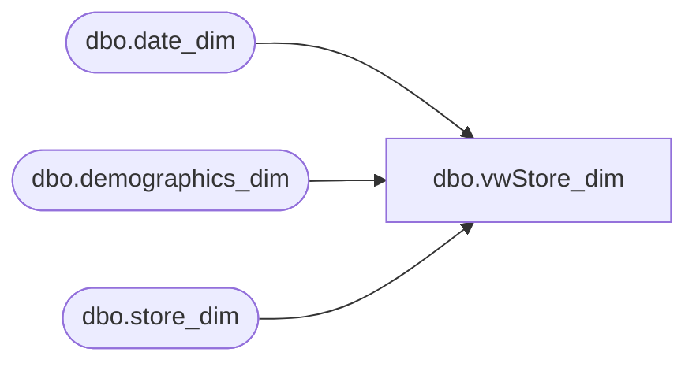

# dbo.vwStore_dim

**Database:** dw  
**Server:** papamart  

## Architecture Diagram



## Table Dependencies

| Referenced Table |
|---|
| dbo.date_dim |
| dbo.demographics_dim |
| dbo.store_dim |

## View Code

```sql
CREATE VIEW [dbo].[vwStore_dim]
-- =============================================================================================================
-- Name: [dbo].[vwStore_dim]
--
-- Description: 
--
-- Dependencies: 
--
-- Revision History
--		Name:			Date:			Comments:
--		Gary Murrish	9/15/2010		Canada Central
--		Keith Missey	2/5/2009		updated per 2/1 re-alignment
--		Keith Missey	8/17/2009		updated for store 303
-- =============================================================================================================

AS
SELECT sd.store_key, sd.store_id, sd.store_name,
storeNameNum = CASE
	when country <> 'UK' then RIGHT('000' + CAST(sd.store_id AS varchar), 3) + ' ' + sd.store_name
	else RIGHT('000' + CAST(sd.store_id AS varchar), 4) + ' ' + sd.store_name
	end,
	CASE
               WHEN sd.store_id IN (130, 174, 188, 204, 205, 215, 228, 229, 269, 270, 279, 280, 283, 293) THEN 'Canada East' 
			WHEN sd.store_id IN (119, 124, 217, 282, 303) THEN 'Canada Central' 
			WHEN sd.store_id IN (150, 177, 250) THEN 'Northwest' 
				WHEN sd.store_id IN (13, 136, 473, - 991) THEN 'Web Stores' ELSE sd.bearea 
	END AS bearea, 
				CASE
					WHEN sd.store_id IN (130, 174, 188, 204, 205, 215, 228, 229, 269, 270, 279, 280, 283, 293) THEN 'Canada East' 
				WHEN sd.store_id IN (119, 124, 217, 282, 303) THEN 'Central Canada' 
				WHEN sd.store_id IN (150, 177, 250) THEN 'Northwest' 
					WHEN sd.store_id IN (13, 136, 473, - 991) THEN 'Web Stores' 
					WHEN sd.bearritory IN ('Southwest','Southeast') AND sd.country = 'GB' THEN sd.bearritory + '-UK'
					ELSE sd.bearritory 
				END AS bearritory, 
				CASE
					WHEN sd.store_id IN (119, 124, 282, 130, 174, 188, 204, 205, 215, 217, 228, 229, 269, 270, 279, 280, 283, 293, 303) THEN 'Central US'
					WHEN sd.store_id IN (150, 177, 250) THEN 'West US'
					WHEN sd.store_id IN (13, 136, 473, - 991) THEN 'Web Stores'
				ELSE sd.region 
	END AS region, sd.country, sd.country_name, d.dma_name, sd.opening_date, 
               dd.day_id AS opening_date_id, 
				sd.closing_date, 
				sd.comp_week_id, 
				dd.period_id AS open_fp_id,
				 dd.week_id AS open_week_id
	-- 1/29/07 - TMK - Added geography related columns
	,sd.state_province
	,sd.city
	,sd.postal_code
	,sd.latitude
	,sd.longitude
FROM  dbo.store_dim AS sd LEFT OUTER JOIN
  dbo.demographics_dim AS d ON sd.demographics_bg_key = d.demographics_bg_key LEFT OUTER JOIN
  dbo.date_dim AS dd ON sd.opening_date = dd.actual_date
WHERE (sd.store_id < 990 or sd.store_id > 1999 ) and sd.store_id not in (489, 471)
```

