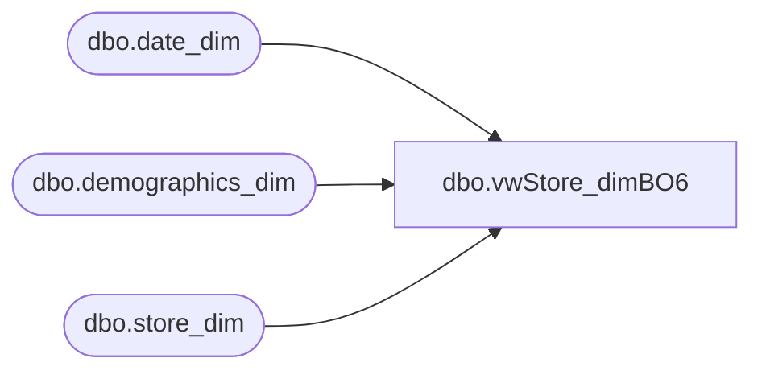

# dbo.vwStore_dimBO6

**Database:** dw  
**Server:** papamart  

## Architecture Diagram



## Table Dependencies

| Referenced Table |
|---|
| dbo.date_dim |
| dbo.demographics_dim |
| dbo.store_dim |

## View Code

```sql
CREATE VIEW [dbo].[vwStore_dimBO6]
/*-- =============================================================================================================
-- Name: [dbo].[vwStore_dim]
--
-- Description: View of Store Dimension used in Business Objects version 6 universes
--
-- Dependencies: 
--
-- Revision History
--		Name:			Date:			Comments:
--		Funmi Agbebi	2/19/2009		Store_dim for Honeypot, based on vwStore_dim created by Keith Missey on 2/5/2009.  
										Added left join to CensusDivision_Dim
-- =============================================================================================================*/

 AS
SELECT sd.[store_key]
      ,sd.[store_id]
      ,sd.[store_name]
      ,sd.[store_name_abbrv]
	  ,storeNameNum = CASE
	when country <> 'UK' then RIGHT('000' + CAST(sd.store_id AS varchar), 3) + ' ' + sd.store_name
	else RIGHT('000' + CAST(sd.store_id AS varchar), 4) + ' ' + sd.store_name
	end
	  ,storeAbbrvNum = CASE
	when country <> 'UK' then RIGHT('000' + CAST(sd.store_id AS varchar), 3) + ' ' + sd.store_name_abbrv
	else RIGHT('000' + CAST(sd.store_id AS varchar), 4) + ' ' + sd.store_name_abbrv
	end,
	CASE
               WHEN sd.store_id IN (130, 174, 188, 204, 205, 215, 228, 229, 269, 270, 279, 280, 283, 293) THEN 'Canada East' 
			WHEN sd.store_id IN (119, 124, 217, 282) THEN 'Upper Midwest/Central Canada' 
			WHEN sd.store_id IN (150, 177, 250) THEN 'Northwest' 
				WHEN sd.store_id IN (13, 136, 473, - 991) THEN 'Web Stores' ELSE sd.bearea 
	END AS bearea, 
				CASE
					WHEN sd.store_id IN (130, 174, 188, 204, 205, 215, 228, 229, 269, 270, 279, 280, 283, 293) THEN 'Canada East' 
				WHEN sd.store_id IN (119, 124, 217, 282) THEN 'Upper Midwest/Central Canada' 
				WHEN sd.store_id IN (150, 177, 250) THEN 'Northwest' 
					WHEN sd.store_id IN (13, 136, 473, - 991) THEN 'Web Stores' 
					WHEN sd.bearritory IN ('Southwest','Southeast') AND sd.country = 'GB' THEN sd.bearritory + '-UK'
					ELSE sd.bearritory 
				END AS bearritory, 
				CASE
					WHEN sd.store_id IN (119, 124, 282, 130, 174, 188, 204, 205, 215, 217, 228, 229, 269, 270, 279, 280, 283, 293) THEN 'Central US'
					WHEN sd.store_id IN (150, 177, 250) THEN 'West US'
					WHEN sd.store_id IN (13, 136, 473, - 991) THEN 'Web Stores'
				ELSE sd.region 
	END AS region, sd.country, sd.country_name, 
	sd.opening_date, 
	dd.fiscal_year AS opening_fiscal_year,
	dd.org_fiscal_quarter AS opening_fiscal_quarter,
	dd.org_fiscal_period AS opening_fiscal_period,
	dd.org_fiscal_week AS opening_fiscal_week,
               dd.day_id AS opening_date_id, 
				sd.closing_date, 
				sd.comp_week_id, 
	co.fiscal_year AS comp_fiscal_year,
	co.fiscal_quarter AS comp_fiscal_quarter,
	co.fiscal_period AS comp_fiscal_period,
	co.fiscal_week AS comp_fiscal_week,
				dd.period_id AS open_fp_id,
				 dd.week_id AS open_week_id,
	cld.fiscal_year AS closing_fiscal_year,
	cld.org_fiscal_quarter AS closing_fiscal_quarter,
	cld.org_fiscal_period AS closing_fiscal_period,
	cld.org_fiscal_week AS closing_fiscal_week
      ,sd.[address1]
      ,sd.[zone]
      ,sd.[address2]
      ,sd.[state_province_name]
      ,sd.[business_type]
      ,sd.[city]
      ,sd.[division]
      ,sd.[state_province]
      ,sd.[county]
      ,sd.[business_unit]
      ,sd.[postal_code]
      ,sd.[phone]
      ,sd.[fax]
      ,sd.[email]
      ,sd.[active]
      ,sd.[latitude]
      ,sd.[longitude]
      ,sd.[volume_group]
      ,sd.[store_mgr]
      ,sd.[bearea_mgr]
      ,sd.[bearitory_mgr]
      ,sd.[region_mgr]
      ,sd.[store_type]
      ,sd.[comp_date]
      ,sd.[store_group_id]
      ,sd.[address3]
      ,sd.[address4]
      ,sd.[square_feet]
      ,sd.[num_of_pos]
      ,sd.[num_of_kiosks]
      ,sd.[postal_plus4]
      ,sd.[Abbreviation]
      ,sd.[Legal_Description]
      ,sd.[bearea_id]
      ,sd.[bearitory_id]
      ,sd.[region_id]
      ,sd.[division_code]
      ,sd.[language]
      ,sd.[demographics_bg_key]
      ,d.[cluster_code]
      ,d.[cluster_name]

 ,case when 
sd.store_id in (0,13,470,473,480,482,489,950,960,975,980,990,991,1513,1570,1580,1590,1591,1592,2992,8500,8550,8600,8610,8620,8630,
8650,9009,9301,9302,9303,9304,9305,9306,9307,9308,9309,9310,9311,9312,9313,9314,9315,9316,9317,9318,9319,9320,9321,9322,9323,9324,
9325,9326,9327,9328,9329,9330,9331,9332,9333,9334,9335,9336,9337,9338,9339,9340,9341,9342,9343,9344,9345,9346,9347,9348,9349,9350,
9352,9353,9354,9355,9356,9357,9358,9360,9361,9362,9363,9364,9365,9366,9367,9368,9369,9370,9371,9372,9373,9374,9375,9376,9377,9378,
9379,9380,9381,9382,9383,9384,9385,9386,9387,9388,9389,9390,9391,9392,9393,9394,9395,9396,9397,9398,9399,9400,9401,9402,9403,9404,
9405,9406,9407,9408,9409,9410,9412,9413,9414,9425,9429,9431,9447,9448,9471,9472,9479,9493,9500,9503,9540,9543,9560,9580,9600,9701,
9702,9720,9760,9901,9902,9903,9904,9905,9906,9907,9908,9910,9911,9912,9917,9918,9919,9920,9921,9922,9925,9948,9950,9990,9991,9993,9995,9999)
then '' else d.[metro_code] end as [metro_code]
,case when 
sd.store_id in (0,13,470,473,480,482,489,950,960,975,980,990,991,1513,1570,1580,1590,1591,1592,2992,8500,8550,8600,8610,8620,8630,
8650,9009,9301,9302,9303,9304,9305,9306,9307,9308,9309,9310,9311,9312,9313,9314,9315,9316,9317,9318,9319,9320,9321,9322,9323,9324,
9325,9326,9327,9328,9329,9330,9331,9332,9333,9334,9335,9336,9337,9338,9339,9340,9341,9342,9343,9344,9345,9346,9347,9348,9349,9350,
9352,9353,9354,9355,9356,9357,9358,9360,9361,9362,9363,9364,9365,9366,9367,9368,9369,9370,9371,9372,9373,9374,9375,9376,9377,9378,
9379,9380,9381,9382,9383,9384,9385,9386,9387,9388,9389,9390,9391,9392,9393,9394,9395,9396,9397,9398,9399,9400,9401,9402,9403,9404,
9405,9406,9407,9408,9409,9410,9412,9413,9414,9425,9429,9431,9447,9448,9471,9472,9479,9493,9500,9503,9540,9543,9560,9580,9600,9701,
9702,9720,9760,9901,9902,9903,9904,9905,9906,9907,9908,9910,9911,9912,9917,9918,9919,9920,9921,9922,9925,9948,9950,9990,9991,9993,9995,9999)
then '' else d.[metro_name] end as [metro_name]
  ,case when 
sd.store_id in (0,13,470,473,480,482,489,950,960,975,980,990,991,1513,1570,1580,1590,1591,1592,2992,8500,8550,8600,8610,8620,8630,
8650,9009,9301,9302,9303,9304,9305,9306,9307,9308,9309,9310,9311,9312,9313,9314,9315,9316,9317,9318,9319,9320,9321,9322,9323,9324,
9325,9326,9327,9328,9329,9330,9331,9332,9333,9334,9335,9336,9337,9338,9339,9340,9341,9342,9343,9344,9345,9346,9347,9348,9349,9350,
9352,9353,9354,9355,9356,9357,9358,9360,9361,9362,9363,9364,9365,9366,9367,9368,9369,9370,9371,9372,9373,9374,9375,9376,9377,9378,
9379,9380,9381,9382,9383,9384,9385,9386,9387,9388,9389,9390,9391,9392,9393,9394,9395,9396,9397,9398,9399,9400,9401,9402,9403,9404,
9405,9406,9407,9408,9409,9410,9412,9413,9414,9425,9429,9431,9447,9448,9471,9472,9479,9493,9500,9503,9540,9543,9560,9580,9600,9701,
9702,9720,9760,9901,9902,9903,9904,9905,9906,9907,9908,9910,9911,9912,9917,9918,9919,9920,9921,9922,9925,9948,9950,9990,9991,9993,9995,9999)
then '' else d.[dma_code] end as dma_code
,case when 
sd.store_id in (0,13,470,473,480,482,489,950,960,975,980,990,991,1513,1570,1580,1590,1591,1592,2992,8500,8550,8600,8610,8620,8630,
8650,9009,9301,9302,9303,9304,9305,9306,9307,9308,9309,9310,9311,9312,9313,9314,9315,9316,9317,9318,9319,9320,9321,9322,9323,9324,
9325,9326,9327,9328,9329,9330,9331,9332,9333,9334,9335,9336,9337,9338,9339,9340,9341,9342,9343,9344,9345,9346,9347,9348,9349,9350,
9352,9353,9354,9355,9356,9357,9358,9360,9361,9362,9363,9364,9365,9366,9367,9368,9369,9370,9371,9372,9373,9374,9375,9376,9377,9378,
9379,9380,9381,9382,9383,9384,9385,9386,9387,9388,9389,9390,9391,9392,9393,9394,9395,9396,9397,9398,9399,9400,9401,9402,9403,9404,
9405,9406,9407,9408,9409,9410,9412,9413,9414,9425,9429,9431,9447,9448,9471,9472,9479,9493,9500,9503,9540,9543,9560,9580,9600,9701,
9702,9720,9760,9901,9902,9903,9904,9905,9906,9907,9908,9910,9911,9912,9917,9918,9919,9920,9921,9922,9925,9948,9950,9990,9991,9993,9995,9999)
then '' else d.[dma_name] end as [dma_name]

     ,CASE WHEN sd.country like 'UK' THEN '' 
when sd.store_id in (0,13,470,473,480,482,489,950,960,975,980,990,991,1513,1570,1580,1590,1591,1592,2992,8500,8550,8600,8610,8620,8630,
8650,9009,9301,9302,9303,9304,9305,9306,9307,9308,9309,9310,9311,9312,9313,9314,9315,9316,9317,9318,9319,9320,9321,9322,9323,9324,
9325,9326,9327,9328,9329,9330,9331,9332,9333,9334,9335,9336,9337,9338,9339,9340,9341,9342,9343,9344,9345,9346,9347,9348,9349,9350,
9352,9353,9354,9355,9356,9357,9358,9360,9361,9362,9363,9364,9365,9366,9367,9368,9369,9370,9371,9372,9373,9374,9375,9376,9377,9378,
9379,9380,9381,9382,9383,9384,9385,9386,9387,9388,9389,9390,9391,9392,9393,9394,9395,9396,9397,9398,9399,9400,9401,9402,9403,9404,
9405,9406,9407,9408,9409,9410,9412,9413,9414,9425,9429,9431,9447,9448,9471,9472,9479,9493,9500,9503,9540,9543,9560,9580,9600,9701,
9702,9720,9760,9901,9902,9903,9904,9905,9906,9907,9908,9910,9911,9912,9917,9918,9919,9920,9921,9922,9925,9948,9950,9990,9991,9993,9995,9999)
then '' ELSE '' END as CensusDivision
      ,CASE WHEN sd.country like 'UK' THEN '' 
when sd.store_id in (0,13,470,473,480,482,489,950,960,975,980,990,991,1513,1570,1580,1590,1591,1592,2992,8500,8550,8600,8610,8620,8630,
8650,9009,9301,9302,9303,9304,9305,9306,9307,9308,9309,9310,9311,9312,9313,9314,9315,9316,9317,9318,9319,9320,9321,9322,9323,9324,
9325,9326,9327,9328,9329,9330,9331,9332,9333,9334,9335,9336,9337,9338,9339,9340,9341,9342,9343,9344,9345,9346,9347,9348,9349,9350,
9352,9353,9354,9355,9356,9357,9358,9360,9361,9362,9363,9364,9365,9366,9367,9368,9369,9370,9371,9372,9373,9374,9375,9376,9377,9378,
9379,9380,9381,9382,9383,9384,9385,9386,9387,9388,9389,9390,9391,9392,9393,9394,9395,9396,9397,9398,9399,9400,9401,9402,9403,9404,
9405,9406,9407,9408,9409,9410,9412,9413,9414,9425,9429,9431,9447,9448,9471,9472,9479,9493,9500,9503,9540,9543,9560,9580,9600,9701,
9702,9720,9760,9901,9902,9903,9904,9905,9906,9907,9908,9910,9911,9912,9917,9918,9919,9920,9921,9922,9925,9948,9950,9990,9991,9993,9995,9999)
then '' ELSE '' END as CensusRegion
      ,CASE WHEN sd.country like 'UK' THEN '' 
when sd.store_id in (0,13,470,473,480,482,489,950,960,975,980,990,991,1513,1570,1580,1590,1591,1592,2992,8500,8550,8600,8610,8620,8630,
8650,9009,9301,9302,9303,9304,9305,9306,9307,9308,9309,9310,9311,9312,9313,9314,9315,9316,9317,9318,9319,9320,9321,9322,9323,9324,
9325,9326,9327,9328,9329,9330,9331,9332,9333,9334,9335,9336,9337,9338,9339,9340,9341,9342,9343,9344,9345,9346,9347,9348,9349,9350,
9352,9353,9354,9355,9356,9357,9358,9360,9361,9362,9363,9364,9365,9366,9367,9368,9369,9370,9371,9372,9373,9374,9375,9376,9377,9378,
9379,9380,9381,9382,9383,9384,9385,9386,9387,9388,9389,9390,9391,9392,9393,9394,9395,9396,9397,9398,9399,9400,9401,9402,9403,9404,
9405,9406,9407,9408,9409,9410,9412,9413,9414,9425,9429,9431,9447,9448,9471,9472,9479,9493,9500,9503,9540,9543,9560,9580,9600,9701,
9702,9720,9760,9901,9902,9903,9904,9905,9906,9907,9908,9910,9911,9912,9917,9918,9919,9920,9921,9922,9925,9948,9950,9990,9991,9993,9995,9999)
then ''  ELSE sd.state_province END as CensusState
, CASE WHEN sd.store_id in (470,473,990) THEN 'Non-Retail Selling Loc'  
	WHEN sd.store_id in (13,136,1513,2013) THEN 'Web Retail'
	WHEN sd.store_id in 
		(1,2,3,4,5,6,7,8,9,10,11,12,14,15,16,17,18,19,20,21,22,23,24,25,26,27,28,29,30,
		31,32,33,34,35,36,37,38,39,40,41,42,43,44,45,46,47,48,49,50,51,52,53,54,55,56,
		57,58,59,60,61,62,63,64,65,66,67,68,69,70,71,72,73,74,75,76,77,78,79,80,81,82,
		83,84,85,86,87,88,89,90,91,92,93,94,95,96,97,98,99,100,101,102,103,
		104,105,106,107,108,109,110,111,112,113,114,115,116,117,118,119,120,121,122,123,124,125,126,127,
		128,129,130,131,132,133,134,135,137,138,139,140,141,142,143,144,145,146,147,148,149,150,151,152,
		153,154,155,156,157,158,159,160,161,162,163,164,165,166,167,168,169,170,171,172,173,174,175,176,
		177,178,179,180,181,182,183,184,185,186,187,188,189,190,191,192,193,194,195,196,197,198,199,200,
		201,202,203,204,205,206,207,208,209,210,211,212,213,214,215,216,217,218,219,220,221,222,223,224,
		225,226,227,228,229,230,231,232,233,234,235,236,237,238,239,240,241,242,243,244,245,246,247,248,
		249,250,251,252,253,254,255,256,257,258,259,260,261,262,263,264,265,266,267,268,269,270,271,272,
		273,274,275,276,277,278,279,280,281,282,283,284,285,286,287,288,289,290,291,292,293,294,295,296,
		460,462,463,471,480,482,485,486,1501,1502,1503,1504,1505,1506,1507,1508,1509,1510,1511,1512,
		2001,2002,2003,2004,2006,2007,2008,2009,2010,2011,2012,2014,2015,2016,2017,2018,2019,2020,
		2021,2022,2023,2024,2025,2026,2027,2028,2029,2030,2031,2032,2033,2034,2035,2036,2037,2038,
		2039,2040,2041,2042,2043,2044,2045,2046,2047,2048,2049,2050,2051,2052,2201,2202,2203) 
	THEN 'Standard Retail'
	WHEN sd.store_id in 
		(-991,0,489,950,960,975,980,991,995,1590,1591,2500,2501,2502,2503,2504,
		2505,2904,2970,2990,2991,2995,2998,8500,8520,8530,8540,8550,8580,8590,8600,8610,8620,8630,
		8640,8670,9009,9301,9302,9303,9304,9305,9306,9307,9308,9309,9310,9311,9312,9313,9314,9315,
		9316,9317,9318,9319,9320,9321,9322,9323,9324,9325,9326,9327,9328,9329,9330,9331,9332,9333,
		9334,9335,9336,9337,9338,9339,9340,9341,9342,9343,9344,9345,9346,9347,9348,9349,9350,9351,
		9352,9353,9354,9355,9356,9357,9358,9359,9360,9361,9362,9363,9364,9365,9366,9367,9368,9369,
		9370,9371,9372,9373,9374,9375,9376,9377,9378,9379,9380,9381,9382,9383,9384,9385,9386,9387,
		9388,9389,9390,9391,9392,9393,9394,9395,9396,9397,9398,9399,9400,9401,9402,9403,9404,9405,
		9406,9407,9471,9472,9760,9901,9902,9903,9904,9905,9906,9907,9908,9910,9911,9912,9948,9950,
		9970,9975,9980,9990,9991,9993,9995,9999,10056,10063) 
	THEN 'Z_NonSelling Acct'
	ELSE 'N/A' END AS StoreType
, CASE WHEN sd.store_id in (17,155,179,180,209,212,272,285) THEN 'Specialty'
	WHEN sd.store_id in (460,462,463,471,486) THEN 'Dino Only'
	WHEN sd.store_id in (1501,1502,1503,1504,1505,1506,1507,1508,1509,1510,1511,1512,1513) THEN 'RZ'
	WHEN sd.store_id in 
		(1,2,3,4,5,6,7,8,9,10,11,12,13,14,15,16,18,19,20,21,22,23,24,25,26,27,28,29,
		30,31,32,33,34,35,36,37,38,39,40,41,42,43,44,45,46,47,48,49,50,51,52,53,54,55,56,57,
		58,59,60,61,62,63,64,65,66,67,68,69,70,71,72,73,74,75,76,77,78,79,80,81,82,83,84,85,
		86,87,88,89,90,91,92,93,94,95,96,97,98,99,100,101,102,103,104,105,106,107,108,109,
		110,111,112,113,114,115,116,117,118,119,120,121,122,123,124,125,126,127,128,129,130,
		131,132,133,134,135,136,137,138,139,140,141,142,143,144,145,146,147,148,149,150,151,
		152,153,154,156,157,158,159,160,161,162,163,164,165,166,167,168,169,170,171,172,173,174,
		175,176,177,178,181,182,183,184,185,186,187,188,189,190,191,192,193,194,195,196,197,198,
		199,200,201,202,203,204,205,206,207,208,210,211,213,214,215,216,217,218,219,220,221,222,
		223,224,225,226,227,228,229,230,231,232,233,234,235,236,237,238,239,240,241,242,243,244,
		245,246,247,248,249,250,251,252,253,254,255,256,257,258,259,260,261,262,263,264,265,266,
		267,268,269,270,271,273,274,275,276,277,278,279,280,281,282,283,284,286,287,288,289,290,
		291,292,293,294,295,296,480,482,485,2001,2002,2003,2004,2006,2007,2008,2009,2010,2011,
		2012,2013,2014,2015,2016,2017,2018,2019,2020,2021,2022,2023,2024,2025,2026,2027,2028,
		2029,2030,2031,2032,2033,2034,2035,2036,2037,2038,2039,2040,2041,2042,2043,2044,2045,
		2046,2047,2048,2049,2050,2051,2052,2201,2202,2203) 
	THEN 'Standard'
	ELSE 'N/A'  END AS StoreProductType
, CASE WHEN sd.store_id in (485,486) THEN 'Temporary'
	WHEN sd.store_id in (17,155,179,180,212,285,480,482) THEN 'Seasonal'
	WHEN sd.store_id in 
		(1,2,3,4,5,6,7,8,9,10,11,12,13,14,15,16,18,19,20,21,22,23,24,25,26,27,28,29,30,31,
		32,33,34,35,36,37,38,39,40,41,42,43,44,45,46,47,48,49,50,51,52,53,54,55,56,57,58,
		59,60,61,62,63,64,65,66,67,68,69,70,71,72,73,74,75,76,77,78,79,80,81,82,83,84,85,
		86,87,88,89,90,91,92,93,94,95,96,97,98,99,100,101,102,103,
		104,105,106,107,108,109,110,111,112,113,114,115,116,117,118,119,120,121,122,123,124,125,126,12,
		128,129,130,131,132,133,134,135,136,137,138,139,140,141,142,143,144,145,146,147,148,149,150,151,
		152,153,154,156,157,158,159,160,161,162,163,164,165,166,167,168,169,170,171,172,173,174,175,176,
		177,178,181,182,183,184,185,186,187,188,189,190,191,192,193,194,195,196,197,198,199,200,201,202,
		203,204,205,206,207,208,209,210,211,213,214,215,216,217,218,219,220,221,222,223,224,225,226,227,
		228,229,230,231,232,233,234,235,236,237,238,239,240,241,242,243,244,245,246,247,248,249,250,251,
		252,253,254,255,256,257,258,259,260,261,262,263,264,265,266,267,268,269,270,271,272,273,274,275,
		276,277,278,279,280,281,282,283,284,286,287,288,289,290,291,292,293,294,295,296,460,462,463,471,
		1501,1502,1503,1504,1505,1506,1507,1508,1509,1510,1511,1512,1513,2001,2002,2003,2004,2006,
		2007,2008,2009,2010,2011,2012,2013,2014,2015,2016,2017,2018,2019,2020,2021,2022,2023,2024,
		2025,2026,2027,2028,2029,2030,2031,2032,2033,2034,2035,2036,2037,2038,2039,2040,2041,2042,
		2043,2044,2045,2046,2047,2048,2049,2050,2051,2052,2201,2202,2203) 
	THEN 'Full Year'
	ELSE 'N/A' END AS StoreSeasonality
FROM  dbo.store_dim AS sd LEFT OUTER JOIN
  dbo.demographics_dim AS d ON sd.demographics_bg_key = d.demographics_bg_key LEFT OUTER JOIN
 -- dbo.CensusDivision_Dim cd on sd.state_province = cd.state LEFT OUTER JOIN
  dbo.date_dim AS dd ON sd.opening_date = dd.actual_date LEFT OUTER JOIN
  dbo.date_dim AS co ON sd.comp_date = co.actual_date LEFT OUTER JOIN
  dbo.date_dim AS cld ON sd.closing_date = cld.actual_date  
--WHERE (sd.store_id < 990 or sd.store_id > 1999 ) and sd.store_id not in (489, 471)

--select * from [dbo].[vwStore_dimBO6] where country like 'UK'
```

