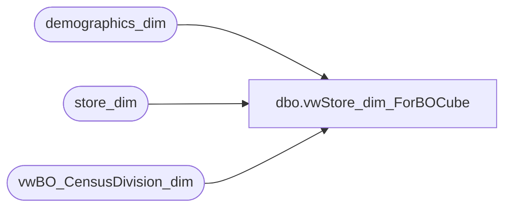

# dbo.vwStore_dim_ForBOCube

**Database:** dw  
**Server:** papamart  

## Architecture Diagram



## Table Dependencies

| Referenced Table |
|---|
| demographics_dim |
| store_dim |
| vwBO_CensusDivision_dim |

## View Code

```sql
CREATE view [dbo].[vwStore_dim_ForBOCube]
as
select *
 ,country_name + cast(dma_code as varchar(20)) as dma_key
 ,country_name + '/' + dma_name as dma_display
 , country_name + cast(dma_code as varchar(20)) + 
 + cast(metro_code as varchar(20))   as msa_key
 ,country_name + '/' + dma_name + '/' + metro_name as msa_display
 ,censusregion + censusdivision as CensusDivisionKey
 ,censusregion + '/' + censusdivision as CensusDivisionDisplay
from
(
select --* from vwBO_store_dim 
store_key, store_id, isnull(dma_code,0) as dma_code,isnull(dma_name,'No DMA') as dma_name, 
isnull(metro_name, 'No MSA') as metro_name,
isnull(metro_code,0) as metro_code, isnull(cluster_name,'(blank)') as cluster_name, 
isnull(cluster_code,0) as cluster_code,
isnull(s.state_province,'(blank)') as state_province, s.state_province_name, s.address1,opening_date,
--case when s.state_province is null or s.country = 'UK'
isnull(s.city,'(blank)') as city,isnull(s.country,'(blank)') as country_name
,isnull(s.country,'(blank)') as country,c.division -- as CensusDivision,
,c.region --as CensusRegion,
				,IsNull(c.Division,'(blank)') as CensusDivision
				,CASE WHEN c.Region is null THEN '(blank)'
					  WHEN len(c.Region) < 4 THEN c.Region
					ELSE Upper(left(c.Region,1)) + lower(substring(c.Region,2,len(c.region) - 1)) end as CensusRegion
,isnull(store_name,'') as store_name
,storeNameNum = CASE
	when store_name is null then cast(s.store_id as varchar(10))
	when len(store_id) < 3 then RIGHT('000' + CAST(s.store_id AS varchar), 3) + ' ' + s.store_name
	else cast(s.store_id as varchar(10)) + ' ' + s.store_name
	end

/*
storeNameNum = CASE
	when country = 'UK' then RIGHT('000' + CAST(sd.store_id AS varchar), 4) + ' ' + sd.store_name
	when region = 'Ridemakerz' then RIGHT('000' + CAST(sd.store_id AS varchar), 4) + ' ' + sd.store_name
	else RIGHT('000' + CAST(sd.store_id AS varchar), 3) + ' ' + sd.store_name
	end,

*/


, CASE WHEN s.store_id in (470,473,990) THEN 'Non-Retail Selling Loc'  
	WHEN s.store_id in (13,136,1513,2013) THEN 'Web Retail'
	WHEN s.store_id in 
		(1,2,3,4,5,6,7,8,9,10,11,12,14,15,16,17,18,19,20,21,22,23,24,25,26,27,28,29,30,
		31,32,33,34,35,36,37,38,39,40,41,42,43,44,45,46,47,48,49,50,51,52,53,54,55,56,
		57,58,59,60,61,62,63,64,65,66,67,68,69,70,71,72,73,74,75,76,77,78,79,80,81,82,
		83,84,85,86,87,88,89,90,91,92,93,94,95,96,97,98,99,100,101,102,103,
		104,105,106,107,108,109,110,111,112,113,114,115,116,117,118,119,120,121,122,123,124,125,126,127,
		128,129,130,131,132,133,134,135,137,138,139,140,141,142,143,144,145,146,147,148,149,150,151,152,
		153,154,155,156,157,158,159,160,161,162,163,164,165,166,167,168,169,170,171,172,173,174,175,176,
		177,178,179,180,181,182,183,184,185,186,187,188,189,190,191,192,193,194,195,196,197,198,199,200,
		201,202,203,204,205,206,207,208,209,210,211,212,213,214,215,216,217,218,219,220,221,222,223,224,
		225,226,227,228,229,230,231,232,233,234,235,236,237,238,239,240,241,242,243,244,245,246,247,248,
		249,250,251,252,253,254,255,256,257,258,259,260,261,262,263,264,265,266,267,268,269,270,271,272,
		273,274,275,276,277,278,279,280,281,282,283,284,285,286,287,288,289,290,291,292,293,294,295,296,
		460,462,463,471,480,482,485,486,1501,1502,1503,1504,1505,1506,1507,1508,1509,1510,1511,1512,
		2001,2002,2003,2004,2006,2007,2008,2009,2010,2011,2012,2014,2015,2016,2017,2018,2019,2020,
		2021,2022,2023,2024,2025,2026,2027,2028,2029,2030,2031,2032,2033,2034,2035,2036,2037,2038,
		2039,2040,2041,2042,2043,2044,2045,2046,2047,2048,2049,2050,2051,2052,2201,2202,2203) 
	THEN 'Standard Retail'
	WHEN s.store_id in 
		(-991,0,489,950,960,975,980,991,995,1590,1591,2500,2501,2502,2503,2504,
		2505,2904,2970,2990,2991,2995,2998,8500,8520,8530,8540,8550,8580,8590,8600,8610,8620,8630,
		8640,8670,9009,9301,9302,9303,9304,9305,9306,9307,9308,9309,9310,9311,9312,9313,9314,9315,
		9316,9317,9318,9319,9320,9321,9322,9323,9324,9325,9326,9327,9328,9329,9330,9331,9332,9333,
		9334,9335,9336,9337,9338,9339,9340,9341,9342,9343,9344,9345,9346,9347,9348,9349,9350,9351,
		9352,9353,9354,9355,9356,9357,9358,9359,9360,9361,9362,9363,9364,9365,9366,9367,9368,9369,
		9370,9371,9372,9373,9374,9375,9376,9377,9378,9379,9380,9381,9382,9383,9384,9385,9386,9387,
		9388,9389,9390,9391,9392,9393,9394,9395,9396,9397,9398,9399,9400,9401,9402,9403,9404,9405,
		9406,9407,9471,9472,9760,9901,9902,9903,9904,9905,9906,9907,9908,9910,9911,9912,9948,9950,
		9970,9975,9980,9990,9991,9993,9995,9999,10056,10063) 
	THEN 'Z_NonSelling Acct'
	ELSE 'N/A' END AS StoreType
, CASE WHEN s.store_id in (17,155,179,180,209,212,272,285) THEN 'Specialty'
	WHEN s.store_id in (460,462,463,471,486) THEN 'Dino Only'
	WHEN s.store_id in (1501,1502,1503,1504,1505,1506,1507,1508,1509,1510,1511,1512,1513) THEN 'RZ'
	WHEN s.store_id in 
		(1,2,3,4,5,6,7,8,9,10,11,12,13,14,15,16,18,19,20,21,22,23,24,25,26,27,28,29,
		30,31,32,33,34,35,36,37,38,39,40,41,42,43,44,45,46,47,48,49,50,51,52,53,54,55,56,57,
		58,59,60,61,62,63,64,65,66,67,68,69,70,71,72,73,74,75,76,77,78,79,80,81,82,83,84,85,
		86,87,88,89,90,91,92,93,94,95,96,97,98,99,100,101,102,103,104,105,106,107,108,109,
		110,111,112,113,114,115,116,117,118,119,120,121,122,123,124,125,126,127,128,129,130,
		131,132,133,134,135,136,137,138,139,140,141,142,143,144,145,146,147,148,149,150,151,
		152,153,154,156,157,158,159,160,161,162,163,164,165,166,167,168,169,170,171,172,173,174,
		175,176,177,178,181,182,183,184,185,186,187,188,189,190,191,192,193,194,195,196,197,198,
		199,200,201,202,203,204,205,206,207,208,210,211,213,214,215,216,217,218,219,220,221,222,
		223,224,225,226,227,228,229,230,231,232,233,234,235,236,237,238,239,240,241,242,243,244,
		245,246,247,248,249,250,251,252,253,254,255,256,257,258,259,260,261,262,263,264,265,266,
		267,268,269,270,271,273,274,275,276,277,278,279,280,281,282,283,284,286,287,288,289,290,
		291,292,293,294,295,296,480,482,485,2001,2002,2003,2004,2006,2007,2008,2009,2010,2011,
		2012,2013,2014,2015,2016,2017,2018,2019,2020,2021,2022,2023,2024,2025,2026,2027,2028,
		2029,2030,2031,2032,2033,2034,2035,2036,2037,2038,2039,2040,2041,2042,2043,2044,2045,
		2046,2047,2048,2049,2050,2051,2052,2201,2202,2203) 
	THEN 'Standard'
	ELSE 'N/A'  END AS StoreProductType
, CASE WHEN s.store_id in (485,486) THEN 'Temporary'
	WHEN s.store_id in (17,155,179,180,212,285,480,482) THEN 'Seasonal'
	WHEN s.store_id in 
		(1,2,3,4,5,6,7,8,9,10,11,12,13,14,15,16,18,19,20,21,22,23,24,25,26,27,28,29,30,31,
		32,33,34,35,36,37,38,39,40,41,42,43,44,45,46,47,48,49,50,51,52,53,54,55,56,57,58,
		59,60,61,62,63,64,65,66,67,68,69,70,71,72,73,74,75,76,77,78,79,80,81,82,83,84,85,
		86,87,88,89,90,91,92,93,94,95,96,97,98,99,100,101,102,103,
		104,105,106,107,108,109,110,111,112,113,114,115,116,117,118,119,120,121,122,123,124,125,126,12,
		128,129,130,131,132,133,134,135,136,137,138,139,140,141,142,143,144,145,146,147,148,149,150,151,
		152,153,154,156,157,158,159,160,161,162,163,164,165,166,167,168,169,170,171,172,173,174,175,176,
		177,178,181,182,183,184,185,186,187,188,189,190,191,192,193,194,195,196,197,198,199,200,201,202,
		203,204,205,206,207,208,209,210,211,213,214,215,216,217,218,219,220,221,222,223,224,225,226,227,
		228,229,230,231,232,233,234,235,236,237,238,239,240,241,242,243,244,245,246,247,248,249,250,251,
		252,253,254,255,256,257,258,259,260,261,262,263,264,265,266,267,268,269,270,271,272,273,274,275,
		276,277,278,279,280,281,282,283,284,286,287,288,289,290,291,292,293,294,295,296,460,462,463,471,
		1501,1502,1503,1504,1505,1506,1507,1508,1509,1510,1511,1512,1513,2001,2002,2003,2004,2006,
		2007,2008,2009,2010,2011,2012,2013,2014,2015,2016,2017,2018,2019,2020,2021,2022,2023,2024,
		2025,2026,2027,2028,2029,2030,2031,2032,2033,2034,2035,2036,2037,2038,2039,2040,2041,2042,
		2043,2044,2045,2046,2047,2048,2049,2050,2051,2052,2201,2202,2203) 
	THEN 'Full Year'
	ELSE 'N/A' END AS StoreSeasonality

from store_dim s left join demographics_dim d on 
s.demographics_bg_key = d.demographics_bg_key left join
vwBO_CensusDivision_dim c on 
c.country = s.country and 
c.state = s.state_province) t
```

