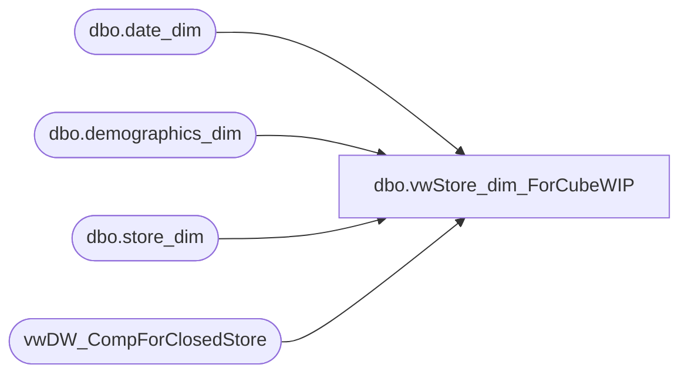

# dbo.vwStore_dim_ForCubeWIP

**Database:** dw  
**Server:** papamart  

## Architecture Diagram



## Table Dependencies

| Referenced Table |
|---|
| dbo.date_dim |
| dbo.demographics_dim |
| dbo.store_dim |
| vwDW_CompForClosedStore |

## View Code

```sql
CREATE VIEW [dbo].[vwStore_dim_ForCubeWIP]
-- =============================================================================================================
-- Name: [dbo].[vwStore_dim_ForCube]
--
-- Description: MODIFY THIS VIEW TO ADD CANADIAN STORES INTO CORRECT BEARITORIES
--
-- Dependencies: 
--
-- Revision History
--		Name:			Date:			Comments:
--		Funmi Agbebi	02/23/2010		Added Merch fields for new Merchandise store hierarchy
--		Funmi Agbebi	02/15/2010		Added max_comp_ly_date and max_comp_ly_date_key fields from dbo.[vwDW_CompForClosedStore]
--		Funmi Agbebi	11/10/2009		Moved FTD Sales, Store Contingency and Mobile Stores Company Level of 'Other' 
--		Funmi Agbebi	8/18/2009		added logic for GeographyCountry column
--		Funmi Agbebi	8/13/2009		added store_name_abbrv and storeAbbrvNum using store_name_abbrv field
--		Keith Missey	2/5/2009		updated per 2/1 re-alignment
-- =============================================================================================================
/*
select * from [vwStore_dim_ForCube] where storeabbrvnum like '%UK%Web%' or  storeabbrvnum like '%FTD%' or storeabbrvnum like '%Truck%'
Bearritory,ParentCountry, 
select --* 
Region,Bearritory--CompanyLevel,BearRange,
from [vwStore_dim_ForCube] 
--where CompanyLevel like 'Company'
group by Region,Bearritory --CompanyLevel,BearRange,
order by Region,Bearritory --CompanyLevel,BearRange,
	
select --* 
Region,Bearritory ,store_key,store_id,storeabbrvnum
from [vwStore_dim_ForCube] 
where bearritory like 'Web Stores'
group by Region,Bearritory --CompanyLevel,BearRange,
order by Region,Bearritory --CompanyLevel,BearRange,

select region, store_key,store_id,store_name_abbrv from store_dim where region like '%Corporate%'
order by region

*/AS
SELECT sd.store_key, sd.store_id, sd.store_name,sd.store_name_abbrv,
storeAbbrvNum = CASE
	when country in('UK','FR','IE') then RIGHT('000' + CAST(sd.store_id AS varchar), 4) + ' ' + sd.store_name_abbrv
	when region = 'Ridemakerz' then RIGHT('000' + CAST(sd.store_id AS varchar), 4) + ' ' + sd.store_name_abbrv
	--when region like '%Corporate%' then RIGHT('000' + CAST(sd.store_id AS varchar), 4) + ' ' + sd.store_name_abbrv
	else RIGHT('000' + CAST(sd.store_id AS varchar), 3) + ' ' + sd.store_name_abbrv
	end,

storeNameNum = CASE
	when country = 'UK' then RIGHT('000' + CAST(sd.store_id AS varchar), 4) + ' ' + sd.store_name
	when region = 'Ridemakerz' then RIGHT('000' + CAST(sd.store_id AS varchar), 4) + ' ' + sd.store_name
	else RIGHT('000' + CAST(sd.store_id AS varchar), 3) + ' ' + sd.store_name
	end,

      CASE WHEN sd.store_id IN (130, 174, 188, 204, 205, 215, 228, 229, 269, 270, 279, 280, 283, 293) THEN 'Canada East' 
			WHEN sd.store_id IN (119, 124, 217, 282, 303) THEN 'Upper Midwest/Central Canada' 
			WHEN sd.store_id IN (150, 177, 250) THEN 'Northwest' 
			WHEN sd.store_id IN (13, 136, 473, - 991, 2013) THEN 'Web Stores' ELSE sd.bearea 
	END AS bearea, 
	
		CASE
				WHEN sd.store_id IN (130, 174, 188, 204, 205, 215, 228, 229, 269, 270, 279, 280, 283, 293) THEN 'Canada East'
				WHEN sd.store_id IN (119, 124, 217, 282, 303) THEN 'Upper Midwest/Central Canada' 
				WHEN sd.store_id IN (150, 177, 250) THEN 'Northwest' 
	--			WHEN sd.store_id IN (13, 136, 473, - 991) THEN 'Web Stores' 
				WHEN sd.store_id IN (13, 136) THEN 'Web Stores' --changed 11/10/2009
				WHEN sd.store_id IN (473, - 991) THEN 'US Corporate' 
				WHEN sd.store_id IN (2013) THEN 'UK Web Store' 		
				WHEN sd.store_id IN (2036) THEN 'Eire'
				WHEN sd.store_id IN (2044) THEN 'Midlands'
				--WHEN sd.store_id IN (2201, 2202, 2203, 2003, 2007) THEN 'Southern UK'
	

				ELSE sd.bearritory 
			END AS bearritory, 


	CASE
					WHEN sd.store_id IN (119, 124, 282, 130, 174, 188, 204, 205, 215, 217, 228, 229, 269, 270, 279, 280, 283, 293, 303) THEN 'Central US'
					WHEN sd.store_id IN (150, 177, 250) THEN 'West US'
--					WHEN sd.store_id IN (13, 136, 473, - 991) THEN 'Web Stores'
--					set store 13 and 136 to Web Stores and FTD Sales and 991 to 'Other'
					WHEN sd.store_id IN (13, 136) THEN 'Web Stores' --'NA Web Stores'
					WHEN sd.store_id IN (2013) THEN 'UK'
					WHEN sd.store_id in (2003, 2007) THEN 'UK'
					WHEN sd.store_id in (2036, 2201, 2202, 2203) THEN 'France and Eire'
					--WHEN bearritory in ('Midlands', 'Scotland & North') then 'North UK'--added 4/1/08 JLL
					--WHEN bearritory in ('Southeast UK', 'Southern UK', 'Southwest UK') then 'South UK'--added 4/1/08 JLL
					WHEN sd.bearritory in ('Midlands', 'Scotland & North', 'Southeast UK', 'Southern UK', 'Southwest UK') then 'UK'--added 4/1/08 JLL
					WHEN region = 'Central' then 'Central US'--added 4/1/08 JLL
					WHEN region = 'East' then 'East US'--added 4/1/08 JLL
					WHEN region = 'West' then 'West US'--added 4/1/08 JLL
				ELSE sd.region 


	END AS region, sd.country, sd.country_name, d.dma_code, d.dma_name, d.metro_code,d.metro_name, 
	 d.cluster_code, d.cluster_name,sd.opening_date, 
               dd.day_id AS opening_date_id, 
				sd.comp_week_id, 
				dd.period_id AS open_fp_id,
				 dd.week_id AS open_week_id
	,sd.state_province
	,sd.city
	,sd.postal_code
	,sd.latitude
	,sd.longitude

, CASE WHEN sd.country = 'UK' THEN 'United Kingdom' 
	WHEN sd.country = 'CA' THEN 'Canada' 
	WHEN sd.country = 'US' THEN 'United States' 
	WHEN sd.country is null THEN 'United States' 
	ELSE sd.country_name END AS ParentCountry -- (FA - 8/18/2009 )

, CASE WHEN sd.city in  ('Glasgow','Aberdeen','Aberdeem','Edinburg','Edinburgh') THEN 'Scotland'
	WHEN sd.city in  ('Cardiff') THEN 'Wales'
	WHEN sd.city in ('Belfast') THEN 'Northern Ireland' 
	WHEN sd.country = 'UK' THEN 'England' 
	WHEN sd.country = 'CA' THEN 'Canada' 
	WHEN sd.country = 'US' THEN 'United States' 
	WHEN sd.country is null THEN 'United States' 
	ELSE sd.country_name END AS ChildCountry -- (FA - 8/18/2009 )


, CASE WHEN sd.store_id in (470,473,990) THEN 'Non-Retail Selling Loc'  
	WHEN sd.store_id in (13,136,1513,2013) THEN 'Web Retail'
	WHEN sd.store_id in 
		(1,2,3,4,5,6,7,8,9,10,11,12,14,15,16,17,18,19,20,21,22,23,24,25,26,27,28,29,30,
		31,32,33,34,35,36,37,38,39,40,41,42,43,44,45,46,47,48,49,50,51,52,53,54,55,56,
		57,58,59,60,61,62,63,64,65,66,67,68,69,70,71,72,73,74,75,76,77,78,79,80,81,82,
		83,84,85,86,87,88,89,90,91,92,93,94,95,96,97,98,99,100,101,102,103,
		104,105,106,107,108,109,110,111,112,113,114,115,116,117,118,119,120,121,122,123,124,125,126,127,
		128,129,130,131,132,133,134,135,137,138,139,140,141,142,143,144,145,146,147,148,149,150,151,152,
		153,154,155,156,157,158,159,160,161,162,163,164,165,166,167,168,169,170,171,172,173,174,175,176,
		177,178,179,180,181,182,183,184,185,186,187,188,189,190,191,192,193,194,195,196,197,198,199,200,
		201,202,203,204,205,206,207,208,209,210,211,212,213,214,215,216,217,218,219,220,221,222,223,224,
		225,226,227,228,229,230,231,232,233,234,235,236,237,238,239,240,241,242,243,244,245,246,247,248,
		249,250,251,252,253,254,255,256,257,258,259,260,261,262,263,264,265,266,267,268,269,270,271,272,
		273,274,275,276,277,278,279,280,281,282,283,284,285,286,287,288,289,290,291,292,293,294,295,296,297,298,299,300,301,302,303,304,305,
		460,462,463,471,480,482,485,486,1501,1502,1503,1504,1505,1506,1507,1508,1509,1510,1511,1512,1514,1515,1516,1517,1518,
		2001,2002,2003,2004,2006,2007,2008,2009,2010,2011,2012,2014,2015,2016,2017,2018,2019,2020,
		2021,2022,2023,2024,2025,2026,2027,2028,2029,2030,2031,2032,2033,2034,2035,2036,2037,2038,
		2039,2040,2041,2042,2043,2044,2045,2046,2047,2048,2049,2050,2051,2052,2053,2054,2201,2202,2203) 
	THEN 'Standard Retail'
	WHEN sd.store_id in 
		(-991,0,489,950,960,975,980,991,995,1590,1591,2500,2501,2502,2503,2504,
		2505,2904,2970,2990,2991,2995,2998,8500,8520,8530,8540,8550,8580,8590,8600,8610,8620,8630,
		8640,8670,9009,9301,9302,9303,9304,9305,9306,9307,9308,9309,9310,9311,9312,9313,9314,9315,
		9316,9317,9318,9319,9320,9321,9322,9323,9324,9325,9326,9327,9328,9329,9330,9331,9332,9333,
		9334,9335,9336,9337,9338,9339,9340,9341,9342,9343,9344,9345,9346,9347,9348,9349,9350,9351,
		9352,9353,9354,9355,9356,9357,9358,9359,9360,9361,9362,9363,9364,9365,9366,9367,9368,9369,
		9370,9371,9372,9373,9374,9375,9376,9377,9378,9379,9380,9381,9382,9383,9384,9385,9386,9387,
		9388,9389,9390,9391,9392,9393,9394,9395,9396,9397,9398,9399,9400,9401,9402,9403,9404,9405,
		9406,9407,9471,9472,9760,9901,9902,9903,9904,9905,9906,9907,9908,9910,9911,9912,9948,9950,
		9970,9975,9980,9990,9991,9993,9995,9999,10056,10063) 
	THEN 'Z_NonSelling Acct'
	ELSE 'N/A' END AS StoreType
, CASE WHEN sd.store_id in (17,155,179,180,209,212,272,285) THEN 'Specialty'
	WHEN sd.store_id in (460,462,463,471,486) THEN 'Dino Only'
	WHEN sd.store_id in (1501,1502,1503,1504,1505,1506,1507,1508,1509,1510,1511,1512,1513, 1514,1515,1516,1517,1518) THEN 'RZ'
	WHEN sd.store_id in 
		(1,2,3,4,5,6,7,8,9,10,11,12,13,14,15,16,18,19,20,21,22,23,24,25,26,27,28,29,
		30,31,32,33,34,35,36,37,38,39,40,41,42,43,44,45,46,47,48,49,50,51,52,53,54,55,56,57,
		58,59,60,61,62,63,64,65,66,67,68,69,70,71,72,73,74,75,76,77,78,79,80,81,82,83,84,85,
		86,87,88,89,90,91,92,93,94,95,96,97,98,99,100,101,102,103,104,105,106,107,108,109,
		110,111,112,113,114,115,116,117,118,119,120,121,122,123,124,125,126,127,128,129,130,
		131,132,133,134,135,136,137,138,139,140,141,142,143,144,145,146,147,148,149,150,151,
		152,153,154,156,157,158,159,160,161,162,163,164,165,166,167,168,169,170,171,172,173,174,
		175,176,177,178,181,182,183,184,185,186,187,188,189,190,191,192,193,194,195,196,197,198,
		199,200,201,202,203,204,205,206,207,208,210,211,213,214,215,216,217,218,219,220,221,222,
		223,224,225,226,227,228,229,230,231,232,233,234,235,236,237,238,239,240,241,242,243,244,
		245,246,247,248,249,250,251,252,253,254,255,256,257,258,259,260,261,262,263,264,265,266,
		267,268,269,270,271,273,274,275,276,277,278,279,280,281,282,283,284,286,287,288,289,290,
		291,292,293,294,295,296,297,298,299,300,301,302,303,304,305,480,482,485,2001,2002,2003,2004,2006,2007,2008,2009,2010,2011,
		2012,2013,2014,2015,2016,2017,2018,2019,2020,2021,2022,2023,2024,2025,2026,2027,2028,
		2029,2030,2031,2032,2033,2034,2035,2036,2037,2038,2039,2040,2041,2042,2043,2044,2045,
		2046,2047,2048,2049,2050,2051,2052,2053,2054,2201,2202,2203) 
	THEN 'Standard'
	ELSE 'N/A'  END AS StoreProductType
, CASE WHEN sd.store_id in (485,486) THEN 'Temporary'
	WHEN sd.store_id in (17,155,179,180,212,285,480,482) THEN 'Seasonal'
	WHEN sd.store_id in 
		(1,2,3,4,5,6,7,8,9,10,11,12,13,14,15,16,18,19,20,21,22,23,24,25,26,27,28,29,30,31,
		32,33,34,35,36,37,38,39,40,41,42,43,44,45,46,47,48,49,50,51,52,53,54,55,56,57,58,
		59,60,61,62,63,64,65,66,67,68,69,70,71,72,73,74,75,76,77,78,79,80,81,82,83,84,85,
		86,87,88,89,90,91,92,93,94,95,96,97,98,99,100,101,102,103,
		104,105,106,107,108,109,110,111,112,113,114,115,116,117,118,119,120,121,122,123,124,125,126,12,
		128,129,130,131,132,133,134,135,136,137,138,139,140,141,142,143,144,145,146,147,148,149,150,151,
		152,153,154,156,157,158,159,160,161,162,163,164,165,166,167,168,169,170,171,172,173,174,175,176,
		177,178,181,182,183,184,185,186,187,188,189,190,191,192,193,194,195,196,197,198,199,200,201,202,
		203,204,205,206,207,208,209,210,211,213,214,215,216,217,218,219,220,221,222,223,224,225,226,227,
		228,229,230,231,232,233,234,235,236,237,238,239,240,241,242,243,244,245,246,247,248,249,250,251,
		252,253,254,255,256,257,258,259,260,261,262,263,264,265,266,267,268,269,270,271,272,273,274,275,
		276,277,278,279,280,281,282,283,284,286,287,288,289,290,291,292,293,294,295,296,297,298,299,300,301,302,303,304,305,460,462,463,471,
		1501,1502,1503,1504,1505,1506,1507,1508,1509,1510,1511,1512,1513,1514,1515,1516,1517,1518, 2001,2002,2003,2004,2006,
		2007,2008,2009,2010,2011,2012,2013,2014,2015,2016,2017,2018,2019,2020,2021,2022,2023,2024,
		2025,2026,2027,2028,2029,2030,2031,2032,2033,2034,2035,2036,2037,2038,2039,2040,2041,2042,
		2043,2044,2045,2046,2047,2048,2049,2050,2051,2052,2053,2054,2201,2202,2203) 
	THEN 'Full Year'
	ELSE 'N/A' END AS StoreSeasonality
	,clsd.IsClosed
	,clsd.closing_date_key
	,sd.closing_date 
	,clsd.closing_max_comp_date_key
	,clsd.closing_max_comp_date
	,clsd.closing_max_ly_comp_date_key
	,clsd.closing_max_ly_comp_date

,MerchStrCntBearritory = CASE
	WHEN sd.store_id IN (473, - 991,9393,0) THEN 'US Corporate' 
	WHEN sd.country = 'UK' and (sd.bearritory like '%Closed%' or sd.closing_date is not null) then 'UK Closed Stores' -- changed FA 02/15/2010
	WHEN (sd.region <> 'Ridemakerz' and sd.country = 'US') 
	 and (sd.bearritory like '%Closed%' or sd.closing_date is not null) then 'US Closed Stores' -- changed FA 02/15/2010
	WHEN sd.store_id IN (209, 212, 272,155,285,17) THEN 'Specialty Stores' -- changed FA 02/15/2010
	WHEN sd.store_id IN (130, 174, 188, 204, 205, 215, 228, 229, 269, 270, 279, 280, 283, 293) THEN 'Canada East'
	WHEN sd.store_id IN (119, 124, 217, 282, 303) THEN 'Upper Midwest/Central Canada' 
	WHEN sd.store_id IN (150, 177, 250) THEN 'Northwest' 
	WHEN sd.store_id IN (13, 136) THEN 'Web Stores' --changed 11/10/2009
	WHEN sd.store_id IN (2013) THEN 'UK Web Store' 		
	WHEN sd.store_id IN (2036) THEN 'Eire'
	WHEN sd.store_id IN (2044) THEN 'Midlands'
ELSE sd.bearritory END

,MerchStrCntRegion = CASE
	WHEN sd.store_id IN (473, - 991,9393,0) THEN 'US Corporate' 
	WHEN sd.country = 'UK' and (sd.bearritory like '%Closed%' or sd.closing_date is not null) then 'Corporate UK' -- changed FA 02/15/2010
	WHEN (sd.region <> 'Ridemakerz' and sd.country = 'US')
	 and (sd.bearritory like '%Closed%' or sd.closing_date is not null) then 'US Corporate' -- changed FA 02/15/2010
	WHEN sd.store_id IN (209, 212, 272,155,285,17) THEN 'US Corporate' -- changed FA 02/15/2010
	WHEN sd.store_id IN (150, 177, 250) THEN 'West US'
	WHEN sd.store_id IN (13, 136) THEN 'Web Stores' --'NA Web Stores'
	WHEN sd.store_id IN (2013) THEN 'UK'
	WHEN sd.store_id in (2003, 2007) THEN 'UK'
	WHEN sd.store_id in (2036, 2201, 2202, 2203) THEN 'France and Eire'
	WHEN sd.bearritory in ('Midlands', 'Scotland & North', 'Southeast UK', 'Southern UK', 'Southwest UK') then 'UK'--added 4/1/08 JLL
	WHEN sd.region like 'Corporate' THEN 'RZ Corporate'
	WHEN sd.region like '%Corporate%' THEN sd.region
	WHEN sd.country = 'CA' then replace(sd.Region,'US','CA') 
ELSE sd.region END 

, MerchCountry = CASE
	WHEN sd.store_id IN (473, - 991, 9393, 0) THEN 'US Corporate' 
	WHEN sd.country = 'UK' and (sd.bearritory like '%Closed%' or sd.closing_date is not null) then 'Corporate UK' -- changed FA 02/15/2010
	WHEN (sd.region <> 'Ridemakerz' and sd.country = 'US')
	 and (sd.bearritory like '%Closed%' or sd.closing_date is not null) then 'US Corporate' -- changed FA 02/15/2010
	WHEN sd.store_id IN (209, 212, 272,155,285,17) THEN 'US Corporate' -- changed FA 02/15/2010
	WHEN sd.store_id IN (2013) THEN 'UK'
	WHEN sd.store_id in (2003, 2007) THEN 'UK'
	WHEN sd.store_id in (2036, 2201, 2202, 2203) THEN 'France and Eire'
	WHEN sd.store_id IN (1401) THEN 'LMM'
	WHEN sd.store_id IN (13) THEN 'US'
	WHEN sd.store_id IN (136) THEN 'CA'
	WHEN sd.bearritory in ('Midlands', 'Scotland & North', 'Southeast UK', 'Southern UK', 'Southwest UK') then 'UK'--added 4/1/08 JLL
	WHEN region in ('Central US','East US ','West') then 'US'--added 4/1/08 JLL
	WHEN sd.region like 'Corporate' THEN 'RZ Corporate'
	WHEN sd.bearritory like 'Ridemakerz' THEN 'Ridemakerz'
	WHEN sd.store_id in (1401) THEN 'NY'
	WHEN sd.region like '%Corporate%' THEN sd.region
 	WHEN sd.country = 'CA' THEN 'CA' 
 	WHEN sd.country = 'US' THEN 'US' 
	ELSE sd.region END  -- (FA - 8/18/2009 )


FROM  dbo.store_dim AS sd LEFT OUTER JOIN
  dbo.demographics_dim AS d ON sd.demographics_bg_key = d.demographics_bg_key LEFT OUTER JOIN
  dbo.date_dim AS dd ON sd.opening_date = dd.actual_date
--WHERE (sd.store_id < 990 or sd.store_id > 1999 ) and sd.store_id not in (489, 471)
left outer join 
[vwDW_CompForClosedStore] clsd on sd.store_key = clsd.store_key


/*

SELECT [store_key]
      ,[store_id]
      ,[store_name]
      ,[CompanyLevel]
--      ,[MerchStrCntCompanyLevel]
      ,[MerchCompanyLevel]
     ,[BearRange]
--      ,[MerchStrCntBearRange]
      ,[MerchBearRange]
      ,[ParentCountry]
      ,[MerchCountry]
      ,[region]
      ,[MerchRegion]
      ,[bearritory]
 --     ,[MerchStrCntBearritory]
       ,[MerchBearritory]
     ,[storeNameNum]
--      ,[MerchStrCntBearRangeKey]
--      ,[MerchStrCntRegionKey]
--      ,[MerchStrCntBearitoryKey]
      ,[country]
      ,[country_name]
      ,[country_display]
      ,[opening_date]
      ,[comp_date_key]
      ,[IsClosed]
      ,[closing_date_key]
      ,[closing_date]
      ,[closing_max_comp_date_key]
      ,[closing_max_comp_date]
      ,[closing_max_ly_comp_date_key]
      ,[closing_max_ly_comp_date]
      ,[BearRangeKey]
      ,[RegionKey]
      ,[BearitoryKey]
  FROM [dw].[dbo].[vwDW_StoreWIP]
 where MerchBearRange like 'LMM'
-- where MerchBearRange like 'North America'
-- where MerchBearRange like '%Other%'
order by 
      [MerchCompanyLevel]
      ,[MerchBearRange]
      ,[MerchRegion]
      ,[MerchCountry]
      ,[MerchBearritory]

*/
```

