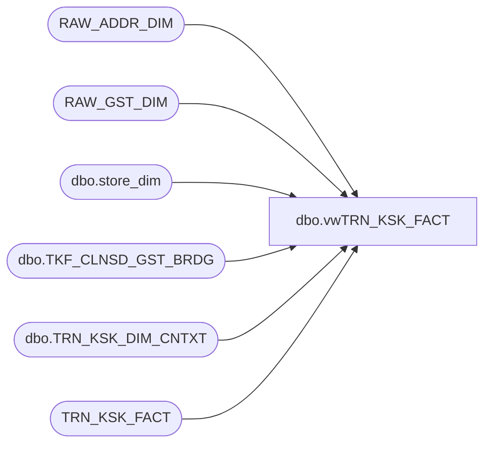

# dbo.vwTRN_KSK_FACT

**Database:** dw  
**Server:** papamart  

## Architecture Diagram



## Table Dependencies

| Referenced Table |
|---|
| RAW_ADDR_DIM |
| RAW_GST_DIM |
| dbo.store_dim |
| dbo.TKF_CLNSD_GST_BRDG |
| dbo.TRN_KSK_DIM_CNTXT |
| TRN_KSK_FACT |

## View Code

```sql
/***********************************************************************************************
Object Name:	dbo.vwTRN_KSK_FACT
Author:			Funmi Agbebi
Created Date:	3/6/2009
Purpose:		View used for reporting.  Primarily used by BO universes to 
				conveniently access all relevant pieces of kiosk registration data.
				Sourced from Kiosk registrations only.
				Joins TRN_KSK_FACT to TKF_CLNSD_GST_BRDG, TRN_KSK_DIM_CNTXT and 
				store_dim (for nearest store info)

Modifications
7/19/2012	G.Murrish	Translated Drvd_Cntry from GB/GBR to UK to match that in the Store.
**********************************************************************************************/

CREATE VIEW [dbo].[vwTRN_KSK_FACT]
AS SELECT b.CLNSD_GST_ID
		, r.RAW_ADDR_ID
		, a.DRVD_CNTRY_ABBRV
		, s.country TORStoreCountry
		, r.DRVD_GNDR_CD
		, r.BRTH_DT
		,
		--Return RegistrationID based on demographic info
		CASE
			  WHEN (b.CLNSD_GST_ID > 0 AND t.TOR_CLNSD_ADDR_ID > 0) THEN
				  t.TKF_ID
			  ELSE
				  -1
		  END AS ValidInfoRegID
		, CASE
			  WHEN (t.TOR_CLNSD_ADDR_ID) > 0 THEN
				  t.TKF_ID
			  ELSE
				  -1
		  END AS ValidAddrRegID
		, CASE
			  WHEN (t.TOR_CLNSD_ADDR_ID) = -1 THEN
				  t.TKF_ID
			  ELSE
				  -1
		  END AS InvalidAddrRegID
		, CASE
			  WHEN (b.CLNSD_GST_ID) = -1 THEN
				  t.TKF_ID
			  ELSE
				  -1
		  END AS InvalidGstRegID
		,

		--Return Guest or Address ID for Tourism based on other available demographic info
		CASE
			  WHEN b.CLNSD_GST_ID > 0 THEN
				  b.CLNSD_GST_ID
			  WHEN (b.CLNSD_GST_ID = -1 AND a.DRVD_CNTRY_ABBRV IS NOT NULL) AND (a.DRVD_CNTRY_ABBRV <> s.country) THEN
				  r.RAW_GST_ID
			  ELSE
				  b.CLNSD_GST_ID
		  END AS ClnsdNRawGstIDCombined
		, CASE
			  WHEN t.TOR_CLNSD_ADDR_ID > 0 THEN
				  t.TOR_CLNSD_ADDR_ID
			  WHEN (t.TOR_CLNSD_ADDR_ID = -1 AND a.DRVD_CNTRY_ABBRV IS NOT NULL) AND (a.DRVD_CNTRY_ABBRV <> s.country) THEN
				  r.RAW_ADDR_ID
			  ELSE
				  t.TOR_CLNSD_ADDR_ID
		  END AS ClnsdNRawAddrIDCombined
		, CASE
			  WHEN (b.CLNSD_GST_ID > 0 AND t.TOR_DSTNC_TO_STR_QTY > 49.99) THEN
				  b.CLNSD_GST_ID
			  WHEN (b.CLNSD_GST_ID = -1 AND a.DRVD_CNTRY_ABBRV IS NOT NULL) AND (a.DRVD_CNTRY_ABBRV <> s.country) THEN
				  r.RAW_GST_ID
			  ELSE
				  -1
		  END AS TouristGstID
		, CASE
			  WHEN (t.TOR_CLNSD_ADDR_ID > 0 AND t.TOR_DSTNC_TO_STR_QTY > 49.99) THEN
				  t.TOR_CLNSD_ADDR_ID
			  WHEN (t.TOR_CLNSD_ADDR_ID = -1 AND a.DRVD_CNTRY_ABBRV IS NOT NULL) AND (a.DRVD_CNTRY_ABBRV <> s.country) THEN
				  r.RAW_ADDR_ID
			  ELSE
				  -1
		  END AS TouristAddrID
		, CASE
			  WHEN t.TOR_DSTNC_TO_STR_QTY < 100 THEN
				  b.CLNSD_GST_ID
			  ELSE
				  -1
		  END AS GstIDWithin100
		, CASE
			  WHEN t.TOR_DSTNC_TO_STR_QTY < 100 THEN
				  t.TOR_CLNSD_ADDR_ID
			  ELSE
				  -1
		  END AS AddrIDWithin100
		, CASE
			  WHEN (b.CLNSD_GST_ID > 0 AND t.TOR_DSTNC_TO_STR_QTY > 99.99) THEN
				  b.CLNSD_GST_ID
			  WHEN (b.CLNSD_GST_ID = -1 AND a.DRVD_CNTRY_ABBRV IS NOT NULL) AND (a.DRVD_CNTRY_ABBRV <> s.country) THEN
				  r.RAW_GST_ID
			  ELSE
				  -1
		  END AS RawNClnsdGstID100Plus
		, CASE
			  WHEN (t.TOR_CLNSD_ADDR_ID > 0 AND t.TOR_DSTNC_TO_STR_QTY > 99.99) THEN
				  t.TOR_CLNSD_ADDR_ID
			  WHEN (t.TOR_CLNSD_ADDR_ID = -1 AND a.DRVD_CNTRY_ABBRV IS NOT NULL) AND (a.DRVD_CNTRY_ABBRV <> s.country) THEN
				  r.RAW_ADDR_ID
			  ELSE
				  -1
		  END AS RawNClnsdAddrID100Plus
		, CASE
			  WHEN (b.CLNSD_GST_ID = -1 AND a.DRVD_CNTRY_ABBRV IS NOT NULL) AND (a.DRVD_CNTRY_ABBRV <> s.country) AND r.RAW_GST_ID > 0 THEN
				  r.RAW_GST_ID
			  ELSE
				  -1
		  END AS ForeignGstID
		, CASE
			  WHEN (t.TOR_CLNSD_ADDR_ID = -1 AND a.DRVD_CNTRY_ABBRV IS NOT NULL) AND (a.DRVD_CNTRY_ABBRV <> s.country) AND r.RAW_ADDR_ID > 0 THEN
				  r.RAW_ADDR_ID
			  ELSE
				  -1
		  END AS ForeignAddrID
		, CASE
			  WHEN t.TOR_DSTNC_TO_STR_QTY BETWEEN 0 AND 29.99 THEN
				  '1) 00.00 - 29.99 Miles'
			  WHEN t.TOR_DSTNC_TO_STR_QTY BETWEEN 30 AND 49.99 THEN
				  '2) 30.00 - 49.99 Miles'
			  WHEN t.TOR_DSTNC_TO_STR_QTY BETWEEN 50 AND 99.99 THEN
				  '3) 50.00 - 99.99 Miles'
			  WHEN t.TOR_DSTNC_TO_STR_QTY > 99.99 THEN
				  '4) 100+ Miles'
			  WHEN ((t.TOR_DSTNC_TO_STR_QTY IS NULL AND a.DRVD_CNTRY_ABBRV IS NOT NULL) AND (a.DRVD_CNTRY_ABBRV <> s.country)) THEN
				  '5) Foreign'
			  ELSE
				  '6) Unspecified'
		  END AS TORTourismBand
		, CASE
			  WHEN t.TOR_DSTNC_TO_STR_QTY BETWEEN 0 AND 4.99 THEN
				  '1) 00.00 - 4.99 Miles'
			  WHEN t.TOR_DSTNC_TO_STR_QTY BETWEEN 5 AND 9.99 THEN
				  '2) 5.00 - 9.99 Miles'
			  WHEN t.TOR_DSTNC_TO_STR_QTY BETWEEN 10 AND 14.99 THEN
				  '3) 10.00 - 14.99 Miles'
			  WHEN t.TOR_DSTNC_TO_STR_QTY BETWEEN 15 AND 19.99 THEN
				  '4) 15.00 - 19.99 Miles'
			  WHEN t.TOR_DSTNC_TO_STR_QTY BETWEEN 20 AND 24.99 THEN
				  '5) 20.00 - 24.99 Miles'
			  WHEN t.TOR_DSTNC_TO_STR_QTY BETWEEN 25 AND 49.99 THEN
				  '6) 25.00 - 49.99 Miles'
			  WHEN t.TOR_DSTNC_TO_STR_QTY BETWEEN 50 AND 74.99 THEN
				  '7) 50.00 - 74.99 Miles'
			  WHEN t.TOR_DSTNC_TO_STR_QTY BETWEEN 75 AND 99.99 THEN
				  '8) 75.00 - 99.99 Miles'
			  WHEN t.TOR_DSTNC_TO_STR_QTY > 99.99 THEN
				  '9) 100+ Miles'
			  WHEN ((t.TOR_DSTNC_TO_STR_QTY IS NULL AND a.DRVD_CNTRY_ABBRV IS NOT NULL) AND (a.DRVD_CNTRY_ABBRV <> s.country)) THEN
				  '10) Foreign'
			  ELSE
				  '11) Unspecified'
		  END AS TOR_5to25_MileBand
		, n.store_name TORNearestStore
		, c.GST_VST_RECUR_CD
		, c.GST_VST_RECUR_DESCR
		, c.ADDR_VST_RECUR_CD
		, c.ADDR_VST_RECUR_DESCR
		, c.PRTY_TRN_IND
		, c.GIFT_IND
		, c.KSK_LANG_CD
		, t.*
   FROM
	   TRN_KSK_FACT t WITH (NOLOCK)
	   LEFT JOIN dbo.TKF_CLNSD_GST_BRDG b WITH (NOLOCK)
		   ON t.tkf_id = b.tkf_id
	   LEFT JOIN dbo.store_dim s WITH (NOLOCK)
		   ON t.str_id = s.store_key
	   LEFT JOIN dbo.store_dim n WITH (NOLOCK)
		   ON t.nrst_str_id = n.store_key
	   LEFT JOIN dbo.TRN_KSK_DIM_CNTXT c WITH (NOLOCK)
		   ON t.TRN_KSK_CNTXT_ID = c.TRN_KSK_CNTXT_ID
	   LEFT JOIN RAW_GST_DIM r WITH (NOLOCK)
		   ON t.raw_gst_id = r.raw_gst_id
	   LEFT JOIN (
				  SELECT RAW_ADDR_ID
					   , CLNSD_ADDR_ID
					   , ADDR_LN_1_TXT
					   , ADDR_LN_2_TXT
					   , APT_UNIT_NBR
					   , CTY_NM
					   , ST_PRVNC_TXT
					   , PSTL_CD
					   , CNTRY_TXT
					   , CASE
							 WHEN DRVD_CNTRY_ABBRV IN('GB', 'GBR') THEN
								 'UK'
							 ELSE
								 DRVD_CNTRY_ABBRV
						 END AS DRVD_CNTRY_ABBRV
					   , DRVD_MAIL_STAT_CD
					   , ADDR_CHKSUM
					   , INS_DT
					   , UPDT_DT
					   , BEG_EFF_DT
					   , END_EFF_DT
					   , ETL_LOG_ID
					   , ETL_EVNT_ID
					   , KSK_SNDR_SND_MAIL_CD
					   , CRM_SND_MAIL_CD
					   , CRM_MAIL_OPT_IN_CD
				  FROM
					  RAW_ADDR_DIM WITH (NOLOCK)) a
		   ON r.raw_addr_id = a.raw_addr_id


dbo,vwReturns,

--select top 100 * from dbo.vwReturns

CREATE  
--CREATE     
 VIEW dbo.vwReturns
   
AS
select 	s.store_id,
	d.actual_date,
	d.fiscal_week,
	d.fiscal_period,
	d.fiscal_year,
	t.transaction_id,
	t.party_deposit,
	t.party_y_n,
	t.non_merch,
	sum(t.unit_gross_amount) as totalDollars,
	sum(t.units) as totalUnits
from dbo.transaction_detail_facts t
join dbo.store_dim s on s.store_key = t.store_key
join dbo.date_dim d on d.date_key = t.date_key
where t.transaction_line_seq > 0
group by  s.store_id,
	  d.actual_date,
	  d.fiscal_week,
	  d.fiscal_period,
	  d.fiscal_year,
	  t.transaction_id,
	  t.party_deposit,
	  t.party_y_n,
	  t.non_merch
```

