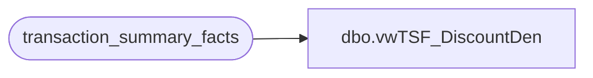

# dbo.vwTSF_DiscountDen

**Database:** dw  
**Server:** papamart  

## Architecture Diagram



## Table Dependencies

| Referenced Table |
|---|
| transaction_summary_facts |

## View Code

```sql
CREATE view [dbo].[vwTSF_DiscountDen] as
select 
(t.Gift_Card_Tender*-1)+t.Cash_Tender+t.Check_Tender+t.Other_Tender+
t.Amex_Tender+t.Discover_Tender+t.MasterCard_Tender+t.Visa_Tender+t.Bear_Buck_Tender+
t.Party_Deposit_Tender+t.Reward_Cert_Tender ReceiptTotalWithTax,
(t.Gift_Card_Tender*-1)+t.Cash_Tender+t.Check_Tender+t.Other_Tender+
t.Amex_Tender+t.Discover_Tender+t.MasterCard_Tender+t.Visa_Tender+t.Bear_Buck_Tender+
t.Party_Deposit_Tender+t.Reward_Cert_Tender+(t.Tax_Tender*-1) ReceiptTotalWithoutTax, 
t.*,t.GAAP_Sale+t.Gift_Card_Sold GAAPNGCSold from  transaction_summary_facts t with (nolock)
```

