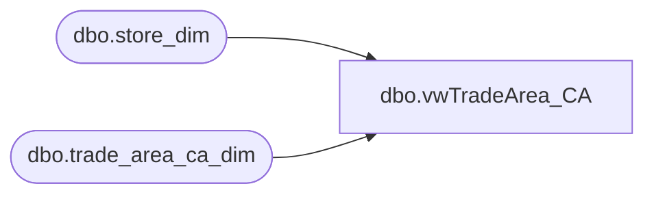

# dbo.vwTradeArea_CA

**Database:** dw  
**Server:** papamart  

## Architecture Diagram



## Table Dependencies

| Referenced Table |
|---|
| dbo.store_dim |
| dbo.trade_area_ca_dim |

## View Code

```sql
CREATE              VIEW dbo.vwTradeArea_CA
--WITH SCHEMABINDING    
AS

SELECT   
sd.store_id as Trade_Area_StoreID,
ta.fsa


FROM  dbo.trade_area_ca_dim ta  
JOIN  dbo.store_dim sd ON ta.store_key = sd.store_key
```

