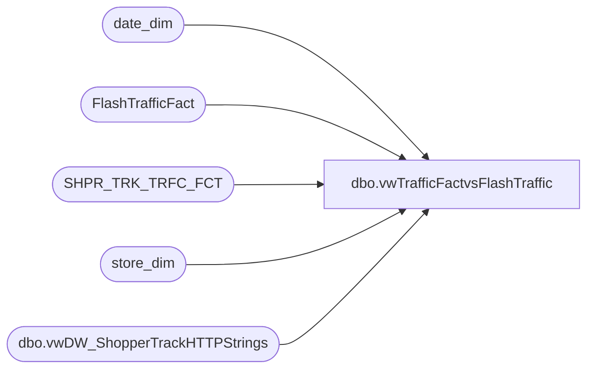

# dbo.vwTrafficFactvsFlashTraffic

**Database:** dw  
**Server:** papamart  

## Architecture Diagram



## Table Dependencies

| Referenced Table |
|---|
| date_dim |
| FlashTrafficFact |
| SHPR_TRK_TRFC_FCT |
| store_dim |
| dbo.vwDW_ShopperTrackHTTPStrings |

## View Code

```sql
CREATE view [dbo].[vwTrafficFactvsFlashTraffic]

as 

With 
Stores as
	(
		select cast(s.LocationCode as int) Store, dd.date_key, cast(dd.actual_date as date) StoreDate
		from kodiak.BABWMstrData.dbo.vwDW_ShopperTrackHTTPStrings s 
		cross join date_dim dd with (nolock)
		where dd.actual_date between getdate()-30 and getdate()
	),
FlashTraffic as
	(
		select
			sd.store_id as Store,
			cast(dd.actual_date as date) TrafficDate,
			sum(t.exits) TrafficCount
		from FlashTrafficFact t with (nolock)
		join store_dim sd with (nolock) on t.store_key = sd.store_key 
		join date_dim dd with (nolock) on t.date_key = dd.date_key 
		join stores s on sd.store_id = s.store and dd.date_key = s.date_key
		group by 
			sd.store_id, cast(dd.actual_date as date) 
	),
TrafficFact as
	(
		select
			sd.store_id as Store,
			cast(dd.actual_date as date) TrafficDate,
			sum(t.exits) TrafficCount,
			case when 
					sum(
						case when t.Data_Ind_Nm = 'Inputed' 
						then 1 
						else 0 
						end
						) > 0
					then 'Inputed'
					else 'Actual'
			end as Inputed
		from SHPR_TRK_TRFC_FCT t with (nolock)
		join store_dim sd with (nolock) on t.STR_KEY = sd.store_key
		join date_dim dd with (nolock) on t.DT_KEY = dd.date_key 
		join Stores s on sd.store_id = s.Store and dd.date_key = s.date_key
		group by sd.store_id, cast(dd.actual_date as date)
	),
FlashAndFact as
	(
		select 
			s.Store,
			s.StoreDate TrafficDate,
			isnull(ft.TrafficCount,0) as FlashTraffic,
			isnull(tf.TrafficCount,0) as TrafficFact,
			isnull(tf.Inputed, 'n/a') InputSource
		from Stores s 
		left join FlashTraffic ft on s.store = ft.store and s.StoreDate = ft.TrafficDate 
		left join TrafficFact tf on s.store = tf.store and s.StoreDate = tf.TrafficDate
	),
Summary as
	(
		select 
			Store,
			TrafficDate,
			FlashTraffic,
			TrafficFact,
			isnull((100*(TrafficFact - FlashTraffic))/nullif(FlashTraffic,0),0)*-1 as Variance,
			InputSource 
		from FlashAndFact 
	)
select 
	Store,
	TrafficDate,
	FlashTraffic,
	TrafficFact,
	Variance,
	case 
		when Variance > 0 
		then '+' + cast(Variance as varchar) + '%' 
		else cast(Variance as varchar) + '%' 
	end as VariancePct,
	InputSource 
from Summary
```

