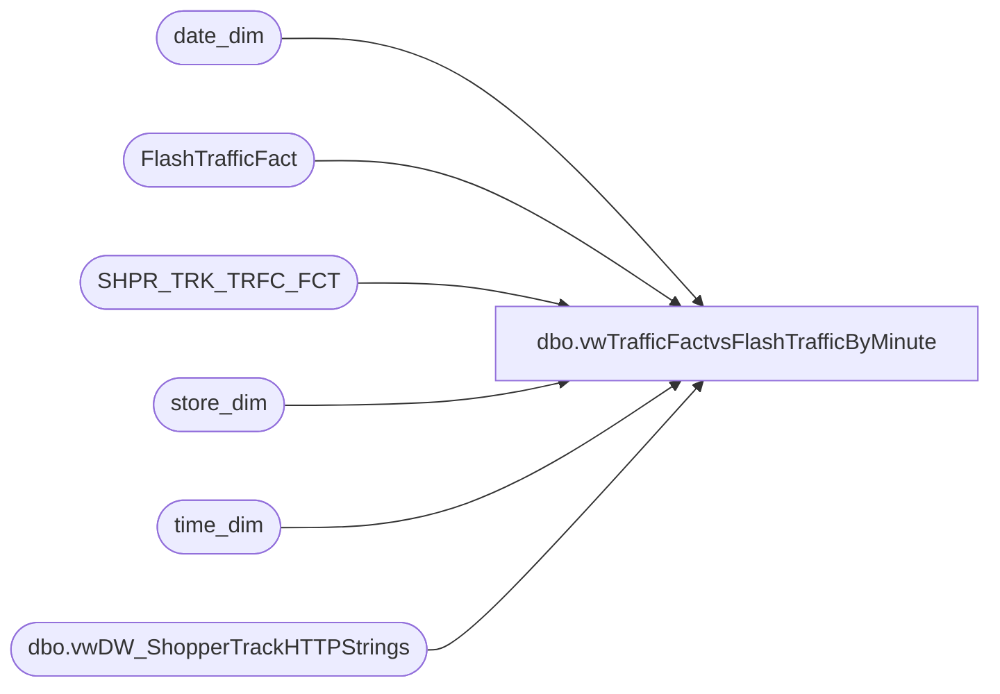

# dbo.vwTrafficFactvsFlashTrafficByMinute

**Database:** dw  
**Server:** papamart  

## Architecture Diagram



## Table Dependencies

| Referenced Table |
|---|
| date_dim |
| FlashTrafficFact |
| SHPR_TRK_TRFC_FCT |
| store_dim |
| time_dim |
| dbo.vwDW_ShopperTrackHTTPStrings |

## View Code

```sql
CREATE view vwTrafficFactvsFlashTrafficByMinute

as 

With 
Stores as
	(
		select 
			cast(s.LocationCode as int) Store, 
			dd.date_key, 
			cast(dd.actual_date as date) StoreDate,
			t.hour,
			t.minute 
		from kodiak.BABWMstrData.dbo.vwDW_ShopperTrackHTTPStrings s 
		cross join date_dim dd with (nolock)
		cross join time_dim t with (nolock) 
		where dd.actual_date between getdate()-7 and getdate()
		and t.minute in (0,15,45)
	),
TrafficFact as 
	(
		select
			sd.store_id as Store,
			cast(dd.actual_date as date) TrafficDate,
			sum(t.exits) TrafficCount,
			td.hour,
			td.minute-14 as minute 
		from SHPR_TRK_TRFC_FCT t with (nolock)
		join store_dim sd with (nolock) on t.STR_KEY = sd.store_key
		join date_dim dd with (nolock) on t.DT_KEY = dd.date_key 
		join time_dim td with (nolock) on t.tm_key = td.time_key
		where 1=1
		and cast(dd.actual_date as date) = '2018-05-17'
		group by sd.store_id, cast(dd.actual_date as date),
		td.hour, td.minute
		having sum(t.exits) > 0 
	),
FlashTraffic as
	(
		select
			sd.store_id as Store,
			cast(dd.actual_date as date) TrafficDate,
			sum(t.exits) TrafficCount,
			td.hour,
			td.minute 
		from FlashTrafficFact t with (nolock)
		join store_dim sd with (nolock) on t.store_key = sd.store_key 
		join date_dim dd with (nolock) on t.date_key = dd.date_key 
		join time_dim td with (nolock) on t.time_key = td.time_key
		where 1=1
		and cast(dd.actual_date as date) = '2018-05-17'
		group by sd.store_id, cast(dd.actual_date as date),
		td.hour, td.minute
		having sum(t.exits) > 0
	)
select 
	sd.Store,
	sd.StoreDate as TrafficDate,
	sd.hour,
	sd.minute,
	isnull(tf.TrafficCount,0) TrafficFact,
	isnull(ft.trafficCount,0) FlashTraffic
from stores sd
left join TrafficFact tf 
	on sd.Store = tf.store 
	and sd.StoreDate = tf.TrafficDate
	and sd.hour = tf.hour
	and sd.minute = tf.minute
left join FlashTraffic ft 
	on tf.Store = ft.Store
	and tf.TrafficDate = ft.TrafficDate
	and sd.Hour = ft.hour
	and sd.minute = ft.minute
```

