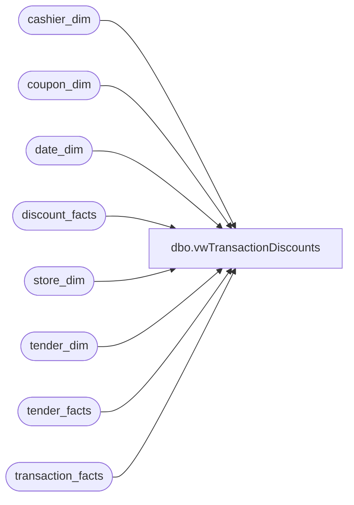

# dbo.vwTransactionDiscounts

**Database:** dw  
**Server:** papamart  

## Architecture Diagram



## Table Dependencies

| Referenced Table |
|---|
| cashier_dim |
| coupon_dim |
| date_dim |
| discount_facts |
| store_dim |
| tender_dim |
| tender_facts |
| transaction_facts |

## View Code

```sql
CREATE view [dbo].[vwTransactionDiscounts] 
as 

select 
	sd.store_id as Store,
	cast(dd.actual_date as date) as TransactionDate,
	tf.register_no as Register,
	tf.Transaction_no as TransactionNumber,
	cash.cashier_code,
	td.tender_desc,
	cp.coupon_desc,
	cast(cp.stop_date as date) CouponStopDate,
	df.reference_no,
	df.units,
	df.unit_gross_amount,
	df.lift_amount,
	df.transaction_id
from discount_facts df with (nolock)
join coupon_dim cp with (nolock)on df.coupon_key=cp.coupon_key
join date_dim dd with (nolock) on df.date_key=dd.date_key
join store_dim sd with (nolock) on df.store_key=sd.store_key
join transaction_facts tf with (nolock) on df.transaction_id=tf.transaction_id 
left join cashier_dim cash on tf.cashier_key=cash.cashier_key
join tender_facts tef with (nolock) on df.transaction_id=tef.transaction_id
join tender_dim td with (nolock) on tef.tender_key=td.tender_key and tender_desc<>'tax'
where 1=1
and cp.coupon_desc is not null
```

