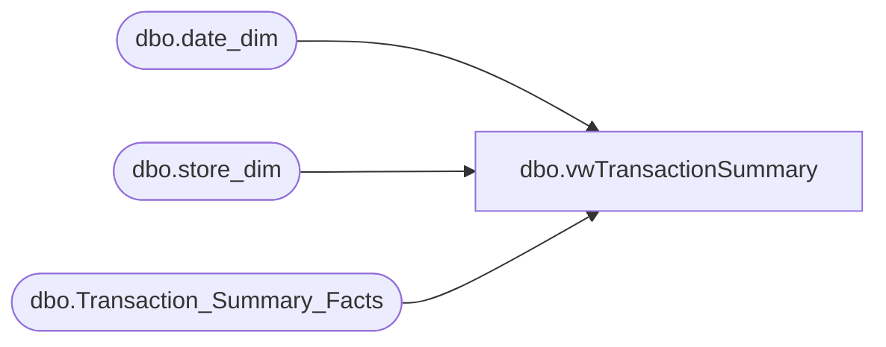

# dbo.vwTransactionSummary

**Database:** dw  
**Server:** papamart  

## Architecture Diagram



## Table Dependencies

| Referenced Table |
|---|
| dbo.date_dim |
| dbo.store_dim |
| dbo.Transaction_Summary_Facts |

## View Code

```sql
--CREATE
CREATE  
VIEW dbo.vwTransactionSummary

AS

select 	--dd.fiscal_year, 
	--dd.fiscal_period,
	--dd.fiscal_week,
	--dd.actual_date,
	--sd.store_id, 
	a.date_key,
	a.store_key,
	a.register_no, 
	a.transaction_id,
	sum(a.Tender_Total) as Tender_Total,
	sum(a.Tender_Ttl_No_Tax) as Tender_Ttl_No_Tax,
	sum(a.Gift_Card_tender) as Gift_Card_tender,
	sum(a.Tax_tender) as Tax_tender,
	sum(a.Cash_tender) as Cash_tender,
	sum(a.Check_tender) as Check_tender,
	sum(a.BuyStuff) as BuyStuff,
	sum(a.Other_Tender) as Other_Tender,
	sum(a.Coupon_Amt) as Coupon_Amt,
	sum(a.Coupon_Units) as Coupon_Units,
	sum(a.Visa) as Visa,
	sum(a.Discover) as Discover,
	sum(a.MasterCard) as MasterCard,
	sum(a.Amex) as Amex,
	sum(a.GAAP_Sales) as GAAP_Sales,
	sum(a.Party_Deposit_merch) as Party_Deposit_merch,
	sum(a.Discounts) as Discounts,
	sum(a.UGA) as UGA,
	sum(a.Units) as Units,
	sum(a.Party_Deposit_tender) as Party_Deposit_tender,
	sum(a.Reward_Certificate) as Reward_Certificate,
	sum(a.Merchandise_UGA) as Merchandise_UGA,
	sum(a.Cub_Cash) as Cub_Cash,
	sum(a.Paid_Outs) as Paid_Outs,
	sum(a.Gift_Card_Sold) as Gift_Card_Sold,
	sum(a.Shipping) as Shipping,
	sum(a.Other_Fee) as Other_Fee,
	sum(a.Bear_Buck_tender) as Bear_Buck_tender
	

from (

	select 	tsf.store_key,
		tsf.date_key,
		tsf.register_no, 
		tsf.transaction_id,
		CASE WHEN tsf.transaction_summary_key = 1  THEN tsf.amount ELSE 0 END as Tender_Total,
		CASE WHEN tsf.transaction_summary_key = 2  THEN tsf.amount ELSE 0 END as Tender_Ttl_No_Tax,
		CASE WHEN tsf.transaction_summary_key = 3  THEN tsf.amount ELSE 0 END as Gift_Card_tender,
		CASE WHEN tsf.transaction_summary_key = 4  THEN tsf.amount ELSE 0 END as Tax_tender,
		CASE WHEN tsf.transaction_summary_key = 5  THEN tsf.amount ELSE 0 END as Cash_tender,
		CASE WHEN tsf.transaction_summary_key = 6  THEN tsf.amount ELSE 0 END as Check_tender,
		CASE WHEN tsf.transaction_summary_key = 7  THEN tsf.amount ELSE 0 END as BuyStuff,
		CASE WHEN tsf.transaction_summary_key = 8  THEN tsf.amount ELSE 0 END as Other_Tender,
		CASE WHEN tsf.transaction_summary_key = 9  THEN tsf.amount ELSE 0 END as Coupon_Amt,
		CASE WHEN tsf.transaction_summary_key = 10 THEN tsf.amount ELSE 0 END as Coupon_Units,
		CASE WHEN tsf.transaction_summary_key = 11 THEN tsf.amount ELSE 0 END as Visa,
		CASE WHEN tsf.transaction_summary_key = 12 THEN tsf.amount ELSE 0 END as Discover,
		CASE WHEN tsf.transaction_summary_key = 13 THEN tsf.amount ELSE 0 END as MasterCard,
		CASE WHEN tsf.transaction_summary_key = 14 THEN tsf.amount ELSE 0 END as Amex,
		CASE WHEN tsf.transaction_summary_key = 15 THEN tsf.amount ELSE 0 END as GAAP_Sales,
		CASE WHEN tsf.transaction_summary_key = 16 THEN tsf.amount ELSE 0 END as Party_Deposit_merch,
		CASE WHEN tsf.transaction_summary_key = 17 THEN tsf.amount ELSE 0 END as Discounts,
		CASE WHEN tsf.transaction_summary_key = 18 THEN tsf.amount ELSE 0 END as UGA,
		CASE WHEN tsf.transaction_summary_key = 19 THEN tsf.amount ELSE 0 END as Units,
		CASE WHEN tsf.transaction_summary_key = 20 THEN tsf.amount ELSE 0 END as Party_Deposit_tender,
		CASE WHEN tsf.transaction_summary_key = 21 THEN tsf.amount ELSE 0 END as Reward_Certificate,
		CASE WHEN tsf.transaction_summary_key = 22 THEN tsf.amount ELSE 0 END as Merchandise_UGA,
		CASE WHEN tsf.transaction_summary_key = 23 THEN tsf.amount ELSE 0 END as Cub_Cash,
		CASE WHEN tsf.transaction_summary_key = 24 THEN tsf.amount ELSE 0 END as Paid_Outs,
		CASE WHEN tsf.transaction_summary_key = 25 THEN tsf.amount ELSE 0 END as Gift_Card_Sold,
		CASE WHEN tsf.transaction_summary_key = 26 THEN tsf.amount ELSE 0 END as Shipping,
		CASE WHEN tsf.transaction_summary_key = 27 THEN tsf.amount ELSE 0 END as Bear_Buck_tender,
		CASE WHEN tsf.transaction_summary_key = 28 THEN tsf.amount ELSE 0 END as Other_Fee
	
	from dbo.Transaction_Summary_Facts tsf
	 
	) a

join dbo.store_dim sd on a.store_key = sd.store_key
join dbo.date_dim dd on a.date_key = dd.date_key

group by --dd.fiscal_year, 
	 --dd.fiscal_period,
	 --dd.fiscal_week,
	-- dd.actual_date,
	 --sd.store_id, 
	 a.date_key,
	 a.store_key,
	 a.register_no, 
	 a.transaction_id
```

