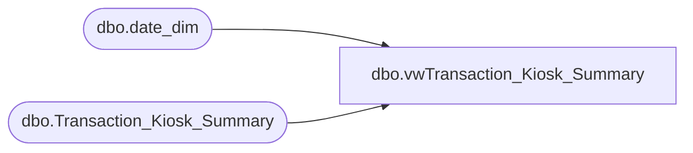

# dbo.vwTransaction_Kiosk_Summary

**Database:** dw  
**Server:** papamart  

## Architecture Diagram



## Table Dependencies

| Referenced Table |
|---|
| dbo.date_dim |
| dbo.Transaction_Kiosk_Summary |

## View Code

```sql
CREATE    VIEW dbo.vwTransaction_Kiosk_Summary
--WITH SCHEMABINDING 
AS
SELECT customer_key, 
	Num_Visits_Store, 
	Num_Visits_Web, 
	Recency_In_Months_Store, 
	Recency_In_Months_Web, 
-- 	First_Visit_Date_Key_Store, 
-- 	Last_Visit_Date_Key_Store, 
-- 	First_Visit_Date_Key_Web, 
-- 	Last_Visit_Date_Key_Web, 
	fsd.actual_date as first_str_visit_date,
	fsd.fiscal_period as first_str_visit_fp,
	fsd.fiscal_year as first_str_visit_fy,
	lsd.actual_date as last_str_visit_date,
	lsd.fiscal_period as last_str_visit_fp,
	lsd.fiscal_year as last_str_visit_fy,
	fwd.actual_date as first_web_visit_date,
	fwd.fiscal_period as first_web_visit_fp,
	fwd.fiscal_year as first_web_visit_fy,
	lwd.actual_date as last_web_visit_date,
	lwd.fiscal_period as last_web_visit_fp,
	lwd.fiscal_year as last_web_visit_fy,
	household_key, 
	current_address_key, 
	nearest_store_key, 
	distance_to_nearest_store, 
	nearest_future_store_key, 
	distance_to_nearest_future_store


FROM dbo.Transaction_Kiosk_Summary tks
JOIN dbo.date_dim fsd on tks.First_Visit_Date_Key_Store = fsd.date_key
JOIN dbo.date_dim lsd on tks.Last_Visit_Date_Key_Store = lsd.date_key
JOIN dbo.date_dim fwd on tks.First_Visit_Date_Key_Web = fwd.date_key
JOIN dbo.date_dim lwd on tks.Last_Visit_Date_Key_Web = lwd.date_key
```

