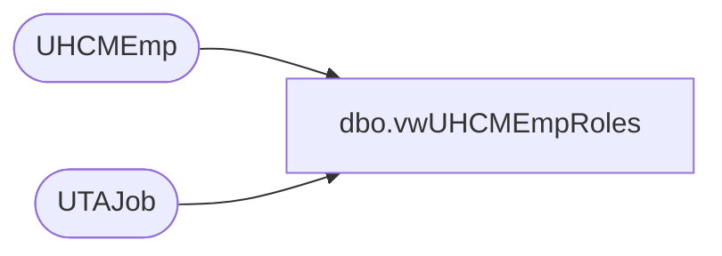

# dbo.vwUHCMEmpRoles

**Database:** dw  
**Server:** papamart  

## Architecture Diagram



## Table Dependencies

| Referenced Table |
|---|
| UHCMEmp |
| UTAJob |

## View Code

```sql
CREATE View [dbo].[vwUHCMEmpRoles]

as 

with CoreJobCodes as
(
	SELECT DISTINCT  JbcJobCode AS LWSN_CD, left (JbcLongDesc, 50) as NM, left(JbcJobCode, 12) AS R_POSITION
	FROM            UHCMEmp WITH (NOLOCK)
	--WHERE JbcJobCode NOT IN ('ASSOC', 'ASST', 'BB', 'CWM', 'GWM', 'DCWM')
	where EepCompanyCode <> 'BABUK'
),
UTAJobCodes as
(
	SELECT DISTINCT Job_Name AS LWSN_CD, left (Job_Desc,50) as NM, left (Job_Name, 12) AS R_POSITION
	from UTAJob 
	--Where Job_Name NOT IN ('ASSOC', 'ASST', 'BB', 'CWM', 'GWM', 'DCWM')
	where Job_Name = 'none'
),
SageJobCodes as 
(
	SELECT DISTINCT  JbcJobCode AS LWSN_CD, left (JbcLongDesc, 50) as NM, JbcJobCode AS R_POSITION
	FROM            UHCMEmp WITH (NOLOCK)
	--WHERE JbcJobCode NOT IN ('ASSOC', 'ASST', 'BB', 'CWM', 'GWM', 'DCWM')
	where EepCompanyCode = 'BABUK'
)
select *
from CoreJobCodes
UNION
select *
from UTAJobCodes 
where Lwsn_cd not in (select lwsn_cd from CoreJobCodes)
UNION
select * from SageJobCodes
--order by R_POSITION asc 

;
```

