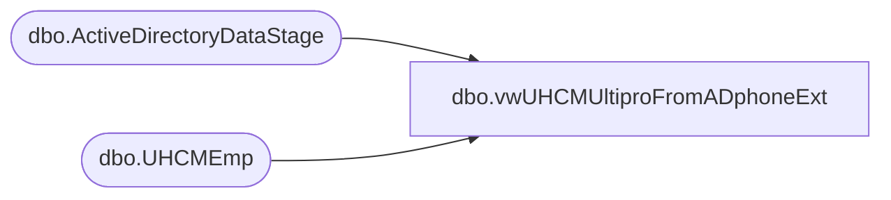

# dbo.vwUHCMUltiproFromADphoneExt

**Database:** dw  
**Server:** papamart  

## Architecture Diagram



## Table Dependencies

| Referenced Table |
|---|
| dbo.ActiveDirectoryDataStage |
| dbo.UHCMEmp |

## View Code

```sql
CREATE View [dbo].[vwUHCMUltiproFromADphoneExt]
AS

with 
adsPaths as
(
select distinct(AdsPAth), Name, DisplayName, samaccountname, EmployeeID, UserPrincipalName, Pager, TelephoneNumber, FacsimileTelephoneNumber, Mobile, OtherTelephone from [dbo].[ActiveDirectoryDataStage] 
where ISNUMERIC(samaccountname) = 0 and ISNUMERIC(EmployeeID) = 1
),
uhcmEmps as
(
select eepCompanyCode as CompanyCode, e.EecLocation, e.EepEEID, e.EepNameFirst, e.EepNamePreferred, e.EepNameLast,e.JbcJobCode, e.EecOrgLvl1Code, e.samaccountname, e.WorkPhoneNumber
from [dbo].[UHCMEmp] e 
where
e.EecEmplStatus <> 'Terminated' 
and e.EepCompanyCode <> 'BABUK'
)
--select u.EecLocation, u.EepEEID, u.EepNameFirst, u.EepNamePreferred, u.EepNameLast,u.JbcJobCode, u.EecOrgLvl1Code, u.samaccountname,  

select	 u.CompanyCode as 'Company',
		convert(varchar, getdate(), 101) as 'Effective Date', 
		u.EepEEID as 'emp #',
'phone number' = case when len(a.TelephoneNumber) = 4 and left(a.TelephoneNumber, 1) = 5 then '3144238000'
                 when a.TelephoneNumber like '%x%' then '3144238000'
				else isnull(replace(a.TelephoneNumber, '-',''), u.WorkPhoneNumber) end,
--else u.WorkPhoneNumber end,

--a.TelephoneNumber as 'ext'

'ext' = case when len(a.TelephoneNumber) < 5 then a.TelephoneNumber
    when a.TelephoneNumber like '%x%' then substring(a.TelephoneNumber, charindex('x',a.TelephoneNumber,1)+1, 4)
else '' end

from uhcmEmps u
join adsPaths a on u.EepEEID = a.EmployeeID
```

