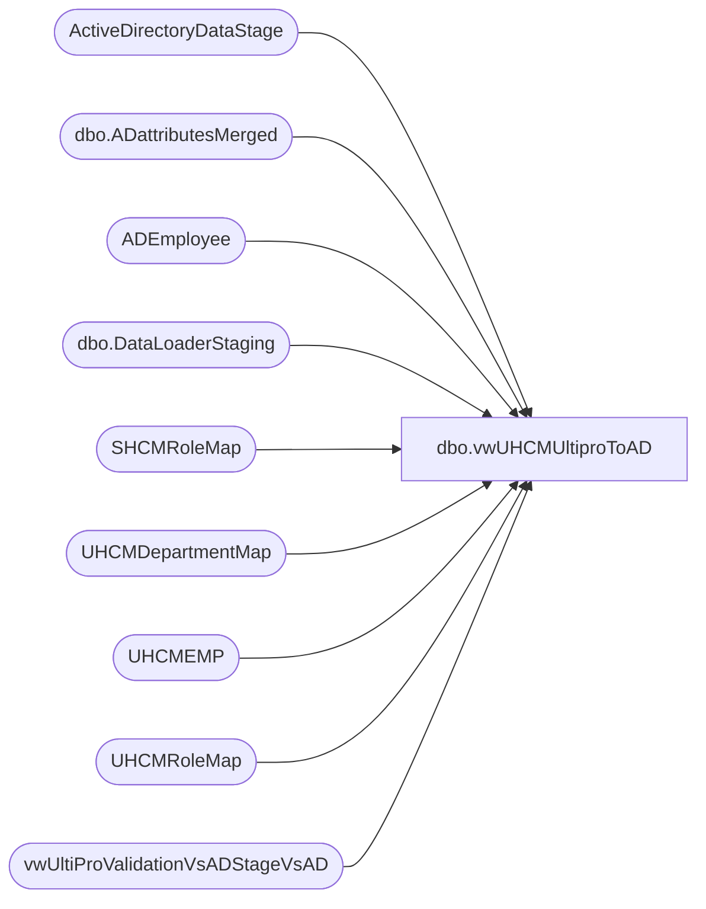

# dbo.vwUHCMUltiproToAD

**Database:** dw  
**Server:** papamart  

## Architecture Diagram



## Table Dependencies

| Referenced Table |
|---|
| ActiveDirectoryDataStage |
| dbo.ADattributesMerged |
| ADEmployee |
| dbo.DataLoaderStaging |
| SHCMRoleMap |
| UHCMDepartmentMap |
| UHCMEMP |
| UHCMRoleMap |
| vwUltiProValidationVsADStageVsAD |

## View Code

```sql
-- Ian Wallace 10-17-2020  Added logic to prevent H and R events for BQ employees
-- Ian Wallace 02-03-2021  Added new logic for ProvisioningEvent, UserProvisioningRole & ExtensionAttribute1 for UK employees
-- Ian Wallace 09-12-2022 Added new bearhouse role logic 

CREATE View [dbo].[vwUHCMUltiproToAD]
AS

with 
MissedTerminations as
	(
		select EmployeeID
		from vwUltiProValidationVsADStageVsAD
		where EmployeeID in (select eepeeid from UHCMEMP where TerminatedFlag = 'Y')
		and isnull(StagedProvisionEvent, 'x') <> 'T'
		and datediff(dd, TerminatedEffectiveDate, getdate()) <= 14
	),

BaseView as
(
	Select 
	ISNULL(e.UpdateDate, e.InsertDate) as [UpdatedTimeStamp],
	-- DATEADD(hh, DATEDIFF(hh, GETDATE(), GETUTCDATE()), ISNULL(e.UpdateDate, e.InsertDate)) as [UpdatedTimeStamp],   -- replaced above datetime to implement UTC
	--Cast(e.EecDateOfLastHire as datetime) as [StartDate],
	
	[StartDate] = CASE 
	
	WHEN e.EepCompanyCode in ('BABW','BABCN','BABR') THEN
		Cast(e.EecDateOfLastHire as datetime)
	
	WHEN e.EepCompanyCode = 'BABUK' and e.JbcJobCode in  ('IrelandChief Workshop Manager40','IrelandChief Workshop Manager35','Dual Site Chief Workshop Manager','Chief Workshop Manager',
	'UKChief Workshop Manager35','UKChief Workshop Manager40','UKDual Site Chief Workshop Manager35','UKDual Site Chief Workshop Manager40','Territory Manager') THEN
		Cast(getdate() as datetime)
	
	WHEN  e.EepCompanyCode = 'BABUK' and e.EecLocation like '9%%' then
		Cast(getdate() as datetime)

		WHEN  e.EepCompanyCode = 'BABUK' and e.EecLocation like '2%%' and e.JbcJobCode not in  ('IrelandChief Workshop Manager40','Dual Site Chief Workshop Manager','Chief Workshop Manager',
	'UKChief Workshop Manager35','UKChief Workshop Manager40','UKDual Site Chief Workshop Manager35','UKDual Site Chief Workshop Manager40','District Manager') then
		Cast(e.EecDateOfOriginalHire as datetime)

	ELSE Cast(getdate() as datetime) END ,
	
	Cast(e.TerminatedEffectiveDate as datetime) as [EndDate],
	
	
	[ProvisioningEvent] = CASE WHEN e.EepCompanyCode in ('BABW','BABCN','BABR') THEN
				Cast(Case
					When (
						(e.TerminatedFlag = 'Y' or e.EecEmplStatus = 'Terminated') 
						and 
						(
						e.TermEmailSentFlag is null 
						or e.eepeeid in (select EmployeeID from MissedTerminations)
						)
						) THEN 'T'
					--When a.EmployeeID is null and e.TerminatedFlag is null and e.sAMAccountName is NULL and e.EecEmplStatus <> 'Terminated' and e.EecOrgLvl1Code <> 'BQ' THEN 'H'
					When a.EmployeeID is null and e.TerminatedFlag is null and e.EecEmplStatus <> 'Terminated' and e.EecOrgLvl1Code <> 'BQ' THEN 'H'
					When (a.EmployeeADGroup <> d.AD_Department) and e.EecEmplStatus <> 'Terminated' THEN 'C'
					Else 'P'
					End as nvarchar)
			 WHEN e.EepCompanyCode = 'BABUK' THEN
				Cast(Case
					When (
						(e.TerminatedFlag = 'y' or e.EecEmplStatus = 'Terminated') 
						and 
						(
						e.TermEmailSentFlag is null 
						or e.eepeeid in (select EmployeeID from MissedTerminations)
						)
						) THEN 'T'
					--When aa.EmployeeID is null and e.TerminatedFlag <> 'y' and e.EecEmplStatus <> 'Terminated' and 
					When a.EmployeeID is null and e.TerminatedFlag <> 'y' and e.EecEmplStatus <> 'Terminated' and 
					(e.sAMAccountName is NULL or e.sAMAccountName = '')  --and e.EecOrgLvl1Code <> 'BQ' 
						THEN 'H'
					--When (aa.Department <> d.AD_Department) and e.EecEmplStatus <> 'Terminated' THEN 'C'
					When (a.Department <> d.AD_Department) and e.EecEmplStatus <> 'Terminated' THEN 'C'
					Else 'P'
					End as nvarchar)
			ELSE 'P' END ,

	Cast('' as Nvarchar) as [ProvisioningValue(s)],
	
	
				----***************************************************** new logic for new store roles added in Nov 2022
				[UserProvisioningRole] = CASE WHEN e.EepCompanyCode in ('BABW','BABCN','BABR') and e.EecOrgLvl1Code <> 'BRHS' THEN
					Cast(Case
						When e.JbcJobCode in ( 'BB', 'CNBB', 'XPOPBB') THEN 'US Bear Builder'
						When e.JbcJobCode in ( 'SL', 'CNSL', 'SLTMP',  'CNSLTMP', 'XPOPSL') THEN 'US Sales Lead'
						When e.JbcJobCode in ( 'ASM',  'CNAWM', 'AWM', 'CNAWM',  'AWMTMP', 'XPOPAWM','AWMCNT') THEN 'US Assistant Manager'
						When e.JbcJobCode in  ('CWM', 'CNCWM','CWMTMP', 'CNCWMTMP', 'CNDCWM', 'DCWM', 'DCWMTMP', 'XPOPCWM','GWM','OPSMGR') THEN 'US Chief Workshop Manager'
						When e.LocDesc = m.LocCodeDescription THEN m.UserProvisioningRole 
						When m.UserProvisioningRole is null then  'BQ General'
						else m.UserProvisioningRole 
					END as Nvarchar) 
					WHEN e.EepCompanyCode in ('BABW','BABCN','BABR') and e.EecOrgLvl1Code = 'BRHS' THEN
						Cast(Case
						When e.JbcJobCode in ('BHWRKI','BHWRKII','WEBBBI','WEBBBII') THEN 'Bear House - WHSE'
						When e.JbcJobCode in ('ITBRHSSU','BHCLEAN', 'BHHRAD', 'BHHRASST', 'BHSHIPSP', 'BHRECPT','BHWRKIII','DXBRHS','LOGWHOCO','LXBH', 'GENBHHR',
						    'LXWEB','MNTTCH','MNTTCH2','MXBHHR','MXBHMNT','MXBHOPS','MXGMBH','SMXOPSEC','SXBH','SXWEB','SXWEBAST','SXWHOCOR','BHRECSP') THEN 'Bear House - General'
						--else 'Bear House – WHSE'
						else 'Bear House - WHSE'
					END as Nvarchar) 
			      WHEN e.EepCompanyCode = 'BABUK' THEN
					Cast(Case
						When  e.JbcJobCode in ('Bear Builder','Bearbuilder','IrelandBear Builder4','UKBear Builder4') THEN 'UK Bear Builder'
						
						When e.JbcJobCode in ('Assistant Workshop Manager','IrelandAssistant Workshop Manager30','IrelandAssistant Workshop Manager35','UKAssistant Workshop Manager20',
						  'UKAssistant Workshop Manager25','UKAssistant Workshop Manager30','UKAssistant Workshop Manager35','UKAssistant Workshop Manager40') THEN 'UK Assistant Manager'
						
						When e.JbcJobCode in (
						  'IrelandSales Lead Hourly12','IrelandSales Lead Hourly20','Sales Lead',
						  'Sales Lead Hourly','Sales Lead(Annual Salary)','Sales Lead(Hourly)','UKSales Lead Hourly12',
						  'UKSales Lead Hourly20','UKSales Lead Hourly4','IrelandSales Lead Hourly4') THEN 'UK Sales Lead'
						
						When e.JbcJobCode in  ('IrelandChief Workshop Manager40','Dual Site Chief Workshop Manager','Chief Workshop Manager',
							'UKChief Workshop Manager35','UKChief Workshop Manager40','UKDual Site Chief Workshop Manager35',
							'UKDual Site Chief Workshop Manager40') THEN 'UK Chief Workshop Manager'
						When e.JbcJobCode = m2.JbcJobCode THEN m2.UserProvisioningRole 
						When m2.UserProvisioningRole is null then  'UK BQ General'
						else m2.UserProvisioningRole 
					END as Nvarchar)
				ELSE m.UserProvisioningRole END,
				----*****************************************************

	Cast(coalesce (nullif (e.eepNamePreferred, ''), e.EepNameFirst) as NVarChar) as [FirstName],

	Cast(e.EepNameMiddle as Nvarchar) as [MiddleName],
	Cast(e.EepNameLast as Nvarchar) as [LastName],
	Cast('' as Nvarchar) as [ContainerOU],
	Cast('' as datetime) as [AccountExpiration],
	Cast (e.EecOrgLvl1Code as Nvarchar) as EecOrgLvl1Code,
	--Cast(e.JbcLongDesc as Nvarchar) as [Title],

	e.JbcLongDesc as [Title],

	Cast(Case 
		When d.AD_Department is null  then 'BQ' 
		else d.AD_Department 
	END as Nvarchar) as [Department],
	Cast('' as Nvarchar) as [Office],
	Cast('' as Nvarchar) as [Street],
	Cast('' as Nvarchar) as [City],
	Cast('' as Nvarchar) as [State],
	Cast('' as Nvarchar) as [Zip/PostalCode],
	Cast('' as Nvarchar) as [Country],
	Cast('' as Nvarchar) as [Business],
	Cast('' as Nvarchar) as [Fax],
	Cast('' as Nvarchar) as [Mobile],
	Cast('' as Nvarchar) as [Pager],
	Cast('' as Nvarchar) as [Home],
	Cast(e.EepEEID as Nvarchar) as [EmployeeID],
	Cast('' as Nvarchar) as [EmployeeNumber],
	Cast('' as Nvarchar) as [AccountingCode],
	Cast(e.SupervisorID as Nvarchar) as [ManagerEmployeeID],
	Cast('' as Nvarchar) as [ManagerEmployeeNumber],
	Cast('' as Nvarchar) as [ManagerEmail],
	Cast('' as Nvarchar) as [ManagerFirstName],
	Cast('' as Nvarchar) as [ManagerMiddleName],
	Cast('' as Nvarchar) as [ManagerLastName],
	Cast('' as Nvarchar) as [Description], 
	Cast('' as Nvarchar) as [UserPassword], 
	
	[Extension Attribute 1] = 
        case 
            when e.EfoPhoneNumber is NULL and e.DateOfBirth is null then Cast(e.EepEEID as Nvarchar) 

            WHEN e.EepCompanyCode in ('BABW','BABCN','BABR') THEN Cast(e.EfoPhoneNumber as Nvarchar)
             WHEN e.EepCompanyCode = 'BABUK' THEN Cast(e.DateOfBirth as Nvarchar)    
        end,

	Cast('' as Nvarchar) as [Extension Attribute 2],
	Cast('' as Nvarchar) as [Extension Attribute 3],
	Cast('' as Nvarchar) as [Extension Attribute 4],
	--Cast('' as Nvarchar) as [Extension Attribute 5],
	e.JbcJobCode as [Extension Attribute 5],
	Cast('' as Nvarchar) as [Extension Attribute 6],
	Cast('' as Nvarchar) as [Extension Attribute 7],
	Cast('' as Nvarchar) as [Extension Attribute 8],
	Cast('' as Nvarchar) as [Extension Attribute 9],
	Cast('' as Nvarchar) as [Extension Attribute 10],
	Cast('' as Nvarchar) as [Extension Attribute 11],
	Cast('' as Nvarchar) as [Extension Attribute 12],
	Cast('' as Nvarchar) as [Extension Attribute 13],
	Cast('' as Nvarchar) as [Extension Attribute 14],
	Cast('' as Nvarchar) as [Extension Attribute 15],
	Cast(e.sAMAccountName  as Nvarchar) as [User Logon Name (Pre-Windows 2000)],
	Cast('' as Nvarchar) as [User Logon Name],
	Cast('' as Nvarchar) as [Full Name],
	--Cast(isnull(e.eepNamePreferred, e.EepNameFirst) + ' ' + e.EepNameLast as Nvarchar) as [Display Name],
	cast(isnull(nullif (e.eepNamePreferred, ''), e.EepNameFirst)  + ' ' + e.EepNameLast as Nvarchar) as [Display Name],
	Cast('' as Nvarchar) as [Email],
	Cast('' as Nvarchar) as [Exchange Alias],
	Cast('' as Nvarchar) as [Exchange Display Name],
	getdate() as InsertDate,
	--Dateadd(minute, 10, getdate()) as InsertDate,
	Dateadd(minute, 10, getdate())as DateUpdated

	From UHCMEMP e with (nolock)
	left join UHCMRoleMap m 
		On e.LocDesc = m.LocCodeDescription
	left join SHCMRoleMap m2
		--On e.LocDesc = m2.JbcJobCode
		On e.JbcJobCode = m2.JbcJobCode
	left Join ADEmployee ad with (nolock)
		On ad.EmployeeID = e.SupervisorID
	Left Join UHCMDepartmentMap d with (nolock)
		On e.EecLocation = d.EecLocation
	--left join vwADEmployee a with (nolock) On a.EmployeeID = e.EepEEID
	 --left join papamart.DWStaging.dbo.ADattributes a with (nolock) on a.EmployeeId = e.EepEEID
	 left join papamart.DW.dbo.ADattributesMerged a with (nolock) on a.EmployeeId = e.EepEEID
	--left join DWStaging.dbo.ADattributes aa on aa.EmployeeID = e.EepEEID
	Where 1=1
	and e.EepEEID <> '0041742'   -- per Dave East 06/11/2026
	
	and 
		(
			e.SendUpdateFlag = 1
			or
			(
				e.EecEmplStatus = 'Active' 
				and a.EmployeeID is null 
				and e.EepCompanyCode <> 'BABUK'
				--and datediff(dd, e.EecDateOfLastHire, getdate()) <= 7 
				and datediff(dd, isnull(e.UpdateDate, e.InsertDate), getdate()) <= 1
				and e.EepEEID not in (
										select EmployeeID 
										from coredb01.[AIMSConfig].[dbo].[DataLoaderStaging] 
										where datediff(dd, UpdatedTimeStamp, getdate()) = 0 
										and datediff(hh, UpdatedTimeStamp, getdate()) <= 6
									)						
			)

			or 
				(
				e.EecEmplStatus = 'PreJoiner' 
				and a.EmployeeID is null 
				--and e.EepCompanyCode <> 'BABUK'
				--and datediff(dd, e.EecDateOfLastHire, getdate()) <= 7 
				and datediff(dd, isnull(e.UpdateDate, e.InsertDate), getdate()) <= 1
				and e.EepEEID not in (select EmployeeID from coredb01.[AIMSConfig].[dbo].[DataLoaderStaging] where datediff(dd, UpdatedTimeStamp, getdate()) = 0 and datediff(hh, UpdatedTimeStamp, getdate()) <= 6)
				)

			or e.eepeeid in (select EmployeeID from MissedTerminations)
			
		)
),
DisabledAccounts as
(
	select EmployeeID
	from ADEmployee 
	where memberOf like '%disabled%'
	UNION
	select distinct EmployeeID
	from ActiveDirectoryDataStage -- loaded nightly so we can identify accounts NOT in this table 
	where ADSPath like '%disable%'
	and EmployeeID is not null
)

--select * from BaseView

select
	bv.[UpdatedTimeStamp],
	bv.[StartDate],
	bv.[EndDate],
	[ProvisioningEvent] = 
CASE WHEN bv.EmployeeID like '2%' THEN
					cast(
		case 
			when bv.[ProvisioningEvent] in ('H', 'P', 'C')
				and da.EmployeeID is not NULL --disabled in AD (not removed)
				and bv.EecOrgLvl1Code <> 'BQ'
			then 'R' 
			when bv.[ProvisioningEvent] in ('P', 'C')
			and  da.EmployeeID is NULL --is not disabled in AD 
			--and bv.EmployeeID not in (select EmployeeID from DWStaging.dbo.ADattributes) --is not in AD
			and bv.EmployeeID not in (select EmployeeID from papamart.DW.dbo.ADattributesMerged) --is not in AD
			and bv.EecOrgLvl1Code <> 'BQ' 
			then 'H'
			else bv.[ProvisioningEvent]
		end as nvarchar) 
WHEN bv.EmployeeID not like '2%' THEN
				cast(
		case 
			when bv.[ProvisioningEvent] in ('H', 'P', 'C')
				and da.EmployeeID is not NULL --disabled in AD (not removed)
				and bv.EecOrgLvl1Code <> 'BQ'
			then 'R' 
			when bv.[ProvisioningEvent] in ('P', 'C')
			and  da.EmployeeID is NULL --is not disabled in AD 
			--and bv.EmployeeID not in (select EmployeeID from ADEmployee) --is not in AD
			and bv.EmployeeID not in (select EmployeeID from papamart.DW.dbo.ADattributesMerged) --is not in AD
			and bv.EecOrgLvl1Code <> 'BQ' 
			then 'H'
			else bv.[ProvisioningEvent]
		end as nvarchar) 

ELSE 'P' END ,
	
	
	bv.[ProvisioningValue(s)],
	bv.[UserProvisioningRole],
	bv.[FirstName],
	bv.[MiddleName],
	bv.[LastName],
	bv.[ContainerOU],
	bv.[AccountExpiration],
	bv.[Title],
	bv.[Department],
	bv.[Office],
	bv.[Street],
	bv.[City],
	bv.[State],
	bv.[Zip/PostalCode],
	bv.[Country],
	bv.[Business],
	bv.[Fax],
	bv.[Mobile],
	bv.[Pager],
	bv.[Home],
	bv.[EmployeeID],
	bv.[EmployeeNumber],
	bv.[AccountingCode],
	bv.[ManagerEmployeeID],
	bv.[ManagerEmployeeNumber],
	bv.[ManagerEmail],
	bv.[ManagerFirstName],
	bv.[ManagerMiddleName],
	bv.[ManagerLastName],
	bv.[Description],
	bv.[UserPassword],
	bv.[Extension Attribute 1],
	bv.[Extension Attribute 2],
	bv.[Extension Attribute 3],
	bv.[Extension Attribute 4],
	bv.[Extension Attribute 5],
	bv.[Extension Attribute 6],
	bv.[Extension Attribute 7],
	bv.[Extension Attribute 8],
	bv.[Extension Attribute 9],
	bv.[Extension Attribute 10],
	bv.[Extension Attribute 11],
	bv.[Extension Attribute 12],
	bv.[Extension Attribute 13],
	bv.[Extension Attribute 14],
	bv.[Extension Attribute 15],
	bv.[User Logon Name (Pre-Windows 2000)],
	bv.[User Logon Name],
	bv.[Full Name],
	bv.[Display Name],
	bv.[Email],
	bv.[Exchange Alias],
	bv.[Exchange Display Name],
	bv.[InsertDate],
	bv.[DateUpdated]
from BaseView bv
join uhcmemp e on bv.EmployeeID=e.eepeeid
left join DisabledAccounts da on bv.EmployeeID=da.EmployeeID 
where 
	(e.EecEmplStatus <> 'Terminated' 
		and cast(
				case 
					when bv.[ProvisioningEvent] in ('H', 'P', 'C')
						and da.EmployeeID is not NULL --disabled in AD (not removed)
					then 'R' 
					when bv.[ProvisioningEvent] in ('P', 'C')
					and  da.EmployeeID is NULL --is not disabled in AD 
					--and bv.EmployeeID not in (select EmployeeID from ADEmployee) --is not in AD
					and bv.EmployeeID not in (select EmployeeID from papamart.DW.dbo.ADattributesMerged) --is not in AD
					then 'H'
					else bv.[ProvisioningEvent]
				end as nvarchar) in ('H', 'P','R','C'))
	or
	(e.EecEmplStatus = 'Terminated' 
		and cast(
					case 
						when bv.[ProvisioningEvent] in ('H', 'P', 'C')
							and da.EmployeeID is not NULL --disabled in AD (not removed)
						then 'R' 
						when bv.[ProvisioningEvent] in ('P', 'C')
						and  da.EmployeeID is NULL --is not disabled in AD 
						--and bv.EmployeeID not in (select EmployeeID from ADEmployee) --is not in AD
						and bv.EmployeeID not in (select EmployeeID from papamart.DW.dbo.ADattributesMerged) --is not in AD
						then 'H'
						else bv.[ProvisioningEvent]
					end as nvarchar) ='T')
```

