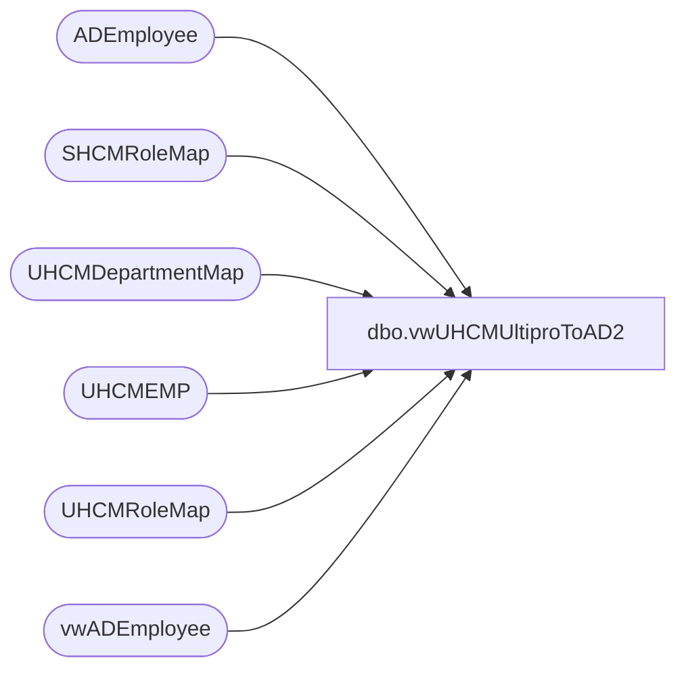

# dbo.vwUHCMUltiproToAD2

**Database:** dw  
**Server:** papamart  

## Architecture Diagram



## Table Dependencies

| Referenced Table |
|---|
| ADEmployee |
| SHCMRoleMap |
| UHCMDepartmentMap |
| UHCMEMP |
| UHCMRoleMap |
| vwADEmployee |

## View Code

```sql
CREATE View [dbo].[vwUHCMUltiproToAD2]
AS

with 

BaseView as
(
	Select 
	ISNULL(e.UpdateDate, e.InsertDate) as [UpdatedTimeStamp],
	Cast(e.EecDateOfLastHire as datetime) as [StartDate],
	Cast(e.TerminatedEffectiveDate as datetime) as [EndDate],
	Cast ('C' as nvarchar) as [ProvisioningEvent],
	Cast('' as Nvarchar) as [ProvisioningValue(s)],
	--Cast(Case
	--	When e.JbcJobCode in ( 'BB', 'ASM', 'SL', 'CNBB', 'CNSL', 'CNASM', 'SLTMP', 'AWM', 'CNAWM') THEN 'US Bear Builder'
	--	When e.JbcJobCode in  ('CWM', 'CNCWM') THEN 'US Chief Workshop Manager'
	--	When e.LocDesc = m.LocCodeDescription THEN m.UserProvisioningRole 
	--	When m.UserProvisioningRole is null then  'BQ General'
	--	else m.UserProvisioningRole 
	--END as Nvarchar) as [UserProvisioningRole],

	[UserProvisioningRole] = CASE WHEN e.EepCompanyCode = 'BABW' THEN
					Cast(Case
						When e.JbcJobCode in ( 'BB', 'ASM', 'SL', 'CNBB', 'CNSL', 'CNASM', 'SLTMP', 'AWM', 'CNAWM') THEN 'US Bear Builder'
						When e.JbcJobCode in  ('CWM', 'CNCWM','CWMTMP','CNCWMTMP','DCWM') THEN 'US Chief Workshop Manager'
						When e.LocDesc = m.LocCodeDescription THEN m.UserProvisioningRole 
						When m.UserProvisioningRole is null then  'BQ General'
						else m.UserProvisioningRole 
					END as Nvarchar) 
			       WHEN e.EepCompanyCode = 'BABUK' THEN
					Cast(Case
						When e.JbcJobCode in ('Assistant Workshop Manager','Bear Builder','Bearbuilder','IrelandAssistant Workshop Manager30',
						  'IrelandBear Builder4','IrelandSales Lead Hourly12','IrelandSales Lead Hourly20','Sales Lead',
						  'Sales Lead Hourly','Sales Lead(Annual Salary)','Sales Lead(Hourly)','UKSales Lead Hourly12',
						  'UKSales Lead Hourly20','UKSales Lead Hourly4','UKAssistant Workshop Manager20',
						  'UKAssistant Workshop Manager25','UKAssistant Workshop Manager30','UKAssistant Workshop Manager35',
						  'UKAssistant Workshop Manager40','UKBear Builder4','IrelandSales Lead Hourly4') THEN 'UK Bear Builder'
						When e.JbcJobCode in  ('IrelandChief Workshop Manager40','Dual Site Chief Workshop Manager','Chief Workshop Manager',
							'UKChief Workshop Manager35','UKChief Workshop Manager40','UKDual Site Chief Workshop Manager35',
							'UKDual Site Chief Workshop Manager40') THEN 'UK Chief Workshop Manager'
						When e.JbcJobCode = m2.JbcJobCode THEN m2.UserProvisioningRole 
						When m2.UserProvisioningRole is null then  'UK BQ General'
						else m2.UserProvisioningRole 
					END as Nvarchar)
				ELSE m.UserProvisioningRole END,

	Cast(e.EecEmplStatus as Nvarchar) as [Status],
	Cast(isnull(e.eepNamePreferred, e.EepNameFirst) as NVarChar) as [FirstName],
	Cast(e.EepNameMiddle as Nvarchar) as [MiddleName],
	Cast(e.EepNameLast as Nvarchar) as [LastName],
	Cast('' as Nvarchar) as [ContainerOU],
	Cast('' as datetime) as [AccountExpiration],
	Cast(e.JbcLongDesc as Nvarchar) as [Title],
	Cast(Case 
		When d.AD_Department is null  then 'BQ' 
		else d.AD_Department 
	END as Nvarchar) as [Department],
	Cast('' as Nvarchar) as [Office],
	Cast('' as Nvarchar) as [Street],
	Cast('' as Nvarchar) as [City],
	Cast('' as Nvarchar) as [State],
	Cast('' as Nvarchar) as [Zip/PostalCode],
	Cast('' as Nvarchar) as [Country],
	Cast('' as Nvarchar) as [Business],
	Cast('' as Nvarchar) as [Fax],
	Cast('' as Nvarchar) as [Mobile],
	Cast('' as Nvarchar) as [Pager],
	Cast('' as Nvarchar) as [Home],
	Cast(e.EepEEID as Nvarchar) as [EmployeeID],
	Cast('' as Nvarchar) as [EmployeeNumber],
	Cast('' as Nvarchar) as [AccountingCode],
	Cast(e.SupervisorID as Nvarchar) as [ManagerEmployeeID],
	Cast('' as Nvarchar) as [ManagerEmployeeNumber],
	Cast('' as Nvarchar) as [ManagerEmail],
	Cast('' as Nvarchar) as [ManagerFirstName],
	Cast('' as Nvarchar) as [ManagerMiddleName],
	Cast('' as Nvarchar) as [ManagerLastName],
	Cast('' as Nvarchar) as [Description], 
	Cast('' as Nvarchar) as [UserPassword], 
	--Cast(e.EfoPhoneNumber as Nvarchar) as [Extension Attribute 1],
	

	[Extension Attribute 1] = CASE WHEN e.EepCompanyCode in ('BABW','BABCN','BABR') THEN Cast(e.EfoPhoneNumber as Nvarchar)
 			  WHEN e.EepCompanyCode = 'BABUK' THEN Cast(e.DateOfBirth as Nvarchar)
			  ELSE Cast(e.EepEEID as Nvarchar) END,


	Cast('' as Nvarchar) as [Extension Attribute 2],
	Cast('' as Nvarchar) as [Extension Attribute 3],
	Cast('' as Nvarchar) as [Extension Attribute 4],
	e.JbcJobCode as [Extension Attribute 5],
	--Cast('' as Nvarchar) as [Extension Attribute 5],
	Cast('' as Nvarchar) as [Extension Attribute 6],
	Cast('' as Nvarchar) as [Extension Attribute 7],
	Cast('' as Nvarchar) as [Extension Attribute 8],
	Cast('' as Nvarchar) as [Extension Attribute 9],
	Cast('' as Nvarchar) as [Extension Attribute 10],
	Cast('' as Nvarchar) as [Extension Attribute 11],
	Cast('' as Nvarchar) as [Extension Attribute 12],
	Cast('' as Nvarchar) as [Extension Attribute 13],
	Cast('' as Nvarchar) as [Extension Attribute 14],
	Cast('' as Nvarchar) as [Extension Attribute 15],
	Cast(e.sAMAccountName  as Nvarchar) as [User Logon Name (Pre-Windows 2000)],
	Cast('' as Nvarchar) as [User Logon Name],
	Cast('' as Nvarchar) as [Full Name],
	Cast(isnull(e.eepNamePreferred, e.EepNameFirst) + ' ' + e.EepNameLast as Nvarchar) as [Display Name],
	Cast('' as Nvarchar) as [Email],
	Cast('' as Nvarchar) as [Exchange Alias],
	Cast('' as Nvarchar) as [Exchange Display Name],
	Dateadd(minute, 10, getdate()) as InsertDate,
	Dateadd(minute, 10, getdate())as DateUpdated

	From UHCMEMP e with (nolock)
	left join UHCMRoleMap m 
		On e.LocDesc = m.LocCodeDescription
	left join SHCMRoleMap m2
		On e.LocDesc = m2.JbcJobCode
	left Join ADEmployee ad with (nolock)
		On ad.EmployeeID = e.SupervisorID
	Left Join UHCMDepartmentMap d with (nolock)
		On e.EecLocation = d.EecLocation
	left join vwADEmployee a with (nolock)
			On a.EmployeeID = e.EepEEID
	Where 1=1
	--and e.EecLocation <> 'UKBQ'   
	--and e.EecLocation not like '2%'
	--and EepEEID = '0074173'
	and e.SendUpdateFlag = 2

)
select
	bv.[UpdatedTimeStamp],
	bv.[StartDate],
	bv.[EndDate],
	bv.[ProvisioningEvent],
	bv.[ProvisioningValue(s)],
	bv.[UserProvisioningRole],
	bv.[Status],
	bv.[FirstName],
	bv.[MiddleName],
	bv.[LastName],
	bv.[ContainerOU],
	bv.[AccountExpiration],
	bv.[Title],
	bv.[Department],
	bv.[Office],
	bv.[Street],
	bv.[City],
	bv.[State],
	bv.[Zip/PostalCode],
	bv.[Country],
	bv.[Business],
	bv.[Fax],
	bv.[Mobile],
	bv.[Pager],
	bv.[Home],
	bv.[EmployeeID],
	bv.[EmployeeNumber],
	bv.[AccountingCode],
	bv.[ManagerEmployeeID],
	bv.[ManagerEmployeeNumber],
	bv.[ManagerEmail],
	bv.[ManagerFirstName],
	bv.[ManagerMiddleName],
	bv.[ManagerLastName],
	bv.[Description],
	bv.[UserPassword],
	bv.[Extension Attribute 1],
	bv.[Extension Attribute 2],
	bv.[Extension Attribute 3],
	bv.[Extension Attribute 4],
	bv.[Extension Attribute 5],
	bv.[Extension Attribute 6],
	bv.[Extension Attribute 7],
	bv.[Extension Attribute 8],
	bv.[Extension Attribute 9],
	bv.[Extension Attribute 10],
	bv.[Extension Attribute 11],
	bv.[Extension Attribute 12],
	bv.[Extension Attribute 13],
	bv.[Extension Attribute 14],
	bv.[Extension Attribute 15],
	bv.[User Logon Name (Pre-Windows 2000)],
	bv.[User Logon Name],
	bv.[Full Name],
	bv.[Display Name],
	bv.[Email],
	bv.[Exchange Alias],
	bv.[Exchange Display Name],
	bv.[InsertDate],
	bv.[DateUpdated]
from BaseView bv
join uhcmemp e on bv.EmployeeID=e.eepeeid
where bv.[EmployeeID] not in ('2016021','2016022','2016023','2016027','2016097','2016483','2016484','2016513','2904000')
and bv.[Status] <> 'Terminated'
```

