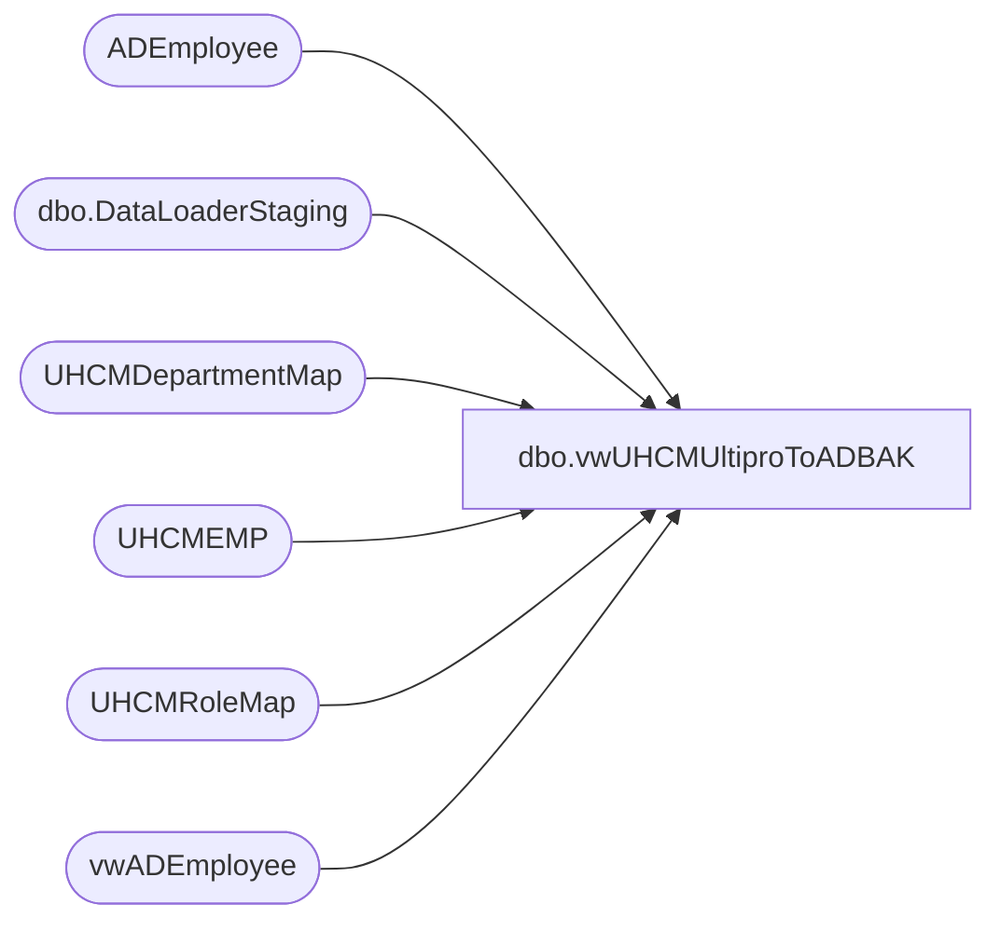

# dbo.vwUHCMUltiproToADBAK

**Database:** dw  
**Server:** papamart  

## Architecture Diagram



## Table Dependencies

| Referenced Table |
|---|
| ADEmployee |
| dbo.DataLoaderStaging |
| UHCMDepartmentMap |
| UHCMEMP |
| UHCMRoleMap |
| vwADEmployee |

## View Code

```sql
--Currently not sending ProvisioningEvent = to C (Change of Department) waiting on Dave East to deploy that logic

CREATE View [dbo].[vwUHCMUltiproToADBAK]
AS
With BaseView as
(
Select 
ISNULL(e.UpdateDate, e.InsertDate) as [UpdatedTimeStamp],
Cast(e.EecDateOfLastHire as datetime) as [StartDate],
Cast(e.TerminatedEffectiveDate as datetime) as [EndDate],
Cast(Case
	When ((e.TerminatedFlag = 'Y' or e.EecEmplStatus = 'Terminated') and e.TermEmailSentFlag is null) THEN 'T'
	When a.EmployeeID is null and e.TerminatedFlag is null and e.sAMAccountName is NULL and e.EecEmplStatus <> 'Terminated' THEN 'H'
	When (a.EmployeeADGroup <> d.AD_Department) and e.EecEmplStatus <> 'Terminated' THEN 'C'
	Else 'P'
End as nvarchar) as [ProvisioningEvent],
Cast('' as Nvarchar) as [ProvisioningValue(s)],
Cast(Case
	When e.JbcJobCode in ( 'BB', 'ASM', 'SL', 'CNBB', 'CNSL', 'CNASM', 'SLTMP', 'AWM', 'CNAWM') THEN 'US Bear Builder'
	When e.JbcJobCode in  ('CWM', 'CNCWM') THEN 'US Chief Workshop Manager'
	When e.LocDesc = m.LocCodeDescription THEN m.UserProvisioningRole 
	When m.UserProvisioningRole is null then  'BQ General'
	else m.UserProvisioningRole 
END as Nvarchar) as [UserProvisioningRole],
Cast(e.EepNameFirst as NVarChar) as [FirstName],
Cast(e.EepNameMiddle as Nvarchar) as [MiddleName],
Cast(e.EepNameLast as Nvarchar) as [LastName],
Cast('' as Nvarchar) as [ContainerOU],
Cast('' as datetime) as [AccountExpiration],
Cast(e.JbcLongDesc as Nvarchar) as [Title],
Cast(Case 
	When d.AD_Department is null  then 'BQ' 
	else d.AD_Department 
END as Nvarchar) as [Department],
Cast('' as Nvarchar) as [Office],
Cast('' as Nvarchar) as [Street],
Cast('' as Nvarchar) as [City],
Cast('' as Nvarchar) as [State],
Cast('' as Nvarchar) as [Zip/PostalCode],
Cast('' as Nvarchar) as [Country],
Cast('' as Nvarchar) as [Business],
Cast('' as Nvarchar) as [Fax],
Cast('' as Nvarchar) as [Mobile],
Cast('' as Nvarchar) as [Pager],
Cast('' as Nvarchar) as [Home],
Cast(e.EepEEID as Nvarchar) as [EmployeeID],
Cast('' as Nvarchar) as [EmployeeNumber],
Cast('' as Nvarchar) as [AccountingCode],
Cast(e.SupervisorID as Nvarchar) as [ManagerEmployeeID],
Cast('' as Nvarchar) as [ManagerEmployeeNumber],
Cast('' as Nvarchar) as [ManagerEmail],
Cast('' as Nvarchar) as [ManagerFirstName],
Cast('' as Nvarchar) as [ManagerMiddleName],
Cast('' as Nvarchar) as [ManagerLastName],
Cast('' as Nvarchar) as [Description], 
Cast('' as Nvarchar) as [UserPassword], 
Cast(e.EfoPhoneNumber as Nvarchar) as [Extension Attribute 1],
Cast('' as Nvarchar) as [Extension Attribute 2],
Cast('' as Nvarchar) as [Extension Attribute 3],
Cast('' as Nvarchar) as [Extension Attribute 4],
Cast('' as Nvarchar) as [Extension Attribute 5],
Cast('' as Nvarchar) as [Extension Attribute 6],
Cast('' as Nvarchar) as [Extension Attribute 7],
Cast('' as Nvarchar) as [Extension Attribute 8],
Cast('' as Nvarchar) as [Extension Attribute 9],
Cast('' as Nvarchar) as [Extension Attribute 10],
Cast('' as Nvarchar) as [Extension Attribute 11],
Cast('' as Nvarchar) as [Extension Attribute 12],
Cast('' as Nvarchar) as [Extension Attribute 13],
Cast('' as Nvarchar) as [Extension Attribute 14],
Cast('' as Nvarchar) as [Extension Attribute 15],
Cast(e.sAMAccountName  as Nvarchar) as [User Logon Name (Pre-Windows 2000)],
Cast('' as Nvarchar) as [User Logon Name],
Cast('' as Nvarchar) as [Full Name],
Cast(e.EepNameFirst + ' ' + e.EepNameLast as Nvarchar) as [Display Name],
Cast('' as Nvarchar) as [Email],
Cast('' as Nvarchar) as [Exchange Alias],
Cast('' as Nvarchar) as [Exchange Display Name],
Dateadd(minute, 10, getdate()) as InsertDate,
Dateadd(minute, 10, getdate())as DateUpdated

From UHCMEMP e with (nolock)
left join UHCMRoleMap m 
	On e.LocDesc = m.LocCodeDescription
Join ADEmployee ad with (nolock)
	On ad.EmployeeID = e.SupervisorID
Left Join UHCMDepartmentMap d with (nolock)
	On e.EecLocation = d.EecLocation
left join vwADEmployee a with (nolock)
		On a.EmployeeID = e.EepEEID
Where 1=1
and e.EecLocation <> 'UKBQ'   
and e.EecLocation not like '2%'
and Cast(Case
	When ((e.TerminatedFlag = 'Y' or e.EecEmplStatus = 'Terminated') and e.TermEmailSentFlag is null) THEN 'T'
	When a.EmployeeID is null and e.TerminatedFlag is null and e.sAMAccountName is NULL and e.EecEmplStatus <> 'Terminated' THEN 'H'
	When (a.EmployeeADGroup <> d.AD_Department) and e.EecEmplStatus <> 'Terminated' THEN 'C'
	Else 'P'
End as nvarchar) <> 'C'
and 
	(
		e.SendUpdateFlag = 1
		or
		(
			e.EecEmplStatus = 'Active' 
			and a.EmployeeID is null 
			--and datediff(dd, e.EecDateOfLastHire, getdate()) <= 7 
			and e.EepEEID not in (select EmployeeID from coredb01.[AIMSConfig].[dbo].[DataLoaderStaging] where datediff(dd, UpdatedTimeStamp, getdate()) = 0 and datediff(hh, UpdatedTimeStamp, getdate()) <= 3)
		)
	)
)
select bv.*
from BaseView bv
join uhcmemp e on bv.EmployeeID=e.eepeeid
where 
	(e.EecEmplStatus <> 'Terminated' and bv.ProvisioningEvent in ('H', 'P'))
	or
	(e.EecEmplStatus = 'Terminated' and bv.ProvisioningEvent ='T')
```

