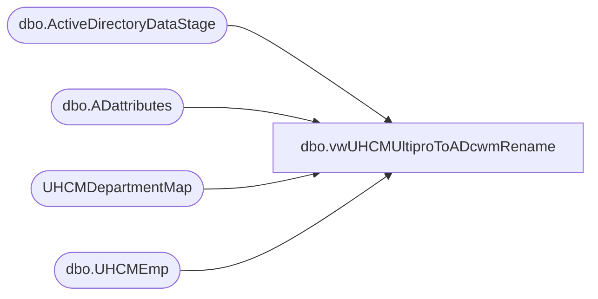

# dbo.vwUHCMUltiproToADcwmRename

**Database:** dw  
**Server:** papamart  

## Architecture Diagram



## Table Dependencies

| Referenced Table |
|---|
| dbo.ActiveDirectoryDataStage |
| dbo.ADattributes |
| UHCMDepartmentMap |
| dbo.UHCMEmp |

## View Code

```sql
--Currently not sending ProvisioningEvent = to C (Change of Department) waiting on Dave East to deploy that logic

CREATE View [dbo].[vwUHCMUltiproToADcwmRename]
AS

with 
adsPaths as
(
select distinct(AdsPAth), Name, samaccountname, EmployeeID, UserPrincipalName from [dbo].[ActiveDirectoryDataStage] 
--where EmployeeID in ('0065517','0063517')
),
uhcmEmps as
(
select e.EecLocation, e.EepEEID, e.EepNameFirst, e.EepNamePreferred, e.EepNameLast, e.LocDesc, e.JbcJobCode, e.EecOrgLvl1Code, e.samaccountname,  
'EmployeeADGroup' = CASE WHEN ISNUMERIC(e.EecLocation) = 1 THEN
						case when  e.JbcJobCode in ('CWM','GWM','DCWM', 'CNCWM','CWMTMP','CNCWMTMP') and a.EmployeeADGroup in ('CWMs','Stores 000-099') and cast(e.EecLocation as integer) < 1013 then '000-099'
						when  e.JbcJobCode in ('CWM','GWM','DCWM', 'CNCWM','CWMTMP','CNCWMTMP') and a.EmployeeADGroup in ('CWMs','Stores 000-099') and cast(e.EecLocation as integer) between 1014 and 1099 then '000-099'
						when  e.JbcJobCode in ('CWM','GWM','DCWM', 'CNCWM','CWMTMP','CNCWMTMP') and a.EmployeeADGroup in ('CWMs','Stores 100-199') and cast(e.EecLocation as integer) between 1014 and 1199 then '100-199'
						when  e.JbcJobCode in ('CWM','GWM','DCWM', 'CNCWM','CWMTMP','CNCWMTMP') and a.EmployeeADGroup in ('CWMs','Stores 200-299') and cast(e.EecLocation as integer) between 1200 and 1299 then '200-299'
						when  e.JbcJobCode in ('CWM','GWM','DCWM', 'CNCWM','CWMTMP','CNCWMTMP') and a.EmployeeADGroup in ('CWMs','Stores 300-399') and cast(e.EecLocation as integer) between 1300 and 1399 then '300-399'
						when  e.JbcJobCode in ('CWM','GWM','DCWM', 'CNCWM','CWMTMP','CNCWMTMP') and a.EmployeeADGroup in ('CWMs','Stores 400-499') and cast(e.EecLocation as integer) between 1400 and 1499 then '400-499'
						when  e.JbcJobCode in ('CWM','GWM','DCWM', 'CNCWM','CWMTMP','CNCWMTMP') and a.EmployeeADGroup in ('CWMs','Stores 400-499') and cast(e.EecLocation as integer) between 1500 and 1599 then '500-599'
						when  e.JbcJobCode in ('CWM','GWM','DCWM', 'CNCWM','CWMTMP','CNCWMTMP') and a.EmployeeADGroup in ('CWMs','Stores 500-599') and cast(e.EecLocation as integer) between 1600 and 1599 then '600-699'
						when cast(e.EecLocation as integer) = 1013 and a.EmployeeADGroup = 'SelfServe' then 'Bearhouse'
						else a.EmployeeADGroup end
					WHEN ISNUMERIC(e.EecLocation) = 0 THEN
						case when e.EecLocation = 'FN' and a.EmployeeADGroup in ('Accounting', 'SalesAudit') then 'Finance'
							 when e.EecLocation = 'EXEC' and a.EmployeeADGroup in ('Business Dev') then 'EXEC'
							 when e.EecLocation = 'EXEC' and a.EmployeeADGroup in ('Accounting') and e.EepEEID = '0045202' then 'EXEC'
							 when e.EecLocation = 'EXEC' and a.EmployeeADGroup in ('HR') and e.EepEEID = '0000019' then 'EXEC'
							 when e.EecLocation = 'EXEC' and a.EmployeeADGroup in ('Legal') and e.EepEEID = '0028889' then 'EXEC'
							 when e.EecLocation = 'OUT' and a.EmployeeADGroup = 'SelfServe' then 'Bearhouse'
							 when e.EecLocation = 'IN' and a.EmployeeADGroup = 'SelfServe' then 'Bearhouse'
							 when e.EecLocation = 'MKT' and a.EmployeeADGroup = 'Creative' and e.EepEEID in (0051689,0049834,0015176,0015300,0013323,0034027,0059005) then 'Marketing'
						else a.EmployeeADGroup end
					else  a.EmployeeADGroup end,

d.EecLocation as 'deptEecLocation', 

'AD_Department' = CASE WHEN ISNUMERIC(e.EecLocation) = 1 THEN								
					case when cast(e.EecLocation as integer) < 1013 and e.JbcJobCode in ('BB','SL','AWM', 'SLTMP') then  'SelfServe'
						when cast(e.EecLocation as integer) between 1014 and 1700  and e.JbcJobCode in ('BB','SL','AWM', 'SLTMP')then  'SelfServe'
						when cast(e.EecLocation as integer) < 1013 and e.JbcJobCode in ('CWM','GWM','DCWM', 'CNCWM') then '000-099' -- 'CWMs' 
						when cast(e.EecLocation as integer) between 1014 and 1099 and e.JbcJobCode in ('CWM','GWM','DCWM', 'CNCWM','CWMTMP','CNCWMTMP') then '000-099' 
						when cast(e.EecLocation as integer) between 1100 and 1199 and e.JbcJobCode in ('CWM','GWM','DCWM', 'CNCWM','CWMTMP','CNCWMTMP') then '100-199'
						when cast(e.EecLocation as integer) between 1200 and 1299 and e.JbcJobCode in ('CWM','GWM','DCWM', 'CNCWM','CWMTMP','CNCWMTMP') then '200-299'
						when cast(e.EecLocation as integer) between 1300 and 1399 and e.JbcJobCode in ('CWM','GWM','DCWM', 'CNCWM','CWMTMP','CNCWMTMP') then '300-399'
						when cast(e.EecLocation as integer) between 1400 and 1499 and e.JbcJobCode in ('CWM','GWM','DCWM', 'CNCWM','CWMTMP','CNCWMTMP') then '400-499'
						when cast(e.EecLocation as integer) between 1500 and 1599 and e.JbcJobCode in ('CWM','GWM','DCWM', 'CNCWM','CWMTMP','CNCWMTMP') then '500-599'
						when cast(e.EecLocation as integer) between 1600 and 1699 and e.JbcJobCode in ('CWM','GWM','DCWM', 'CNCWM','CWMTMP','CNCWMTMP') then '600-699'
						else d.AD_Department end
					WHEN e.EecLocation = '1068A' then '000-099' 
					else d.AD_Department end,
--'promotedCWM' = case when e.JbcJobCode in ('CWM','CNCWM','GWM') and e.samaccountname like '0%' and a.EmployeeADGroup = 'SelfServe' then 'Yes' else 'No' end,

'newAdsPath' = CASE WHEN ISNUMERIC(e.EecLocation) = 1 THEN								
					case when cast(e.EecLocation as integer) < 1013 and e.JbcJobCode in ('CWM','GWM','DCWM', 'CNCWM') then 'LDAP://OU=000-099,OU=CWMs,OU=Stores,OU=BABW,DC=buildabear,DC=com'
						when cast(e.EecLocation as integer) = 1013 then  'LDAP://OU=Bearhouse,OU=BQ,OU=BABW,DC=buildabear,DC=com'
						when cast(e.EecLocation as integer) between 1014 and 1099 and e.JbcJobCode in ('CWM','GWM','DCWM', 'CNCWM','CWMTMP','CNCWMTMP') then  'LDAP://OU=000-099,OU=CWMs,OU=Stores,OU=BABW,DC=buildabear,DC=com'
						when cast(e.EecLocation as integer) between 1100 and 1199 and e.JbcJobCode in ('CWM','GWM','DCWM', 'CNCWM','CWMTMP','CNCWMTMP') then  'LDAP://OU=100-199,OU=CWMs,OU=Stores,OU=BABW,DC=buildabear,DC=com'
						when cast(e.EecLocation as integer) between 1200 and 1299 and e.JbcJobCode in ('CWM','GWM','DCWM', 'CNCWM','CWMTMP','CNCWMTMP') then  'LDAP://OU=200-299,OU=CWMs,OU=Stores,OU=BABW,DC=buildabear,DC=com'
						when cast(e.EecLocation as integer) between 1300 and 1399 and e.JbcJobCode in ('CWM','GWM','DCWM', 'CNCWM','CWMTMP','CNCWMTMP') then 'LDAP://OU=300-399,OU=CWMs,OU=Stores,OU=BABW,DC=buildabear,DC=com'
						when cast(e.EecLocation as integer) between 1400 and 1499 and e.JbcJobCode in ('CWM','GWM','DCWM', 'CNCWM','CWMTMP','CNCWMTMP') then 'LDAP://OU=400-499,OU=CWMs,OU=Stores,OU=BABW,DC=buildabear,DC=com'
						when cast(e.EecLocation as integer) between 1500 and 1599 and e.JbcJobCode in ('CWM','GWM','DCWM', 'CNCWM','CWMTMP','CNCWMTMP') then 'LDAP://OU=500-599,OU=CWMs,OU=Stores,OU=BABW,DC=buildabear,DC=com'
						when cast(e.EecLocation as integer) between 1600 and 1699 and e.JbcJobCode in ('CWM','GWM','DCWM', 'CNCWM','CWMTMP','CNCWMTMP') then 'LDAP://OU=600-699,OU=CWMs,OU=Stores,OU=BABW,DC=buildabear,DC=com'
						when cast(e.EecLocation as integer) < 1013 and e.JbcJobCode in ('BB','SL','AWM', 'SLTMP') then 'LDAP://OU=SelfServe,DC=buildabear,DC=com'
						when cast(e.EecLocation as integer) between 1014 and 1700  and e.JbcJobCode in ('BB','SL','AWM', 'SLTMP')then  'LDAP://OU=SelfServe,DC=buildabear,DC=com'

						when cast(e.EecLocation as integer) between 2000 and 2999  and e.JbcJobCode in ('IrelandChief Workshop Manager40','Dual Site Chief Workshop Manager','Chief Workshop Manager','UKChief Workshop Manager35',
						'UKChief Workshop Manager40','UKDual Site Chief Workshop Manager35','UKDual Site Chief Workshop Manager40') then 'LDAP://OU=CWM,OU=Stores,OU=BABWUK,DC=buildabear,DC=com'

						else '' end
					WHEN ISNUMERIC(e.EecLocation) = 0 THEN
						case when e.EecLocation = 'FN' then 'LDAP://OU=Accounting,OU=BQ,OU=BABW,DC=buildabear,DC=com'
						when e.EecLocation = 'EXEC' then 'LDAP://OU=Business Dev,OU=Accounting,OU=BQ,OU=BABW,DC=buildabear,DC=com'
						when e.EecLocation = 'OUT' then 'LDAP://OU=Bearhouse,OU=BQ,OU=BABW,DC=buildabear,DC=com'
						when e.EecLocation = 'IN' then 'LDAP://OU=Bearhouse,OU=BQ,OU=BABW,DC=buildabear,DC=com'
						when e.EecLocation = 'RE' then 'LDAP://OU=Business Dev,OU=BQ,OU=BABW,DC=buildabear,DC=com'
						when e.EecLocation = 'Creative' then 'LDAP://OU=Creative,OU=BQ,OU=BABW,DC=buildabear,DC=com'
						when e.EecLocation like 'HR%' then 'LDAP://OU=HR,OU=BQ,OU=BABW,DC=buildabear,DC=com'
						when e.EecLocation = 'INTL' then 'LDAP://OU=International,OU=BQ,OU=BABW,DC=buildabear,DC=com'			
						when e.EecLocation = 'IT' then 'LDAP://OU=IT,OU=BQ,OU=BABW,DC=buildabear,DC=com'
						when e.EecLocation = 'LGL' then 'LDAP://OU=Legal,OU=BQ,OU=BABW,DC=buildabear,DC=com'
						when e.EecLocation = 'MKT' or e.EecLocation = 'EMKT' or e.EecLocation = 'STRG' then 'LDAP://OU=Marketing,OU=BQ,OU=BABW,DC=buildabear,DC=com'
						when e.EecLocation = 'LOG' or e.EecLocation = 'MPLN' or e.EecLocation = 'PRO' then 'LDAP://OU=Planning,OU=BQ,OU=BABW,DC=buildabear,DC=com'
						when e.EecLocation = 'PR' then 'LDAP://OU=PR,OU=BQ,OU=BABW,DC=buildabear,DC=com'
						when e.EecLocation = 'PROD' or e.EecLocation = 'PROD1' then 'LDAP://OU=Product Dev,OU=BQ,OU=BABW,DC=buildabear,DC=com'
						when e.EecLocation = 'OPS' or e.EecLocation = 'CNST' then 'LDAP://OU=StoreOps,OU=BQ,OU=BABW,DC=buildabear,DC=com'
						when e.EecLocation = 'GSR' then 'LDAP://OU=BSR,OU=StoreOps,OU=BQ,OU=BABW,DC=buildabear,DC=com'
						when e.EecLocation like 'DM%' or e.EecLocation like 'AM%' then 'LDAP://OU=BL,OU=Regional Directors,OU=StoreOps,OU=BQ,OU=BABW,DC=buildabear,DC=com'
						when e.EecLocation like '1068A%' then 'LDAP://OU=000-099,OU=CWMs,OU=Stores,OU=BABW,DC=buildabear,DC=com'
						else '' end
					ELSE '' END,
		'newFullName' = CASE WHEN ISNUMERIC(e.EecLocation) = 1 and e.JbcJobCode in ('CWM','CNCWM','GWM','DCWM','CWMTMP','CNCWMTMP') THEN
							case when e.EepNamePreferred is null then e.EepNameFirst + ' ' + e.EepNameLast + ' - ' + right(('000' + cast(cast(e.EecLocation as integer)-1000 as varchar)) , 3) 
							else e.EepNamePreferred + ' ' + e.EepNameLast + ' - ' + right(('000' + cast(cast(e.EecLocation as integer)-1000 as varchar)) , 3) end
						WHEN ISNUMERIC(e.EecLocation) = 0 and e.JbcJobCode in ('CWM','CNCWM','GWM','DCWM','CWMTMP','CNCWMTMP') THEN
							case when e.EepNamePreferred is null then e.EepNameFirst + ' ' + e.EepNameLast + ' - ' +  right(('000' + cast(cast(left(e.EecLocation,4) as integer)-1000 as varchar)) , 3) 
							else e.EepNamePreferred + ' ' + e.EepNameLast + ' - ' +  right(('000' + cast(cast(left(e.EecLocation,4) as integer)-1000 as varchar)) , 3) end
						WHEN ISNUMERIC(e.EecLocation) = 1 and e.JbcJobCode in ('BB','SL','AWM', 'SLTMP','CNBB') THEN
							case when e.EepNamePreferred is null then e.EepNameFirst + ' ' + e.EepNameLast
							else e.EepNamePreferred + ' ' + e.EepNameLast end
						WHEN ISNUMERIC(e.EecLocation) = 1 and e.JbcJobCode not in ('BB','SL','AWM', 'SLTMP','CWM','CNCWM','GWM','DCWM') and e.EepCompanyCode <> 'BABUK' THEN
							case when e.EepNamePreferred is null then e.EepNameFirst + ' ' + e.EepNameLast
							else e.EepNamePreferred + ' ' + e.EepNameLast end
						WHEN ISNUMERIC(e.EecLocation) = 0 and e.JbcJobCode not in ('CWM','CNCWM','GWM','DCWM','CWMTMP','CNCWMTMP')  and e.EepCompanyCode <> 'BABUK' THEN
							case when e.EepNamePreferred is null then e.EepNameFirst + ' ' + e.EepNameLast
							else e.EepNamePreferred + ' ' + e.EepNameLast end
						WHEN e.JbcJobCode in ('IrelandChief Workshop Manager40','Dual Site Chief Workshop Manager','Chief Workshop Manager','UKChief Workshop Manager35',
							'UKChief Workshop Manager40','UKDual Site Chief Workshop Manager35','UKDual Site Chief Workshop Manager40') THEN
								case when e.EepNamePreferred is null then e.EepNameFirst + ' ' + e.EepNameLast + ' - ' + + e.EecLocation 
								when e.EepNamePreferred = '' then e.EepNameFirst + ' ' + e.EepNameLast + ' - ' + + e.EecLocation 
							else e.EepNamePreferred + ' ' + e.EepNameLast + ' - ' + e.EecLocation end
						WHEN e.JbcJobCode not in ('IrelandChief Workshop Manager40','Dual Site Chief Workshop Manager','Chief Workshop Manager','UKChief Workshop Manager35',
							'UKChief Workshop Manager40','UKDual Site Chief Workshop Manager35','UKDual Site Chief Workshop Manager40') THEN
							case when e.EepNamePreferred is null then e.EepNameFirst + ' ' + e.EepNameLast 
							     when e.EepNamePreferred = '' then e.EepNameFirst + ' ' + e.EepNameLast 
							else e.EepNamePreferred + ' ' + e.EepNameLast end
						else '' end


from [dbo].[UHCMEmp] e 
--join vwADEmployee a On a.EmployeeID = e.EepEEID
join DWstaging.[dbo].[ADattributes] a on a.EmployeeID = e.EepEEID and isnumeric(a.SamAccountName)=0
left join  UHCMDepartmentMap d on e.EecLocation = d.EecLocation
--where e.EecEmplStatus = 'Active' 
--and e.JbcJobCode = 'CWM'

where
e.EecEmplStatus <> 'Terminated' 
--and e.EepCompanyCode <> 'BABUK'
--and e.EepEEID = '0059619'
--and e.EepEEID in ('2015070','2013482','2007147','2015297','2012909','2013381','2011777','2014806','2011847','2900319','2014952','2011199''2014953')

	-- limit results to records updated in past x days
--and (datediff(dd, e.UpdateDate, getdate()) < 200 or datediff(dd, e.InsertDate, getdate()) < 200)
)


select u.EecLocation, u.EepEEID, u.EepNameFirst, u.EepNamePreferred, u.EepNameLast, u.LocDesc, 
u.JbcJobCode, u.EecOrgLvl1Code, u.samaccountname,  u.newAdsPath, a.adsPath as 'objectToMove',
u.EmployeeADGroup,u.AD_Department, a.UserPrincipalName, u.newFullName
from uhcmEmps u
join adsPaths a on u.EepEEID = a.EmployeeID
--where (u.EmployeeADGroup <> u.AD_Department)
--and u.EepEEID in ('0018930','0036380', '0057430')
--where 
--(u.JbcJobCode in ('CWM','GWM','DCWM', 'CNCWM') and ISNUMERIC(u.samaccountname) = 1)
--or (u.EecOrgLvl1Code = 'BQ' and ISNUMERIC(u.samaccountname) = 1)
where 1=1
--and isnumeric(substring(a.UserPrincipalName, 1, 5))=0 
--and isnumeric(LEFT(a.UserPrincipalName, CHARINDEX('@', a.UserPrincipalName) - 1))=0


and isnumeric(
LEFT(a.UserPrincipalName, CASE WHEN CHARINDEX('@', a.UserPrincipalName) > 0 
			THEN CHARINDEX('@', a.UserPrincipalName) - 1
			ELSE 0 END)
)= 0

-- select a.UserPrincipalName, LEFT(a.UserPrincipalName, CHARINDEX('@', a.UserPrincipalName) - 1)  from  DWstaging.[dbo].[ADattributes]  a  where  a.EmployeeID = '0059619'

-- select a.UserPrincipalName from  DWstaging.[dbo].[ADattributes]  a  order by a.UserPrincipalName asc


-- LEFT(Email.Locator, CASE WHEN CHARINDEX('@', Email.Locator) > 0 
--                         THEN CHARINDEX('@', Email.Locator) - 1
--                         ELSE 0 END)


--select a.UserPrincipalName, LEFT(a.UserPrincipalName, CASE WHEN CHARINDEX('@', a.UserPrincipalName) > 0 
--			THEN CHARINDEX('@', a.UserPrincipalName) - 1
--			ELSE 0 END)
--			 from  DWstaging.[dbo].[ADattributes]  a 


--CHARINDEX('@', a.UserPrincipalName) - 1)  from  DWstaging.[dbo].[ADattributes]  a

--and u.J, bcJobCode in ('CWM','DCWM','CNCWM','GWM','CNDCWM')
--and u.EepEEID in ('0063517')


--where u.EecOrgLvl1Code = 'STORE' and ISNUMERIC(u.samaccountname) = 0 and u.JbcJobCode not in ('CWM','DCWM','CNCWM','GWM','CNDCWM')
--and u.samaccountname is not null 
--and u.EepEEID not in (0014173,0033009)
--order by u.EepEEID asc
```

