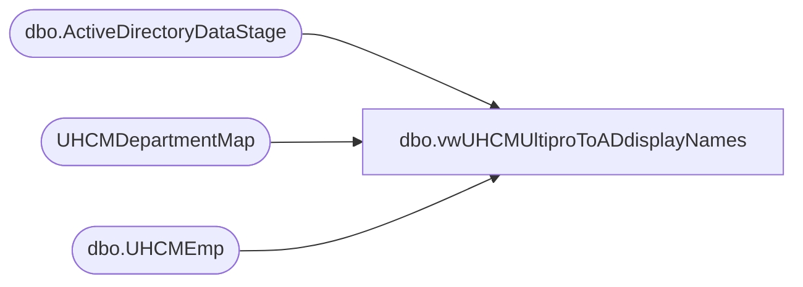

# dbo.vwUHCMUltiproToADdisplayNames

**Database:** dw  
**Server:** papamart  

## Architecture Diagram



## Table Dependencies

| Referenced Table |
|---|
| dbo.ActiveDirectoryDataStage |
| UHCMDepartmentMap |
| dbo.UHCMEmp |

## View Code

```sql
--Currently not sending ProvisioningEvent = to C (Change of Department) waiting on Dave East to deploy that logic

CREATE View [dbo].[vwUHCMUltiproToADdisplayNames]
AS

with 
adsPaths as
(
select distinct(AdsPAth), Name, DisplayName, samaccountname, EmployeeID, UserPrincipalName from [dbo].[ActiveDirectoryDataStage] 
--where ISNUMERIC(samaccountname) = 0
),
uhcmEmps as
(
select e.EecLocation, e.EepEEID, e.EepNameFirst, e.EepNamePreferred, e.EepNameLast,e.JbcJobCode, e.EecOrgLvl1Code, e.samaccountname,

'newDisplayName' = CASE WHEN e.EepCompanyCode <> 'BABUK' and  ISNUMERIC(e.EecLocation) = 1 and e.JbcJobCode in ('CWM','CNCWM','GWM','DCWM') THEN
							case when e.EepNamePreferred is null then e.EepNameFirst + ' ' + e.EepNameLast + ' - ' + right(('000' + cast(cast(e.EecLocation as integer)-1000 as varchar)) , 3) 
							else e.EepNamePreferred + ' ' + e.EepNameLast + ' - ' + right(('000' + cast(cast(e.EecLocation as integer)-1000 as varchar)) , 3) end
						WHEN e.EepCompanyCode <> 'BABUK' and ISNUMERIC(e.EecLocation) = 0 and e.JbcJobCode in ('CWM','CNCWM','GWM','DCWM') THEN
							case when e.EepNamePreferred is null then e.EepNameFirst + ' ' + e.EepNameLast + ' - ' +  right(('000' + cast(cast(left(e.EecLocation,4) as integer)-1000 as varchar)) , 3) 
							else e.EepNamePreferred + ' ' + e.EepNameLast + ' - ' +  right(('000' + cast(cast(left(e.EecLocation,4) as integer)-1000 as varchar)) , 3) end
						WHEN e.EepCompanyCode <> 'BABUK' and  ISNUMERIC(e.EecLocation) = 1 and e.JbcJobCode in ('BB','SL','AWM', 'SLTMP','CNBB') THEN
							case when e.EepNamePreferred is null then e.EepNameFirst + ' ' + e.EepNameLast
							else e.EepNamePreferred + ' ' + e.EepNameLast end
						WHEN e.EepCompanyCode <> 'BABUK' and ISNUMERIC(e.EecLocation) = 1 and e.JbcJobCode not in ('BB','SL','AWM', 'SLTMP','CWM','CNCWM','GWM','DCWM') THEN
							case when e.EepNamePreferred is null then e.EepNameFirst + ' ' + e.EepNameLast
							else e.EepNamePreferred + ' ' + e.EepNameLast end
						WHEN e.EepCompanyCode <> 'BABUK' and ISNUMERIC(e.EecLocation) = 0 and e.JbcJobCode not in ('CWM','CNCWM','GWM','DCWM') THEN
							case when e.EepNamePreferred is null then e.EepNameFirst + ' ' + e.EepNameLast
							else e.EepNamePreferred + ' ' + e.EepNameLast end
						WHEN e.EepCompanyCode = 'BABUK' and e.JbcJobCode in ('IrelandChief Workshop Manager40','Dual Site Chief Workshop Manager','Chief Workshop Manager','UKChief Workshop Manager35',
							'UKChief Workshop Manager40','UKDual Site Chief Workshop Manager35','UKDual Site Chief Workshop Manager40') THEN
							case when (e.EepNamePreferred is null or e.EepNamePreferred = '') then e.EepNameFirst + ' ' + e.EepNameLast + ' - ' + + e.EecLocation 
							else e.EepNamePreferred + ' ' + e.EepNameLast + ' - ' + e.EecLocation end
						WHEN e.EepCompanyCode = 'BABUK' and e.JbcJobCode not in ('IrelandChief Workshop Manager40','Dual Site Chief Workshop Manager','Chief Workshop Manager','UKChief Workshop Manager35',
							'UKChief Workshop Manager40','UKDual Site Chief Workshop Manager35','UKDual Site Chief Workshop Manager40') THEN
							case when (e.EepNamePreferred is null or e.EepNamePreferred = '') then e.EepNameFirst + ' ' + e.EepNameLast 
							else e.EepNamePreferred + ' ' + e.EepNameLast end
						else '' end
from [dbo].[UHCMEmp] e 
--join vwADEmployee a On a.EmployeeID = e.EepEEID

left join  UHCMDepartmentMap d on e.EecLocation = d.EecLocation
where
e.EecEmplStatus <> 'Terminated' --and e.JbcJobCode in ('CWM','CNCWM','GWM','DCWM','DCWMTMP','CNGWM','CWMTMP','CNDCWM') 
--and e.EepCompanyCode <> 'BABUK'

)
select u.EecLocation, u.EepEEID, u.EepNameFirst, u.EepNamePreferred, u.EepNameLast,u.JbcJobCode, u.EecOrgLvl1Code, u.samaccountname, a.UserPrincipalName,  a.DisplayName as 'currentDisplayName', u.newDisplayName, u.samaccountname as 'mailnickname'
from uhcmEmps u
join adsPaths a on u.EepEEID = a.EmployeeID
```

