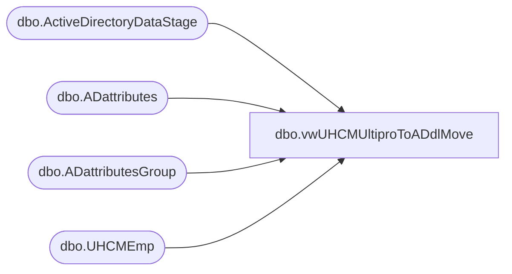

# dbo.vwUHCMUltiproToADdlMove

**Database:** dw  
**Server:** papamart  

## Architecture Diagram



## Table Dependencies

| Referenced Table |
|---|
| dbo.ActiveDirectoryDataStage |
| dbo.ADattributes |
| dbo.ADattributesGroup |
| dbo.UHCMEmp |

## View Code

```sql
-- CTE that shows current DL for CWMs 

CREATE View [dbo].[vwUHCMUltiproToADdlMove]
AS

-- 
with
storeDLmaster
as
(
select 
storeNumAD = CASE 
when Samaccountname = 'Store 0425 - Victorville Walmart' then '425'
when Samaccountname = 'Store 0443 - Sacramento Walmart' then '443'
when Samaccountname = 'Store 0452 - Murfreesboro Walmart' then '452'
when Samaccountname = 'Store 0468 - Covington Walmart' then '468'
when Samaccountname = 'Store 0521 - BQ Location' then '521'
when Samaccountname = 'Store 99 - Tacoma' then '099'
else SUBSTRING(SamAccountName, PATINDEX('%[0-9]%', SamAccountName), 4) end
,Name,SamAccountName 
from [papamart].[DWStaging].[dbo].[ADattributesGroup] 
where SamAccountName like 'Store %'
and Samaccountname not in ('Store Managers','Store Diagnostic Report','Store Donations','Store Orders','Store Force','Store Users')
--order by storeNum
--order by SamAccountName asc
),
adsPaths as
(
select distinct(AdsPAth), Name, samaccountname, EmployeeID, UserPrincipalName from [dbo].[ActiveDirectoryDataStage] 
),
newGroup
as
(
select right(EecLocation,3) as storeNumUHCM, EepEEID, EepNameFirst, EepNameLast, JbcJobCode, LocDesc, EecEmplStatus, sAMAccountName from papamart.dw.dbo.UHCMEmp
--where JbcJobCode in ('CWM','GWM','DCWM','CNCWM','CNDCWM','UKCWM') and EecEmplStatus = 'Active'  and sAMAccountName is not null and isnumeric(samaccountname) = 0
where JbcJobCode in ('CWM','GWM','CNCWM','UKCWM','CWMTMP','CNCWMTMP') and EecEmplStatus = 'Active'  and sAMAccountName is not null and isnumeric(samaccountname) = 0
),
currentGroups 
as
(
        select Samaccountname, EmployeeID, MemberOf,substring(Memberof, charindex('CN=Store', MemberOf)+3,100) Mem
        from [papamart].[DWStaging].[dbo].[ADattributes]
        where MemberOf like '%CN=Store%' and  ISNUMERIC(Samaccountname) = 0  and isnumeric(EmployeeID) = 1
		--order by EmployeeID asc
),
currentGroups2 as
(
        select Samaccountname, EmployeeID, substring(mem, 1, charindex(',', mem)-1) currentStoreDistributionList
       from currentGroups
)
--select SamaccountName, EmployeeID, currentStoreDistributionList from currentGroups2

select n.storeNumUHCM, n.EepEEID, n.EepNameFirst as 'firstName', n.EepNameLast as 'lastName', n.JbcJobCode, n.LocDesc, n.EecEmplStatus, n.sAMAccountName, 
convert(nvarchar(4000), c.currentStoreDistributionList) as 'currentStoreDistributionList',
m.storeNumAD, m.[Name] as newGroupName,m.SamAccountName as 'newwGroupSamaccountName'
,a.UserPrincipalName
from newGroup n
left join currentGroups2 c on n.EepEEID = c.EmployeeId
join storeDLmaster m on n.storeNumUHCM = m.storeNumAD
join adsPaths a on n.EepEEID = a.EmployeeId
where (c.currentStoreDistributionList <> m.[Name] or c.currentStoreDistributionList is null) 
and n.EepEEID not in ('0051194','2003442','2010412')
```

