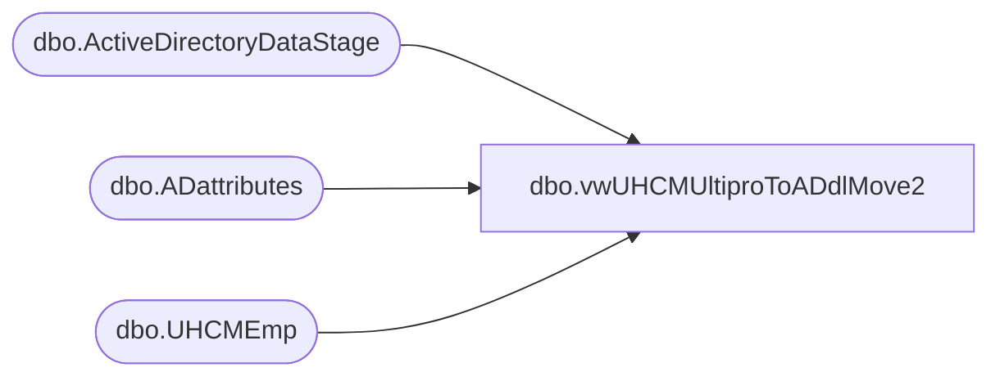

# dbo.vwUHCMUltiproToADdlMove2

**Database:** dw  
**Server:** papamart  

## Architecture Diagram



## Table Dependencies

| Referenced Table |
|---|
| dbo.ActiveDirectoryDataStage |
| dbo.ADattributes |
| dbo.UHCMEmp |

## View Code

```sql
-- view for a demoted CWM only

CREATE View [dbo].[vwUHCMUltiproToADdlMove2]
AS


with
newGroup
as
(
select right(EecLocation,3) as storeNumUHCM, EepEEID, EepNameFirst, EepNameLast, JbcJobCode, LocDesc, EecEmplStatus, sAMAccountName from papamart.dw.dbo.UHCMEmp
where  EecEmplStatus = 'Active' 
),
adsPaths as
(
select distinct(AdsPAth), Name, samaccountname, EmployeeID, UserPrincipalName from [dbo].[ActiveDirectoryDataStage] 
),
currentGroups 
as
(
        select Samaccountname, EmployeeID, MemberOf,substring(Memberof, charindex('CN=Store', MemberOf)+3,100) Mem
        from [papamart].[DWStaging].[dbo].[ADattributes]
        where MemberOf like '%CN=Store%' 
		and isnumeric(EmployeeID) = 1
),
currentGroups2 as
(
        select Samaccountname, EmployeeID, substring(mem, 1, charindex('OU=', mem)-2) currentStoreDistributionList
      from currentGroups
)
select n.storeNumUHCM, n.EepEEID, n.EepNameFirst as firstName, n.EepNameLast as lastName, n.JbcJobCode, n.LocDesc, n.EecEmplStatus, n.sAMAccountName, 
convert(nvarchar(4000), c.currentStoreDistributionList) as 'currentStoreDistributionList'
,'Store Users' as newGroupName,
--a.UserPrincipalName
n.EepEEID as 'UserPrincipalName'
from newGroup n
left join currentGroups2 c on n.EepEEID = c.EmployeeId
join adsPaths a on n.EepEEID = a.EmployeeId
```

